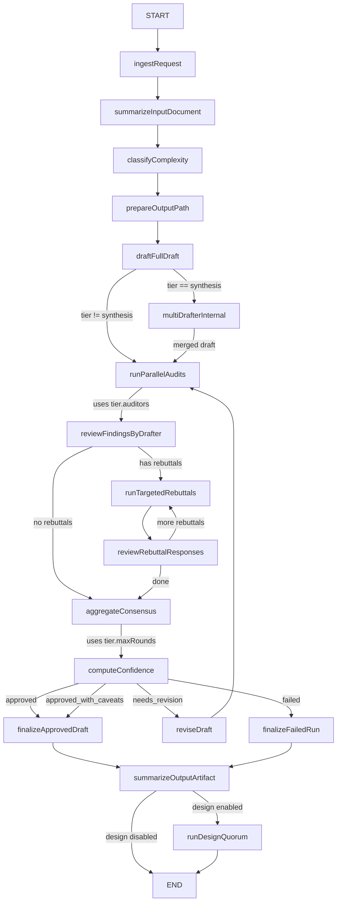
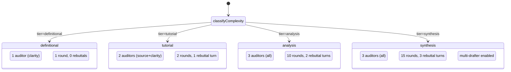

# Implementation Plan: Adaptive Depth, Multi-Drafter, and Confidence Scoring

## 1. Goal

Three features that make the quorum pipeline adapt its cost and behavior to the topic, produce richer output through synthesis, and communicate uncertainty to the user instead of a binary pass/fail.

## 2. Starting point, driving problem, and finish line

**Starting point.** The pipeline (`src/graph.ts`, `src/schema.ts`, `src/config.ts`) is a fixed-depth LangGraph state machine: one drafter writes a markdown deep-dive, three auditors review it, the drafter rebuts, and the cycle repeats until consensus or `maxRounds` (10). All topics — a simple definition, a deep systems analysis — pay the same cost. The output is binary: `approved` or `failed`.

**Driving problem.** Three things are broken or missing:

1. **Fixed cost for variable difficulty.** A query like "what is protobuf?" costs the same agent calls as "explain Linux CFS bandwidth control from kernel source." The pipeline burns tokens on simple queries and can under-serve complex ones by not giving them enough depth.

2. **Single-drafter bottleneck.** One model, one knowledge boundary, one set of blind spots. Real research benefits from multiple perspectives. Two drafters with different research lenses would catch each other's gaps before the audit phase even runs, reducing the number of expensive rebuttal rounds.

3. **Binary output loses signal.** The current outcome is `approved` or `failed` (or `failed_non_convergent`). A document that is 90% rock-solid with one minor wording issue in a footnote is "failed" — same as a document where an entire section is speculative. The user can't distinguish these.

**Finish line.** The pipeline:
- Classifies topic complexity upfront and routes to a tier-specific configuration (definitional → cheap, tutorial → moderate, analysis → current, synthesis → multi-drafter with extended rounds).
- At `synthesis` tier, runs two drafters in parallel with different research lenses, then a synthesizer merges them into one draft that the normal audit pipeline processes.
- After aggregation, computes per-section confidence scores and surfaces low-confidence sections to the user, including them in the summary output.

## 3. Constraints and assumptions

**Constraints:**
- Must not break the existing single-drafter flow. All current tiers and configurations must continue to work.
- The LangGraph state machine in `src/graph.ts` uses `StateGraph` with `addNode`/`addConditionalEdges`. Fork/join semantics (for parallel drafters) need to be implemented within a single node using `Promise.all`, not through LangGraph's `Send` API (which would require restructuring every edge).
- The Zod schemas in `src/schema.ts` are used for state validation at every graph boundary. New state fields must pass through `researchStateObjectSchema` and `researchStateSchema`.
- The TUI (`src/tui/`) and view server (`src/view-server.ts`) render state from the graph. New state fields (confidence scores, depth tier) must be backward-compatible — undefined fields must not crash the UI.

**Assumptions:**
- The scoping agent (for topic classification) is cheap and fast. Confirmed: the `markdown-summarizer` agent already exists and uses a smaller model; a topic classifier is a similar single-prompt call.
- Two drafters can run in parallel without exceeding the opencode server's session capacity. Confirmed: the current `runParallelAudits` already runs 3 auditors in parallel via `Promise.all`.
- The synthesizer agent can merge two drafts without hallucinating. Inferred: the summarizer agent already summarizes markdown; merging is a similar capability.

## 4. Current state

The graph topology (`src/graph.ts:1569-1656`):

```
START → ingestRequest → summarizeInputDocument → prepareOutputPath
  → draftFullDraft              // single drafter, one pass
    → runParallelAudits         // 3 auditors in parallel
      → reviewFindingsByDrafter // drafter accepts/rebuts findings
        → runTargetedRebuttals  // auditors respond to rebuttals
          → reviewRebuttalResponses → (loop back or continue)
            → aggregateConsensus    // compute outcome
              → finalizeApprovedDraft or reviseDraft or finalizeFailedRun
                → summarizeOutputArtifact
                  → runDesignQuorum → END
```

Key files:

| File | Role |
|------|------|
| `src/graph.ts` | LangGraph state machine: all nodes, edges, routing |
| `src/schema.ts` | Zod schemas for ResearchState and all sub-types |
| `src/config.ts` | Zod schema for `quorum.config.json` |
| `quorum.config.json` | Runtime config (auditors, maxRounds, designQuorum) |
| `src/output.ts` | Writes artifacts to disk (`final.md`, `summary.json`, etc.) |
| `src/runner.ts` | Wraps graph invocation, telemetry, lifecycle events |
| `assets/prompts/` | Prompt templates (11 markdown files) |

State fields relevant to this plan (`src/schema.ts:262-286`):

```ts
researchStateObjectSchema = {
  requestId, inputMode, topic, documentPath, documentText,
  inputSummary, artifactSummary,
  round, draft,                        // single draft
  audits, activeRebuttals, currentRebuttalResponsesByFinding,
  rebuttalTurnCounts, rebuttalHistory, rebuttalResponseHistory,
  unresolvedFindings, lastUnresolvedSignature,
  approvedAgents, status, failureReason,
  outputPath, designHtml, designStatus
}
```

Config relevant to this plan (`quorum.config.json`):

```json
{
  "designatedDrafter": "research-drafter",
  "auditors": ["source-auditor", "logic-auditor", "clarity-auditor"],
  "maxRounds": 10,
  "maxRebuttalTurnsPerFinding": 2,
  "requireUnanimousApproval": true
}
```

## 5. What is actually causing the problem

There are three distinct causes:

**Cause 1 (adaptive depth).** The pipeline has no awareness of topic difficulty. Every invocation follows the same graph path with the same agent count and round limit. The cost is `O(maxRounds × (1 drafter + N auditors))` for every query. This is structurally wasteful for most queries — the majority of real-world questions are definitional or tutorial-level, not deep analysis.

**Cause 2 (single drafter).** The `draftFullDraft` node (`src/graph.ts:612`) calls one agent with one prompt. That agent's output is the sole input to the audit phase. Any gap in the drafter's knowledge — a missing framework, an overlooked paper, a misinterpreted source — becomes an audit finding at best and an undetected error at worst. The rebuttal mechanism can correct some of these, but only if an auditor happens to catch them.

**Cause 3 (binary output).** The `aggregateConsensus` node (`src/graph.ts:1118`) computes a single outcome: `approved`, `needs_revision`, or `failed_non_convergent`. The `runSummarySchema` (`src/schema.ts:225`) records this outcome plus the list of unresolved findings. But it doesn't distinguish between sections with zero findings and sections that survived three rebuttal rounds. The user sees "approved" or "failed" — no signal about where the document is strong and where it's speculative.

## 6. Intuition and mental model

### Adaptive depth as a cost dial

Think of the pipeline as a manufacturing process with a cost dial. Right now the dial is stuck at 10. For a simple query, you're paying 10× what's needed. For an extremely complex query, 10 might not be enough.

The scoping agent is a cheap pre-flight check: "how hard is this question?" It reads the topic and returns a tier. The tier acts as a preset on the cost dial:

```
definitional → dial at 1-2   (1 drafter, 1 auditor, 1 round, no rebuttals)
tutorial     → dial at 2-4   (1 drafter, 2 auditors, 2 rounds, limited rebuttals)
analysis     → dial at 6-20  (current pipeline)
synthesis    → dial at 12-40 (multi-drafter, extended rounds)
```

### Multi-drafter as perspective diversity

A single researcher reads a topic and writes a report. Two researchers read the same topic, one focusing on mechanism, one on ecosystem. They write independent reports. A third researcher merges them: "keep the strongest evidence from each, drop duplicates, flag contradictions."

The synthesizer is not a summarizer. It doesn't write "Author A says X, Author B says Y." It writes a unified document that takes the best from both. When they disagree, it picks the version with stronger source evidence and notes the disagreement if unresolvable.

### Confidence as a heat map

After the audit phase, each section of the document has a history. Some sections were never challenged (high confidence). Some survived rebuttals (moderate confidence). Some still have unresolved minor findings (lower confidence). The confidence score is a heat map over the document: green = solid, yellow = caveated, red = speculative.

## 7. Options considered

### G: Adaptive depth — implementation approaches

**Option A: Duplicate the graph per tier.**
Build four separate StateGraph subgraphs, one per tier, and route to the right one.

- *Pros:* Maximum flexibility per tier.
- *Cons:* Massive code duplication. Every node change must be replicated 4×. The graph construction in `createGraph` is already large.
- *Verdict:* Rejected. Too much maintenance burden.

**Option B: Parameterize the existing nodes.**
The graph stays the same. Key parameters (auditor count, maxRounds, maxRebuttalTurns) are read from a tier config object attached to the state. Nodes check `state.depthTier` and adjust their behavior.

- *Pros:* Zero graph restructuring. One code path.
- *Cons:* Nodes must be aware of tiers. Some nodes (like `draftFullDraft`) don't change with tier — this is fine. The ones that do (auditor count in `runParallelAudits`, round limits in `aggregateConsensus`) are isolated.
- *Verdict:* Accepted. Cleanest approach with minimal blast radius.

**Option C: Separate LangGraph subgraph per tier, composed via `StateGraph.addNode` with subgraphs.**
- *Pros:* Graph inspection is clearer.
- *Cons:* LangGraph subgraph composition is fragile; state passing between subgraphs requires careful schema alignment.
- *Verdict:* Rejected. Over-engineered for this use case.

### F: Multi-drafter — implementation approaches

**Option A: Two separate graph nodes + conditional routing.**
Add `draftV1` and `draftV2` nodes, then a `synthesizeDrafts` node. Route to them based on tier.

- *Pros:* Clean graph separation. Each drafter gets its own telemetry node.
- *Cons:* LangGraph doesn't support true fork/join natively. You'd need to route to one, then the other, then join — making them sequential, not parallel.
- *Verdict:* Rejected. Sequential defeats the purpose.

**Option B: Single `draftFullDraft` node that runs two drafters in parallel internally.**
The existing `draftFullDraft` node checks `state.depthTier === "synthesis"`. If true, it calls `draftWithLens(config, promptBundle, state, lensA)` and `draftWithLens(config, promptBundle, state, lensB)` via `Promise.all`, then calls a synthesizer. If false, it runs the existing single-drafter path.

- *Pros:* Zero graph restructuring. Parallel execution via `Promise.all`. Single node to maintain. Drop-in replacement — the rest of the pipeline (audits, rebuttals, aggregation) is identical.
- *Cons:* The `draftFullDraft` function grows. Mitigated by extracting the multi-drafter path into a separate function.
- *Verdict:* Accepted.

### I: Confidence scoring — implementation approaches

**Option A: Compute confidence inside `aggregateConsensus`.**
- *Pros:* All the data (findings, rebuttal history, resolutions) is already available there.
- *Cons:* `aggregateConsensus` is already complex (outcome computation, signature detection, stagnation checks). Adding confidence would make it harder to test.
- *Verdict:* Rejected. Better to keep aggregation and confidence as separate concerns.

**Option B: New `computeConfidence` node after aggregation.**
- *Pros:* Clean separation. Read-only — doesn't modify the draft or findings, only annotates the state. Easy to test independently.
- *Cons:* Needs access to `state.draft` to extract sections (via markdown heading parsing) and `state.unresolvedFindings` + `state.rebuttalHistory` to compute penalties.
- *Verdict:* Accepted.

## 8. Recommended approach

Implement in this order (dependencies flow forward):

```
Step 1: G. Adaptive depth
   ↓ (creates tier config, adds depthTier to state)
Step 2: F. Multi-drafter synthesis
   ↓ (plugs into synthesis tier)
Step 3: I. Confidence scoring
   (independent of 1 and 2, but benefits from richer finding data)
```

### Step 1: Adaptive Depth

**Config changes.** Add `depthTiers` to `quorum.config.json` and `config.ts`:

```json
{
  "depthTiers": {
    "definitional": { "auditors": ["clarity-auditor"], "maxRounds": 1, "maxRebuttalTurnsPerFinding": 0, "requireUnanimousApproval": false },
    "tutorial":     { "auditors": ["source-auditor", "clarity-auditor"], "maxRounds": 2, "maxRebuttalTurnsPerFinding": 1, "requireUnanimousApproval": true },
    "analysis":     { "auditors": ["source-auditor", "logic-auditor", "clarity-auditor"], "maxRounds": 10, "maxRebuttalTurnsPerFinding": 2, "requireUnanimousApproval": true },
    "synthesis":    { "auditors": ["source-auditor", "logic-auditor", "clarity-auditor"], "maxRounds": 15, "maxRebuttalTurnsPerFinding": 3, "requireUnanimousApproval": false, "multiDrafter": true }
  },
  "depthTierDefault": "analysis"
}
```

**Schema changes.** Add to `researchStateObjectSchema`:

```ts
depthTier: z.enum(["definitional", "tutorial", "analysis", "synthesis"]).optional(),
depthConfidence: z.number().min(0).max(1).optional(),
```

**New node: `classifyComplexity`.** Inserted between `summarizeInputDocument` and `prepareOutputPath`. Calls the `markdown-summarizer` agent (reused, not a new agent) with a classification prompt:

```
Classify this research topic into a complexity tier.

Topic: "{topic}"
{inputSummary}

Tiers:
- "definitional": A term, concept, or simple question. Answerable with an explanation and 1-2 sources.
  Example: "What is gRPC?" "What does `docker build` do?"
- "tutorial": A how-to, mechanism walkthrough, or comparison. Needs step-by-step explanation and moderate source depth.
  Example: "How does Kafka consumer group rebalancing work?"
- "analysis": Deep technical analysis. Needs source-code evidence, multiple perspectives, or performance characteristics.
  Example: "Explain Linux CFS bandwidth control from kernel source"
- "synthesis": Cross-domain integration. Connects multiple systems or traces requests across boundaries.
  Example: "How does a Kubernetes pod get an IP address end-to-end?"

Return: { tier, confidence }

If unsure, prefer "analysis" (the safe default).
```

**Node behavior changes.** Three existing nodes read tier config from state instead of global config:

- `runParallelAudits`: uses `depthTiers[tier].auditors` instead of `config.quorumConfig.auditors`
- `aggregateConsensus`: uses `depthTiers[tier].maxRounds` and `depthTiers[tier].requireUnanimousApproval`
- `reviewFindingsByDrafter`: uses `depthTiers[tier].maxRebuttalTurnsPerFinding`

**Graph change.** One new node, one edge change:

```
// Before
summarizeInputDocument → prepareOutputPath

// After
summarizeInputDocument → classifyComplexity → prepareOutputPath
```

### Step 2: Multi-Drafter Synthesis

**New prompt asset: `assets/prompts/synthesize-drafts.md`:**

```
Synthesize the following {N} independent research drafts into one unified draft.

{crossDraftSummary}

Draft A ({lensA} lens):
{draftA}

Draft B ({lensB} lens):
{draftB}

Rules:
1. Use the strongest evidence for each claim. When drafts disagree, prefer the one with primary source support.
2. Cover ALL unique insights from both drafts. Do not drop a substantive section or finding just because only one drafter covered it.
3. When drafts contradict on a factual claim, resolve it by source quality: primary source > official docs > secondary articles. If unresolvable, note the contradiction explicitly with a brief note.
4. Preserve the deep-dive contract in full (source-backed, closure bar, artifact guidance, output rules).
5. This is a UNIFIED draft, not a meta-analysis. Do not write "Draft A says X but Draft B says Y." The reader should not know there were multiple drafters.
6. Keep the best structure from the two drafts. If Draft A has a clearer organization, use it as the skeleton and weave in Draft B's unique insights at the right places.
```

**New function: `synthesizeDrafts`** (in `src/graph.ts`):

- Takes state, config, promptBundle, and two draft strings.
- Calls the `markdown-summarizer` agent with the synthesis prompt.
- Returns the merged draft string.

**Modified function: `draftFullDraft`** (in `src/graph.ts`):

```ts
async function draftFullDraft(...) {
  const tier = state.depthTier ?? "analysis"
  const multiDrafter = config.quorumConfig.depthTiers[tier]?.multiDrafter ?? false

  if (!multiDrafter) {
    // Existing single-drafter path (unchanged)
    return singleDrafterFlow(...)
  }

  // Multi-drafter path
  const lenses = [
    "Focus on internal mechanisms, source code evidence, and how it actually works. Prefer implementation-level detail.",
    "Focus on ecosystem, trade-offs, alternatives, edge cases, and common misconceptions. Prefer breadth over depth on any single mechanism."
  ]

  const [draftA, draftB] = await Promise.all(
    lenses.map(lens => draftWithLens(config, promptBundle, state, lens, telemetry, observer))
  )

  const merged = await synthesizeDrafts(config, promptBundle, state, draftA, draftB, lenses, telemetry, observer)

  return researchStateSchema.parse({
    ...state,
    draft: merged,
    status: "auditing",
    drafts: [draftA, draftB],  // NEW: preserve originals for debugging
  })
}
```

**New function: `draftWithLens`** (in `src/graph.ts`):

- Identical to the existing single-drafter flow, except the lens suffix is appended to the prompt.
- Creates its own opencode session.
- Returns the draft text.

**State change.** Add `drafts` field to `researchStateObjectSchema`:

```ts
drafts: z.array(z.string()).optional(),
```

This is for observability only — the view server can show the individual drafts that were synthesized.

### Step 3: Confidence Scoring

**New node: `computeConfidence`.** Inserted between `aggregateConsensus` and the finalize/revise routes.

**Algorithm** (implemented in `src/graph.ts` as `computeConfidenceNode`):

```
For each top-level heading in state.draft:
  base_confidence = 0.95
  findings_this_section = state.unresolvedFindings.filter(finding targets this section)
  
  for each finding:
    severity_weight = { blocker: 0.30, major: 0.15, minor: 0.05 }
    
    rebuttal_multiplier = 0.0 (if finding was withdrawn via rebuttal)
                        = 0.5 (if softened)
                        = 1.0 (if upheld or never rebutted)
    
    penalty = severity_weight[severity] * rebuttal_multiplier
    base_confidence -= penalty
  
  section_confidence = max(0.0, base_confidence)
  if findings_this_section.length > 0 and all are minor and withdrawn:
    section_confidence = 0.95  // effectively clean

overall_confidence = average of all section confidences (weighted by section length)
```

**Section-to-finding mapping.** How does a finding "target" a section? The finding's `issue` field usually quotes or references a section. A simple heuristic:

- Parse the draft into sections by splitting on `^## ` headings.
- For each finding, check if any of its `evidence` strings or its `issue` string contains a heading name or a quoted phrase from a section.
- If ambiguity, assign to the most recent heading the finding discusses.

This is a heuristic, not a guarantee. Label it as such in the output.

**Output.** The confidence data is written to a new artifact `confidence.json` in the run directory:

```json
{
  "overall_confidence": 0.82,
  "outcome": "approved_with_caveats",
  "sections": [
    { "heading": "API Overview", "confidence": 0.95, "findings": 0 },
    { "heading": "Performance", "confidence": 0.80, "findings": 1, "caveat": "Based on documentation benchmarks" },
    { "heading": "Internals", "confidence": 0.65, "findings": 2, "caveat": "Inferred from source; not runtime-verified" }
  ]
}
```

**Outcome enrichment.** The `aggregatedFindingsSchema` outcome enum changes:

```ts
// Before
export const aggregateOutcomeSchema = z.enum(["approved", "needs_revision", "failed_non_convergent"])

// After
export const aggregateOutcomeSchema = z.enum(["approved", "approved_with_caveats", "needs_revision", "failed_non_convergent"])
```

`approved_with_caveats` means: no blockers, no majors, all auditors approved or minor findings withdrawn. But at least one section has confidence < 0.70. The draft passes, but the user sees where to be cautious.

**State change.** Add to `researchStateObjectSchema`:

```ts
confidence: z.object({
  overall: z.number().min(0).max(1),
  sections: z.array(z.object({
    heading: z.string(),
    confidence: z.number().min(0).max(1),
    findings: z.number().int().nonnegative(),
    caveat: z.string().optional(),
  })),
}).optional(),
```

**Graph change.** New node, new route:

```
// Before
aggregateConsensus → (conditional) → finalizeApprovedDraft | reviseDraft | finalizeFailedRun

// After
aggregateConsensus → computeConfidence → (conditional) → ...
```

`computeConfidence` does not change routing — it passes through the same `status` and `outcome`. The routing function `routeAfterAggregate` is unchanged.

## 9. Visual overview

### Graph topology after all three features



### Tier decision flow



## 10. Step-by-step implementation plan

### Phase 1: Adaptive Depth (G)

**Step 1.1: Config schema** (`src/config.ts`)
- Add `depthTiers` to `quorumConfigSchema` — a record of tier name to `{ auditors, maxRounds, maxRebuttalTurnsPerFinding, requireUnanimousApproval, multiDrafter? }`.
- Add `depthTierDefault` (default `"analysis"`).
- Add to `quorum.config.json`.

**Step 1.2: State schema** (`src/schema.ts`)
- Add `depthTier` and `depthConfidence` fields to `researchStateObjectSchema` (both optional for backward compatibility).

**Step 1.3: Classify node** (`src/graph.ts`)
- Add `classifyComplexity` function. Reuses `markdown-summarizer` agent (already configured). Prompt is the classification text from section 8.
- Add `classifyComplexity` node to the graph.
- Change edge: `summarizeInputDocument → classifyComplexity → prepareOutputPath`.

**Step 1.4: Node parameterization** (`src/graph.ts`)
- In `runParallelAudits`, read auditors from `depthTiers[tier].auditors` if tier is set, else fall back to `config.quorumConfig.auditors`.
- In `aggregateConsensus`, read `maxRounds` and `requireUnanimousApproval` the same way.
- In `reviewFindingsByDrafter`, read `maxRebuttalTurnsPerFinding` the same way.

**Step 1.5: Artifact** (`src/output.ts`)
- Write `depth-tier.json` to the run directory containing `{ tier, confidence, config }`.

**Step 1.6: TUI/View server** (optional, can be post-MVP)
- Show depth tier in Dashboard status line: `"⬤ Drafting (tutorial tier)"`.

### Phase 2: Multi-Drafter Synthesis (F)

**Step 2.1: Prompt asset** (`assets/prompts/synthesize-drafts.md`)
- Create the synthesizer prompt as described in section 8.

**Step 2.2: Synthesizer function** (`src/graph.ts`)
- Add `synthesizeDrafts` function: calls `promptAgent` with the synthesis prompt, returns merged draft.

**Step 2.3: Lens-drafter function** (`src/graph.ts`)
- Extract the existing single-drafter logic from `draftFullDraft` into `draftWithLens(config, promptBundle, state, lens, telemetry, observer)`.
- The `lens` parameter is appended to the draft prompt as a suffix: `"\n\nResearch lens: {lens}"`.

**Step 2.4: Fork logic in draftFullDraft** (`src/graph.ts`)
- Add tier check at the top of `draftFullDraft`.
- For non-synthesis tiers: call `draftWithLens` once with empty lens (identical to current behavior).
- For synthesis tier: `Promise.all([draftWithLens(lensA), draftWithLens(lensB)])` → `synthesizeDrafts`.
- Persist intermediate drafts as `draft-round-{N}-vA.md` and `draft-round-{N}-vB.md` for debugging.

**Step 2.5: State schema** (`src/schema.ts`)
- Add `drafts: z.array(z.string()).optional()` to state for observability.

### Phase 3: Confidence Scoring (I)

**Step 3.1: Schema changes** (`src/schema.ts`)
- Add `"approved_with_caveats"` to `aggregateOutcomeSchema`.
- Add `confidence` object to `researchStateObjectSchema`.
- Update `aggregatedFindingsSchema` superRefine to allow `approved_with_caveats` with minor findings.

**Step 3.2: Confidence node** (`src/graph.ts`)
- Add `computeConfidenceNode` function. Parses `state.draft` for sections. Computes penalties from `state.unresolvedFindings` and `state.rebuttalResponseHistory`. Returns state with `confidence` field populated.
- Edge change: `aggregateConsensus → computeConfidence → (routeAfterAggregate)`.
- `routeAfterAggregate` is unchanged — `computeConfidence` doesn't change status.

**Step 3.3: Outcome enrichment** (`src/graph.ts`)
- In `aggregateConsensus`, when the outcome would be `approved` but there are unresolved minor findings (all from auditors who ultimately approved after soften/withdraw), set outcome to `approved_with_caveats` instead.

**Step 3.4: Artifact** (`src/output.ts`)
- Add `writeRunJsonArtifact(state.outputPath, "confidence.json", state.confidence)` call in `computeConfidenceNode`.
- Include confidence data in `summary.json` (extend `runSummarySchema`).

**Step 3.5: TUI/View server** (optional, can be post-MVP)
- Dashboard: show overall confidence percentage.
- SummaryScreen: show per-section confidence bars.
- View server: render confidence card in run detail.

## 11. UI sketch — TUI Dashboard changes

The dashboard after adaptive depth + confidence:

```
┌──────────────────────────────────────────────────────────────┐
│ ✓ Approved with caveats (82%)                    elapsed 03:12│
│ 🎨 HTML: approved → runs/.../final.html                       │
│                                                                │
│ auditors: ✓ source-auditor  ✓ logic-auditor  ✓ clarity-auditor│
│ research findings: ● 0  ○ 0  · 2                               │
│ research unresolved: · 1 (touch targets)                       │
│                                                                │
│ Sections:                                                      │
│   API Overview              ████████████████████ 95%           │
│   Performance characteristics████████████████░░░░ 80%         │
│   Internal implementation    █████████████░░░░░░░ 65% ⚠       │
│                                                                │
│ output: runs/...  ·  press e to view draft                    │
└──────────────────────────────────────────────────────────────┘
```

The confidence bars are only shown on the SummaryScreen, not the Dashboard (Dashboard is too compact during a live run). During a live run, the tier is shown in the status line:

```
⬤ Drafting (synthesis tier)                          elapsed 00:45
```

## 12. Risks and failure modes

### Scoping misclassification

**Risk:** The scoping agent classifies a deep analysis question as `definitional`. The pipeline runs with 1 auditor, 1 round, and produces a shallow draft.

**Mitigation:** The scoping agent is instructed: "If unsure, prefer analysis." The `depthTierDefault` is `"analysis"`. The `depthConfidence` field is persisted — if confidence is low, the run artifact records it.

**Recovery:** The user can re-run with `depthTier` forced via a CLI flag (future enhancement).

### Synthesizer hallucination

**Risk:** The synthesizer fabricates claims that aren't in either source draft, or it drops an important section.

**Mitigation:** The synthesis prompt explicitly says "cover ALL unique insights from both drafts." The intermediate drafts are persisted to disk — if the merged output is suspicious, the user can compare.

**Recovery:** None automatic. The user inspects the artifacts and re-runs.

### Confidence heuristic inaccuracy

**Risk:** The section-to-finding mapping heuristic assigns a finding to the wrong section, producing misleading confidence scores.

**Mitigation:** Label it as heuristic in the output. The confidence JSON includes the mapping reasoning. If a section has suspiciously low confidence, the user can check which findings were mapped to it.

**Recovery:** Confidence is advisory — it doesn't change the approval decision (except for the `approved_with_caveats` outcome, which still passes).

### Increased token cost at synthesis tier

**Risk:** Multi-drafter + synthesizer roughly doubles the drafting cost. For a synthesis-tier topic, this could mean 30+ agent calls.

**Mitigation:** Synthesis tier is only triggered when the scoping agent selects it. The default is `analysis` (current behavior). The user can configure tier thresholds.

### Graph recursion limit

**Risk:** Synthesis tier increases maxRounds to 15. Combined with maxRebuttalTurnsPerFinding = 3, the recursion limit (80) should still be sufficient. But each round generates multiple nodes.

**Mitigation:** Increase `recursionLimit` to 120 for synthesis tier if needed. This is tracked via `depthTiers[tier]`.

## 13. Verification plan

### Phase 1 verification

1. **Unit test:** `classifyComplexity` returns a valid tier for:
   - "What is Docker?" → `definitional`
   - "How does Kafka consumer group rebalancing work?" → `tutorial`
   - "Explain the Linux CFS I/O scheduler from source" → `analysis` (or `synthesis`)

2. **Integration test:** Run the full pipeline with a definitional topic. Verify:
   - Only 1 auditor runs (clarity-auditor)
   - Only 1 round
   - `depth-tier.json` exists in the run directory
   - Total agent calls ≤ 5

3. **Regression test:** Run with a topic that would get `analysis` tier. Verify behavior is identical to current (3 auditors, 10 rounds).

4. **Config validation:** `bun run typecheck` passes with new schema fields.

### Phase 2 verification

1. **Unit test:** `draftWithLens` produces a draft that differs from the non-lens version (different structure, different sources cited).

2. **Unit test:** `synthesizeDrafts` merges two drafts:
   - Unique sections from each are preserved
   - Overlapping sections use the strongest evidence
   - Contradictions are noted

3. **Integration test:** Run with synthesis tier. Verify:
   - `draft-round-0-vA.md` and `draft-round-0-vB.md` exist
   - `draft-round-0.md` is the merged output
   - Merged output contains content from both source drafts

### Phase 3 verification

1. **Unit test:** `computeConfidenceNode` computes correct penalties:
   - Section with 0 findings → confidence 0.95
   - Section with 1 minor upheld → confidence 0.90
   - Section with 1 blocker upheld → confidence 0.65

2. **Integration test:** Run to completion. Verify:
   - `confidence.json` exists
   - Overall confidence is between 0 and 1
   - Sections with findings have lower confidence than sections without

3. **Edge case:** Run with 0 findings (perfect approval). Verify confidence is 0.95 for all sections.

## 14. Rollback or recovery plan

All three features are additive — they extend state fields and add nodes, but the existing nodes are unchanged in their core logic. Rollback is trivial:

- Remove the new nodes from `createGraph` and restore the original edges.
- Remove new state fields from `researchStateObjectSchema` (they're all optional).
- Remove `depthTiers` from config (the old fields `auditors`, `maxRounds`, etc. are still present and become the fallback).
- Delete new prompt assets.

If a run is in progress with the new code and something goes wrong, the checkpoint (`runs/checkpoints.sqlite`) can be cleared and the run restarted with the old code. The run directory artifacts are backward-compatible — new files (`depth-tier.json`, `confidence.json`, `draft-round-N-vA.md`) are just additional files that the old code ignores.

## 15. Sources

- Graph topology and node definitions: `src/graph.ts:1569-1656` (graph construction), `src/graph.ts:612` (draftFullDraft), `src/graph.ts:1118` (aggregateConsensus)
- State schema: `src/schema.ts:262-286` (researchStateObjectSchema), `src/schema.ts:225` (runSummarySchema)
- Config schema: `src/config.ts:17-50` (quorumConfigSchema)
- Parallel audit pattern: `src/graph.ts:712` (runParallelAudits uses `Promise.all`)
- Prompt injection for tools: `src/opencode.ts:80-118` (buildResearchToolHint, isResearchAgent)
- Design quorum as post-research phase: `src/graph.ts:1347` (runDesignQuorumNode), `src/design-quorum.ts:328` (runDesignQuorum)
- Output artifact writing: `src/output.ts` (writeRunJsonArtifact, writeRunTextArtifact, writeApprovedArtifacts)
- Runner and telemetry: `src/runner.ts` (runResearchPipeline, telemetry updateTrace)
- Existing agent definitions with web tools: `.opencode/agents/source-auditor.md`, `.opencode/agents/logic-auditor.md`, `.opencode/agents/clarity-auditor.md` (all have `webfetch: allow, websearch: allow, codesearch: allow`)
- Tier-adaptive precedent: `src/graph.ts:1362` (design quorum has its own `timeoutMs` config, showing the pattern of feature-specific config)
