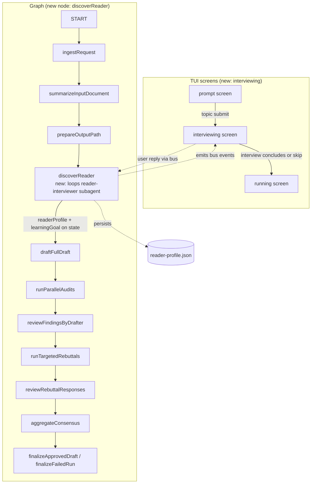

# Reader Discovery — Implementation Plan

> Status: **decision document, not yet executed.**
> Source skill: `implementation-plan`.
> Companion to the recovery-router plan in `docs/plan/recovery-router/`.

## Goal

Before the quorum writes anything, run an **interactive multi-turn interview** with the reader that discovers, per prerequisite concept, what the reader already knows and what they are trying to accomplish. Thread that signal through every agent in the quorum so the final document is calibrated to *this reader* — including a Prerequisites section for concepts the reader lacks.

## Starting point, driving problem, and finish line

**Starting point.** The pipeline today is: type a topic → `ingestRequest` → `summarizeInputDocument` → `prepareOutputPath` → `draftFullDraft` → auditors → rebuttals → final document (`src/graph.ts:1899` edge chain). There is no reader signal anywhere. Every run produces one document for one phantom "competent practitioner" reader regardless of who asked. The just-removed `scope-classifier`/depth-tier system (commit `2224a41`) tried to size the *quorum* from the topic string; it was dead code and is gone. The quorum is now correctly generic and global-sized.

**Driving problem.** "What is goroutine?" for a Go expert and for a Python dev are different documents. "What is MLX?" could mean "should I switch from PyTorch", "how do I write a custom kernel", or "is this real or hype" — four different documents from one topic string. Topic-derived signal cannot tell these apart; only the reader can. And readers do not reliably self-report ("do you know PyTorch?" → yes from a tutorial-once user, no from an impostor-syndrome daily user). Free-text blurbs force the user to structure their own knowledge, which they often cannot do for a topic they're trying to learn.

**Finish line.** A reader types a topic. A multi-turn interview runs in the TUI, asking targeted probes per hypothesized prerequisite concept ("do you know what a scheduler is? a channel?"), adapting based on answers. It produces two structured artifacts: a per-concept `readerProfile` (`[{ concept, level, evidence }]`) and a `learningGoal` (intent). Both are persisted to `reader-profile.json` and injected into **every** agent prompt in the quorum — drafter, all three auditors, rebuttal, drafter-review. The final document includes a Prerequisites section covering concepts at `unknown`/`heard-of` and is calibrated to the reader's demonstrated level. The interview has an always-available skip escape and a bounded stopping rule.

## Constraints and assumptions

**Constraints.**
- The quorum stays generic and global-sized. `maxRounds`, `auditors`, `requireUnanimousApproval` come from the top-level `quorum.config.json` fields and are not modified by reader signal. (Confirmed: this is the post-`2224a41` state; `aggregateConsensus` reads `config.quorumConfig.auditors` always.)
- All three auditors run on every run regardless of reader level or topic. A light ELI5 and a 10000-word paper both get all three. (User requirement; matches current code.)
- Document mode (paste-a-file) is out of scope for v1. Discovery is a topic-mode feature; the document author is the reader and the document itself is the signal. (Assumption — flag if wrong.)
- No external services beyond the existing OpenCode server. The interviewer is a denied-permissions subagent like the old `scope-classifier` (`opencode-go/deepseek-v4-flash`, all tools denied).

**Assumptions (call out before execution if wrong).**
- Quorum is invoked as one long-lived process per run (the interview state lives in-process). Inferred from `src/tui/App.tsx` `startRun` spawning one `runResearchPipeline` per submission.
- The OpenCode subagent can carry a multi-turn conversation within one session via repeated `client.session.prompt` calls (the same mechanism `promptAgent`'s recovery A-branch uses for in-session reprompts — `src/opencode.ts:706`). **Inferred — confirm against the SDK before Phase 1.**
- The TUI can render a chat-like surface with a scrollable history and a single input line. `@opentui/react` has `<input>` and `<text>` primitives (Confirmed: `src/tui/components/PromptScreen.tsx`); a scrollable list is buildable but has no existing precedent in this repo.

## Current state

The relevant code, with file paths:

- **Input collection** — `src/tui/components/PromptScreen.tsx`: a single `<input>` field per mode (topic/document/design). `onSubmit({ inputMode: "topic", topic })` flows to `App.startRun` (`src/tui/App.tsx:38`) → `runResearchPipeline({ request, bus, ... })` (`src/runner.ts:122`). No second input step exists.
- **Graph entry** — `ingestRequest` (`src/graph.ts:535`) parses `inputRequestSchema` (`src/schema.ts:54`, a discriminated union on `inputMode`) and seeds `baseState`. The edge chain is `START → ingestRequest → summarizeInputDocument → prepareOutputPath → draftFullDraft` (`src/graph.ts:1899`).
- **Prompt construction** — `fullDraftPrompt` (`src/graph.ts:127`), `auditPrompt` (`:138`), `rebuttalPrompt` (`:179`), `rebuttalReviewPrompt` (`:190`), `drafterReviewPrompt` (used at `:790`). All take `state` or `requestLabel(state)` (`:97`). These are the injection points.
- **Mid-run interactivity precedent** — **there is none.** `interactiveEnhance` (`src/graph.ts:1556`) is misnamed: it runs an enhancer agent automatically with no user input. The `agent.permission` event flow (`src/runner.ts:48`) emits permission events to the bus, but `replyToPermission` (`src/opencode.ts:857`) is **never called from the TUI** — there is no permission UI in `src/tui/`. So the interview is a **brand-new interactive surface**, not an extension of an existing one. This is the single biggest scope driver.
- **Structured-output subagent pattern** — the old `scope-classifier` agent (deleted in `2224a41`, recoverable from git) is the exact shape: denied permissions, text-in/JSON-out, one `promptAgent` call with a Zod schema. The new `reader-interviewer` agent reuses this shape.
- **Run artifact + surfacing** — `writeRunJsonArtifact` (`src/output.ts`) writes JSON to the run dir; the view-server dispatches cards by filename (`src/view-server.ts:535`), e.g. `renderRequestCard` for `request.json` (`:308`). The just-removed `depth-tier.json` slot, `summarizeNodeState` case, and Dashboard badge are the exact slots to repurpose.

## What is actually causing the problem

The phantom reader. Every prompt-contract function in `src/graph.ts` builds its prompt from `state.topic` / `state.documentText` plus static prompt assets — nothing about who is asking. The clarity auditor (`assets/prompts/audit.md`) judges "clarity" against an unstated default reader, so for an expert reader it flags "too basic" and for a beginner "assumes too much," producing findings that reflect the auditor's default-reader assumption rather than a real defect. The drafter has no way to know which prerequisite concepts to include. This is not a missing feature tacked on top of a working system; it's a missing input to every prompt-contract function.

## Intuition and mental model of the change

The mental model that matters: **the interview is not a new "phase" bolted on top of the quorum — it is a new input that feeds the same prompt-contract functions.** The quorum already has `requestLabel(state)` threaded into every prompt. The profile becomes a peer of `requestLabel`: a `readerContextBlock(state)` function that returns either "Reader profile: ..." or an empty string (default-reader fallback), inserted into the same prompt arrays.

One concrete flow, "What is MLX?":

1. Reader types the topic. TUI switches to a new `interviewing` screen.
2. `discoverReader` node calls `reader-interviewer` subagent turn 1: "Have you used any ML framework? Which? What are you trying to do with MLX?" → reader answers.
3. Interviewer (with a topic primer — see Open Decision A) hypothesizes prerequisites: {autograd, tensor ops, PyTorch, Swift, metal}. Generates targeted probes: "Do you know what a computational graph is? what backprop computes?"
4. Two more turns narrow per-concept level. Stopping rule fires (max 4 turns OR all concepts at confidence floor).
5. Node persists `reader-profile.json`: `{ learningGoal: "deciding whether MLX is worth learning for side projects", concepts: [{ concept: "autograd", level: "unknown", evidence: "couldn't explain chain rule" }, { concept: "tensor ops", level: "familiar", ... }, ...] }`.
6. `draftFullDraft` runs. `fullDraftPrompt` now includes `readerContextBlock(state)` → "Writing for a reader who knows tensor ops and PyTorch basics, does NOT know autograd or GPU memory. Goal: deciding whether MLX is worth learning. Include a Prerequisites section covering: autograd, GPU/memory fundamentals." The drafter writes that document.
7. `clarity-auditor` gets the same `readerContextBlock` in its `auditPrompt` → judges clarity *for this reader*, stops flagging the autograd prereq section as "too basic."
8. Final document is calibrated. The profile never touched `maxRounds` or `auditors`.

**Why this changes the recommendation:** the profile is *data flowing through existing prompt functions*, not a control-flow change to the quorum. That keeps the blast radius small and is exactly why the just-removed depth-tier approach (which changed control flow — per-tier auditor lists) was wrong. The interview changes *what the prompts say*, not *how many agents run*.

## Open decisions (decide before the indicated phase)

These are the hard design questions surfaced during planning. They must be answered before execution reaches the phase that depends on them.

### Decision A — prerequisite hypothesis source (before Phase 1)

The interviewer cannot ask good probes without knowing what the topic *depends on*. Two options:

- **A1: separate cheap "topic primer" call.** Before the interview, one `promptAgent` call to a `topic-primer` subagent (or reuse `reader-interviewer` with a different prompt) returns `{ prerequisites: ["autograd", "tensor ops", ...], suggestedProbes: {...} }` from its parametric knowledge. The interviewer then runs adaptive probes against that hypothesis. **Pro:** probes are on-domain. **Con:** two model calls before the interview; if the primer is wrong, the probes are confidently wrong.
- **A2: fully adaptive, no primer.** The interviewer starts broad ("have you used any ML framework?") and discovers the prerequisite tree empirically. **Pro:** no primer failure mode. **Con:** more turns to converge; may never reach the specific prerequisites that matter.

**Recommendation: A1.** The "confidently wrong primer" risk is real but lower than the "never converges" risk of A2, and A1 needs fewer turns (which matters for the stopping problem). Mitigate the wrong-primer risk by giving the interviewer license to add concepts the primer missed based on answers (the primer is a *starting* hypothesis, not a fixed list).

### Decision B — stopping rule (before Phase 1)

- **B1: fixed max turns (e.g. 4) + per-concept confidence floor, whichever first.** Bounded, predictable. **Recommended.**
- **B2: open-ended until the interviewer reports "profile complete."** Higher quality, unbounded, abandonment risk. **Rejected** — open-ended interviews lose users.

Concrete rule for B1: stop when `turn >= maxTurns` (config, default 4) OR every hypothesized concept has a `level` with `confidence >= 0.7`. Always allow user skip (Decision C).

### Decision C — escape hatch (before Phase 1)

Every interview turn must offer a visible "skip / use defaults" path. On skip, `discoverReader` writes a default profile (`learningGoal: undefined`, `concepts: []`) and the run proceeds with `readerContextBlock` returning empty — the drafter/auditors fall back to today's phantom-reader behavior. **Never trap the user.** This is a hard requirement, not a preference.

### Decision D — interview state ownership (before Phase 1)

Where does the multi-turn conversation state live? Two options:

- **D1: in the graph node.** `discoverReader` is a single node that loops `promptAgent` calls internally, emitting bus events per turn, and the TUI renders from those events. The node blocks (returns) only when the interview concludes. **Pro:** graph stays linear; checkpointing handles the wait. **Con:** the node is long-running and blocks the graph thread.
- **D2: split across turns with a `awaiting_reader_reply` status.** The node emits a question, sets `status: "awaiting_reader_reply"`, returns; a separate `readerReply` node picks up the answer. **Pro:** explicit state machine; matches how `awaiting_auditor_rebuttal` already works (`src/graph.ts:1742`). **Con:** more plumbing; the interview transcript must persist in `ResearchState` for checkpoint resume.

**Recommendation: D1 for v1.** Simpler, and the interview is short enough (≤4 turns) that blocking is acceptable. If checkpoint-resume-during-interview becomes a real need, graduate to D2. **Flag:** confirm the OpenCode session can hold multi-turn state across `prompt` calls in one session (Assumption above) — if not, D1 collapses to one-turn-per-session and D2 becomes mandatory.

## Recommended approach

A new **pre-draft `discoverReader` graph node** between `prepareOutputPath` and `draftFullDraft` (the exact slot `classifyComplexity` vacated), driven by a new **`interviewing` TUI screen** that renders a chat-like transcript and a single input line. The node loops a denied-permissions `reader-interviewer` subagent (Decision A1: with a topic-primer pre-call; Decision B1: bounded turns; Decision C: always-skippable; Decision D1: in-node loop). It persists `reader-profile.json` and sets two new optional `ResearchState` fields: `readerProfile` and `learningGoal`. A new `readerContextBlock(state)` function feeds those into `fullDraftPrompt`, `auditPrompt`, `rebuttalPrompt`, `rebuttalReviewPrompt`, and `drafterReviewPrompt`. The just-removed depth-tier surfacing slots (view-server card, `summarizeNodeState` case, Dashboard badge) are repurposed for the profile.

What is **not** changing: quorum size, auditor count, round/rebuttal budgets, the graph nodes after `draftFullDraft`, the design phase, the recovery router.

## Visual overview



What this shows: the interview is a **TUI screen ↔ graph node loop** that sits between topic-submit and the existing draft pipeline. The node blocks the graph until the interview concludes; the TUI renders transcript turns from bus events and sends replies back via the bus. After the node returns, the rest of the graph is unchanged except every prompt-contract function reads `state.readerProfile`/`state.learningGoal`.

## Step-by-step implementation plan

Phases are dependency-ordered. Phase 1 is the minimum that proves the feature; Phase 2 is where the feature starts improving audit signal (vs. fighting it); Phase 3 is surfacing; Phase 4 is the optional adaptive upgrade.

### Phase 1 — profile + intent, threaded to drafter only

**Files to change:**
- `src/schema.ts` — add `readerProfileSchema` (`z.array(z.object({ concept: z.string(), level: z.enum(["familiar", "heard-of", "unknown"]), confidence: z.number().min(0).max(1), evidence: z.string().optional() }))`), `learningGoalSchema` (`z.string().optional()`); add both as optional fields on `researchStateSchema`; extend `inputRequestSchema`/`graphInputSchema` is **not** needed (the topic is already there — the interview derives the profile, the user doesn't supply it).
- `.opencode/agents/reader-interviewer.md` — new agent, denied-permissions subagent on `opencode-go/deepseek-v4-flash` (mirror the deleted `scope-classifier.md` shape, recoverable from git history at `2224a41^`).
- `assets/prompts/reader-interview.md` — new prompt asset: the interviewer system prompt. Specifies: ask one question at a time; cover `learningGoal` first, then probe each hypothesized prerequisite; never exceed the turn budget; output the structured profile on the final turn.
- `assets/prompts/topic-primer.md` — new prompt asset for Decision A1: "Given topic X, list likely prerequisite concepts and one probe per concept." Output schema `{ prerequisites: [{ concept, suggestedProbe }], intentHypotheses: [] }`.
- `src/prompt-assets.ts` — register `readerInterview` and `topicPrimer` in `promptAssetFiles`.
- `src/graph.ts` — new `discoverReader` node function (Decision D1: in-node loop). Calls `topic-primer` once, then loops `reader-interviewer` up to `maxTurns` (config, default 4), emitting a bus event per turn (see Phase 1 TUI below). Persists `reader-profile.json` via `writeRunJsonArtifact`. Sets `state.readerProfile`/`state.learningGoal`. New `readerContextBlock(state)` function returning a prompt fragment or `""`. Inject `readerContextBlock` into `fullDraftPrompt` only in Phase 1. Add node + edges: `prepareOutputPath → discoverReader → draftFullDraft` (replacing the current direct edge).
- `src/config.ts` + `quorum.config.json` — add `readerDiscovery: { maxTurns: z.number().int().positive().default(4), enabled: z.boolean().default(true) }`.
- `src/runner.ts` — emit a new `reader.interview_turn` event kind from the node (via the observer/bus) carrying `{ turn, question, isFinal }`. Add the event type to the `RunnerEvent` union.
- `src/tui/App.tsx` — new `Screen` value `"interviewing"`. Transition `prompt → interviewing` on topic submit (instead of `prompt → running`). Transition `interviewing → running` when the `discoverReader` node completes (listen for `graph.node` end on `discoverReader`).
- `src/tui/components/InterviewScreen.tsx` — **new component.** Renders a scrollable transcript (questions from `reader.interview_turn` events + user replies) and a single `<input>` line. Sends replies via a new bus event `reader.reply` (or a callback into the runner). Shows a persistent `Tab: skip` hint. On skip, emits a sentinel reply that the node treats as "use defaults."

**Sequence of work:** schema → agent + prompts → prompt-assets → graph node → config → runner events → TUI screen → App wiring. The node can be developed and tested against a stubbed interactive surface before the TUI screen exists (use a hardcoded reply sequence in a test harness).

**Phase 1 success criterion:** a topic-mode run produces a `reader-profile.json` on disk and a first draft that includes a Prerequisites section naming concepts at `unknown`/`heard-of`. Manual verification: run `bun run dev`, type "What is MLX?", answer the interview, confirm the draft includes prereqs matching the answers.

### Phase 2 — thread the profile to auditors and rebuttals

**Files to change:**
- `src/graph.ts` — inject `readerContextBlock(state)` into `auditPrompt`, `rebuttalPrompt`, `rebuttalReviewPrompt`, `drafterReviewPrompt`. Each gets `state` (several already take it; `auditPrompt` currently takes `request: string` — change it to take `state` and derive `request` internally, or pass `readerContextBlock(state)` as an extra arg).
- `assets/prompts/audit.md` — add a section: "The reader's profile is below. Judge clarity *for this reader*." (The injection is data; the prompt asset gains a placeholder `{readerContext}` consumed by the prompt-contract function.)

**Phase 2 success criterion:** in a run where the reader is an expert, the clarity auditor does **not** flag the (intentionally basic) Prerequisites section as "too basic." In a run where the reader is a beginner, it does **not** flag jargon-heavy sections as "assumes too much." This is the feature's value moment — the quorum stops fighting the reader calibration.

### Phase 3 — surfacing (view-server + TUI badge)

**Files to change:**
- `src/view-server.ts` — new `renderReaderProfileCard` (mirror `renderRequestCard` at `:308`), dispatched on `filename === "reader-profile.json"` in the card dispatcher (`:535`). Repurpose the just-removed `depth-tier.json` read block slot (now empty) to read `reader-profile.json` for a header label. Add a pipeline row for `discoverReader` (repurpose the removed `classifyComplexity` row slot).
- `src/live-status.ts` — repurpose the removed `summarizeNodeState` `classifyComplexity` case: `if (node === "discoverReader") return { concepts: s.readerProfile?.length, goal: s.learningGoal }`.
- `src/tui/components/Dashboard.tsx` — repurpose the removed `depth:` badge slot: a one-line `reader: {N concepts} · {goal snippet}` badge shown during/after the run.

**Phase 3 success criterion:** the view-server run page shows a Reader profile card with the per-concept table and the learning goal; the live pipeline shows the `discoverReader` step; the TUI shows the badge.

### Phase 4 (optional) — adaptive interview upgrades

Only if Phase 1–2 show the fixed-turn interview is too thin. Candidates: dynamic probe generation from primer + answers (already in A1), per-concept drill-down when a probe answer is ambiguous, a "the reader asked a clarifying question back" branch. Out of scope unless the data demands it.

## UI sketch and component map

### Interview screen (new)

```
┌─ research-qurom ─────────────────────────────────┐
│                                                  │
│ 🎙 reader interview · "What is MLX?"             │
│                                                  │
│ ┌────────────────────────────────────────────┐   │
│ │ 🤖 what are you trying to do with MLX?     │   │
│ │    decide if it's worth learning for       │   │
│ │    side projects                           │   │
│ │                                            │   │
│ │ 🤖 have you used any ML framework before?  │   │
│ │    yes, pytorch, but only tutorials        │   │
│ │                                            │   │
│ │ 🤖 do you know what a computational graph  │   │
│ │    is? what backprop computes?             │   │
│ │ ▌                                          │   │
│ └────────────────────────────────────────────┘   │
│                                                  │
│ ┌────────────────────────────────────────────┐   │
│ │ type your answer...                       ▌│   │
│ └────────────────────────────────────────────┘   │
│ Enter: send · Tab: skip (use defaults) · Ctrl-C: quit │
└────────────────────────────────────────────────┘
```

### Component map

```
App
├─ Screen: "prompt"      → PromptScreen (existing, unchanged)
├─ Screen: "interviewing" → InterviewScreen (NEW)
│   ├─ props: store (transcript from bus events), onReply, onSkip
│   ├─ state: transcript[], draftInput
│   ├─ renders: scrollable <text> history + <input> line
│   └─ emits: reader.reply / reader.skip via bus or callback
└─ Screen: "running"      → Dashboard (existing + new reader badge)
```

**State ownership:**
- The **transcript** lives in the `RunStore` (new `readerInterview` slice) populated by `reader.interview_turn` events from the bus, mirroring how `agent.tool` events populate `agents` today (`src/tui/state/runStore.ts:181`).
- The **user's draft input** is local `InterviewScreen` state (cleared on send).
- The **canonical profile** lives in `ResearchState.readerProfile` (set when the node completes) and in `reader-profile.json` on disk.

**Responsive differences:** none material — the TUI is terminal-sized; the interview surface uses the same `useTerminalDimensions` pattern as `PromptScreen`. A very short terminal (<20 rows) truncates the transcript to the last N turns.

## Risks and failure modes

1. **Confidently-wrong prerequisite hypothesis (Decision A1).** The topic primer misidentifies what the topic depends on; probes are off-domain; the profile is a clean record of the wrong things; the drafter calibrates to a phantom reader. *Mitigation:* the interviewer can add concepts the primer missed based on answers; the profile persists `confidence` per concept so low-confidence concepts fall back to inclusion; Phase 2's clarity auditor acts as a backstop. *Detection:* view-server profile card shows low average confidence → user can re-run.
2. **Interview abandonment.** User bounces at the surprise of being asked questions before anything happens. *Mitigation:* Decision C (always-skippable, visible `Tab: skip`), and the run proceeds with defaults on skip. *Detection:* telemetry on skip-rate; if high, reconsider whether the interview is too long (Decision B).
3. **OpenCode session multi-turn assumption fails (Assumption).** If `client.session.prompt` does not carry conversation state across calls in one session, the in-node loop (D1) collapses. *Mitigation:* the interview prompt re-sends the transcript so far on each turn (stateless repair), or fall back to D2 (one session per turn). *Detection:* Phase 1 manual test — confirm the interviewer references prior answers.
4. **TUI has no chat-surface precedent.** `@opentui/react` has `<input>` and `<text>` but no scrollable-list primitive in this repo. *Mitigation:* render the transcript as a column of `<text>` nodes inside a `<box>` with fixed height, truncating to the last N turns (the same manual layout `PromptScreen` uses). *Detection:* Phase 1 manual render test.
5. **Checkpoint resume mid-interview.** If the run crashes during the interview, the in-node loop (D1) has no resume point — the interview restarts from turn 1. *Mitigation:* persist the partial transcript to `reader-profile.json` (or a `reader-interview.jsonl`) each turn and have the node resume on re-entry. *Acceptable for v1* — the interview is short.
6. **Profile makes auditors *too* lenient.** If "judge clarity for this reader" is read as "don't flag anything the reader wouldn't notice," the clarity auditor stops catching real defects. *Mitigation:* the audit prompt asset (Phase 2) must distinguish "clarity for this reader" from "correctness" — the profile gates *explanation depth*, not *factual rigor*. *Detection:* Phase 2 manual run — confirm auditors still flag factual/logic defects.
7. **Profile schema too rigid.** The `{concept, level, confidence}` triple may not capture nuance (e.g. "knows PyTorch but not custom CUDA kernels"). *Mitigation:* `evidence` field captures the nuance; Phase 4 can add sub-concepts if needed. *Acceptable for v1.*

## Verification plan

**Commands:**
- `bunx tsc --noEmit` — clean after each phase.
- `bun test` — full suite green after each phase.
- New `tests/reader-discovery.test.ts` — stub the OpenCode client (reuse the `tests/json-repair.test.ts` harness pattern at `:45`): script a topic-primer response + 3 interviewer turns + 3 user replies; assert (a) `reader-profile.json` is written with the expected concepts/levels, (b) `state.readerProfile` is set, (c) the draft prompt contains the reader context block, (d) skip path writes a default profile and the draft prompt omits the block.
- New tests in `tests/json-repair.test.ts` (or a sibling) for the prompt-injection: assert `fullDraftPrompt` includes prereq concepts at `unknown`/`heard-of` and excludes `familiar` (Phase 1); assert `auditPrompt` includes the reader context (Phase 2).

**Behaviors to verify manually:**
- "What is MLX?" with beginner answers → draft includes "Prerequisites: autograd, computational graphs, ..." section.
- Same topic with expert answers → draft omits the prereq section, goes deeper.
- Skip at turn 1 → run proceeds, draft looks like today's phantom-reader output.
- Clarity auditor (Phase 2) does not flag the expert draft's jargon as "assumes too much," and does not flag the beginner draft's prereq section as "too basic."
- View-server run page (Phase 3) shows the Reader profile card; live pipeline shows `discoverReader`.

**Regression checks:**
- Document mode (paste-a-file) is unchanged — `discoverReader` is a no-op for `inputMode === "document"` (early return with default profile). Confirm a document-mode run still works end-to-end.
- Design phase unchanged — the profile is not injected into design prompts (out of scope for v1).
- Recovery router unchanged — `discoverReader` uses `promptAgent` and inherits D/A/B/C recovery; a malformed profile JSON triggers the router, not a crash.

## Rollback or recovery plan

- **Per-phase rollback:** each phase is one commit (or a small set). Revert the commit to roll back that phase; earlier phases continue to work because the profile fields are optional and `readerContextBlock` returns `""` when absent.
- **Feature kill-switch:** `quorum.config.json` `readerDiscovery.enabled: false` → `discoverReader` node short-circuits to a default profile and the run proceeds as today. Add this gate in Phase 1.
- **Full rollback:** revert all phase commits. The schema fields (`readerProfile`, `learningGoal`) are optional, so older checkpoints still parse. The agent definition and prompt assets are additive files (deletable). The view-server card and TUI badge are additive (gated on the artifact existing). No data migration needed in either direction.
- **Run-artifact compatibility:** old runs without `reader-profile.json` render fine (the card is absent, same as today); new runs with the artifact render the card. No backfill.

## Sources

- `src/graph.ts:97` (`requestLabel`), `:127` (`fullDraftPrompt`), `:138` (`auditPrompt`), `:179`/`:190` (`rebuttalPrompt`/`rebuttalReviewPrompt`), `:535` (`ingestRequest`), `:1556` (`interactiveEnhanceNode` — the misnamed "interactive" precedent), `:1899` (edge chain).
- `src/schema.ts:44–54` (`inputRequestSchema` discriminated union), `:286+` (`researchStateSchema`), `:338` (`InputRequest` type).
- `src/tui/App.tsx:30` (`Screen` type — currently `"prompt" | "running"`), `:38` (`startRun`), `:113` (PromptScreen mount).
- `src/tui/components/PromptScreen.tsx` — single-`<input>` pattern, `useTerminalDimensions`, `useKeyboard`.
- `src/runner.ts:40`–`65` (`RunnerEvent` union incl. `agent.permission` — the closest precedent for bus-based agent round-trips), `:122` (`runResearchPipeline`).
- `src/opencode.ts:857` (`replyToPermission` — never called from TUI; confirms no mid-run interactivity precedent), `:706` (in-session reprompt pattern the interview loop reuses).
- `src/view-server.ts:308` (`renderRequestCard` — card pattern to mirror), `:535` (card dispatcher — injection point for `reader-profile.json`).
- `src/live-status.ts:285` (`summarizeNodeState` — repurpose the removed `classifyComplexity` case).
- `src/output.ts` — `writeRunJsonArtifact` (artifact writer).
- Git history `2224a41^` — deleted `scope-classifier.md` agent shape (recoverable template for `reader-interviewer.md`).
- `docs/plan/recovery-router/` — phase-brief format this plan follows.
