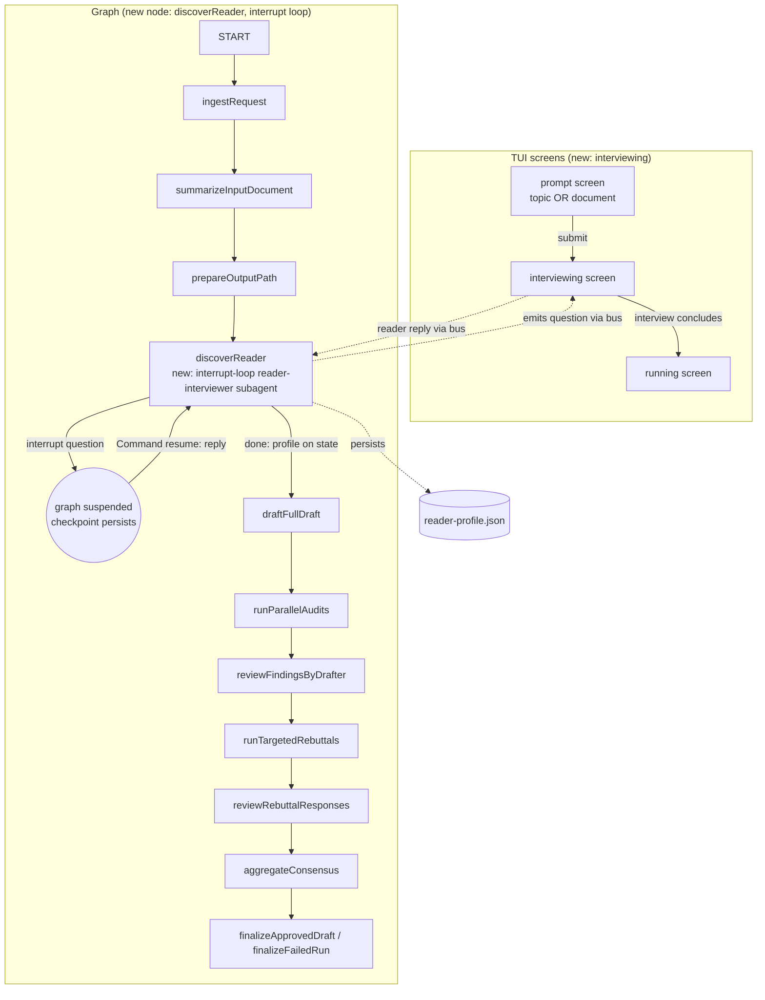

# Reader Discovery — Implementation Plan

> Status: **decision document, not yet executed.**
> Source skill: `implementation-plan`.
> Companion to the recovery-router plan in `docs/plan/recovery-router/`.

## Goal

Before the quorum writes anything, run an **interactive multi-turn interview** with the reader that discovers, per prerequisite concept, what the reader already knows and what they are trying to accomplish. Thread that signal through every agent in the quorum so the final document is calibrated to *this reader* — including a Prerequisites section for concepts the reader lacks. The interview runs for **both topic mode and document mode**.

## Starting point, driving problem, and finish line

**Starting point.** The pipeline today is: submit a topic or document → `ingestRequest` → `summarizeInputDocument` → `prepareOutputPath` → `draftFullDraft` → auditors → rebuttals → final document (`src/graph.ts` edge chain). There is no reader signal anywhere. Every run produces one document for one phantom "competent practitioner" reader regardless of who asked. The just-removed `scope-classifier`/depth-tier system (commit `2224a41`) tried to size the *quorum* from the topic string; it was dead code and is gone. The quorum is now correctly generic and global-sized.

**Driving problem.** "What is goroutine?" for a Go expert and for a Python dev are different documents. "What is MLX?" could mean "should I switch from PyTorch", "how do I write a custom kernel", or "is this real or hype" — four different documents from one topic string. Topic-derived signal cannot tell these apart; only the reader can. And readers do not reliably self-report ("do you know PyTorch?" → yes from a tutorial-once user, no from an impostor-syndrome daily user). Free-text blurbs force the user to structure their own knowledge, which they often cannot do for a topic they're trying to learn. The same is true for document mode: pasting a long document does not reveal which parts the reader already understands vs. is trying to learn.

**Finish line.** A reader submits a topic *or* a document. A multi-turn interview runs in the TUI, asking targeted probes per prerequisite concept ("do you know what a scheduler is? a channel?"), adapting based on answers, with the interviewer using research tools to look up what the topic actually depends on. It produces two structured artifacts: a per-concept `readerProfile` (`[{ concept, level, evidence? }]`) and a `learningGoal` (intent). Both are persisted to `reader-profile.json` and injected into **every** agent prompt in the quorum — drafter, all three auditors, rebuttal, drafter-review. The final document includes a Prerequisites section covering concepts at `unknown`/`heard-of` and is calibrated to the reader's demonstrated level. The interview runs to completion (no mid-interview skip); the only exit is Ctrl-C, which aborts the run.

## Constraints and assumptions

**Constraints.**
- The quorum stays generic and global-sized. `maxRounds`, `auditors`, `requireUnanimousApproval` come from the top-level `quorum.config.json` fields and are not modified by reader signal. (Confirmed: this is the post-`2224a41` state; `aggregateConsensus` reads `config.quorumConfig.auditors` always.)
- All three auditors run on every run regardless of reader level or topic. A light ELI5 and a 10000-word paper both get all three. (User requirement; matches current code.)
- The interview runs for **both** topic mode and document mode. In document mode, the document is the request/topic context (the reader pasted it because they want to learn what's in it); the interview still discovers the reader's baseline against that context.
- No external services beyond the existing OpenCode server. The interviewer is a subagent on the same OpenCode instance.

**Assumptions (call out before execution if wrong).**
- The OpenCode subagent can carry a multi-turn conversation within one session via repeated `client.session.prompt` calls (the same mechanism `promptAgent`'s recovery A-branch uses for in-session reprompts — `src/opencode.ts`). **Inferred — confirm against the SDK before Phase 1.** (If false, the LangGraph `interrupt` path in Decision D still works — each turn is a fresh `promptAgent` call with the transcript re-sent, because the canonical state lives in `ResearchState`, not the OpenCode session.)
- Quorum is invoked as one long-lived process per run. Inferred from `src/tui/App.tsx` `startRun` spawning one `runResearchPipeline` per submission.
- The TUI can render a chat-like surface with a scrollable history and a single input line. `@opentui/react` has `<input>` and `<text>` primitives (Confirmed: `src/tui/components/PromptScreen.tsx`); a scrollable column is buildable but has no existing precedent in this repo.

## Current state

The relevant code, with file paths:

- **Input collection** — `src/tui/components/PromptScreen.tsx`: a single `<input>` field per mode (topic/document/design). `onSubmit({ inputMode, ... })` flows to `App.startRun` (`src/tui/App.tsx`) → `runResearchPipeline({ request, bus, ... })` (`src/runner.ts:122`). No second input step exists.
- **Graph entry** — `ingestRequest` (`src/graph.ts:535`) parses `inputRequestSchema` (`src/schema.ts:54`, a discriminated union on `inputMode`) and seeds `baseState`. Both modes flow through `summarizeInputDocument` (which sets `state.inputSummary` for documents) → `prepareOutputPath` → `draftFullDraft`.
- **Prompt construction** — `fullDraftPrompt` (`src/graph.ts:127`), `auditPrompt` (`:138`), `rebuttalPrompt` (`:179`), `rebuttalReviewPrompt` (`:190`), `drafterReviewPrompt` (used at `:790`). All take `state` or `requestLabel(state)` (`:97`). `requestContextBlock(state)` (`:121`) already branches on `inputMode` (topic → `state.topic`, document → `state.documentText`). These are the injection points.
- **Research tools (config-defined)** — `config.quorumConfig.researchTools` (`prefer: ["context7","exa","grepapp"]` + `webSearchProvider: "exa"` in `quorum.config.json`) is surfaced to agents as prompt guidance by `researchToolBlock(config)` (`src/graph.ts:108`), which is injected into `fullDraftPrompt`. This is what "research tools" means in this plan — the config-defined tool preferences, not the OpenCode permission primitives. The interviewer gets the same `researchToolBlock(config)` injected into its prompt. **Separately**, for that guidance to be actionable the agent definition must *permit* the underlying OpenCode tools (`websearch`/`codesearch`/`webfetch: allow`); that permission layer is the enabling mechanism beneath `researchToolBlock`, not "research tools" itself.
- **Human-in-the-loop precedent** — **there is none for user input.** `interactiveEnhance` (`src/graph.ts:1556`) is misnamed: it runs an enhancer agent automatically with no user input. The `agent.permission` event flow (`src/runner.ts:48`) emits permission events to the bus, but `replyToPermission` (`src/opencode.ts:857`) is **never called from the TUI**. **However**, the checkpoint-resume mechanism exists: design-resume at `src/runner.ts:763` does `graph.invoke(null, { configurable: { thread_id, checkpoint_id } })` to continue a paused graph from its checkpoint. LangGraph `@langchain/langgraph` v1.2.9 exports `interrupt` and `Command` (Confirmed: `node_modules/@langchain/langgraph/dist/index.d.ts`) — the native human-in-the-loop primitives. So the interview is the first *true* human-in-the-loop, but it builds on the existing resume plumbing.
- **JSON-output subagent pattern (mirrors auditors)** — the existing auditors are the template for a structured-output agent. The `promptAgent` call sets `outputFile` + `schema` (`src/graph.ts:668-675`: `outputFile: .../audit-${agent}-round-${round}.json`, `schema: auditResultSchema`); the agent definition grants `edit: "runs/**/audit-source-auditor-*.json": allow` + `read: "runs/**": allow` (`.opencode/agents/source-auditor.md`); the **agent writes the JSON file itself** and `promptAgent` reads it back file-first (`src/opencode.ts:556`, `readOutputFile`). Phase 4 persistence is only the fallback for inline returns. The interviewer follows this exact pattern with `outputFile: .../reader-profile.json` and `edit: "runs/**/reader-profile.json": allow`. The deleted `scope-classifier` (`2224a41^`, git) is **not** the right template — it denied all tools and returned inline JSON; the interviewer needs the auditor's file-writing + read/edit permissions plus the research-tool permissions.
- **Run artifact + surfacing** — `writeRunJsonArtifact` (`src/output.ts`) writes JSON to the run dir; the view-server dispatches cards by filename (`src/view-server.ts:535`), e.g. `renderRequestCard` for `request.json` (`:308`). The just-removed `depth-tier.json` slot, `summarizeNodeState` case, and Dashboard badge are the exact slots to repurpose.

## What is actually causing the problem

The phantom reader. Every prompt-contract function in `src/graph.ts` builds its prompt from `state.topic` / `state.documentText` plus static prompt assets — nothing about who is asking. The clarity auditor (`assets/prompts/audit.md`) judges "clarity" against an unstated default reader, so for an expert reader it flags "too basic" and for a beginner "assumes too much," producing findings that reflect the auditor's default-reader assumption rather than a real defect. The drafter has no way to know which prerequisite concepts to include. This is not a missing feature tacked on top of a working system; it's a missing input to every prompt-contract function.

## Intuition and mental model of the change

The mental model that matters: **the interview is not a new "phase" bolted on top of the quorum — it is a new input that feeds the same prompt-contract functions.** The quorum already has `requestLabel(state)` threaded into every prompt. The profile becomes a peer of `requestLabel`: a `readerContextBlock(state)` function that returns either "Reader profile: ..." or an empty string (default-reader fallback), inserted into the same prompt arrays.

The second mental model that matters: **the interview is a LangGraph `interrupt` loop, not a bespoke state machine.** The `discoverReader` node calls `interrupt(question)` to pause the graph each turn. The graph checkpoint persists (the same `BunSqliteSaver` the design-resume path uses). The runner catches the pause, surfaces the question via the bus, the TUI collects the reply, and the runner resumes the graph with `Command({ resume: reply })`. To the node code it looks like a loop that yields one question per iteration; to the graph it's a clean suspend/resume with full checkpoint support.

One concrete flow, "What is MLX?" (topic mode):

1. Reader submits the topic. TUI switches to a new `interviewing` screen.
2. `discoverReader` node runs turn 1: calls `reader-interviewer` subagent with the topic context (`requestContextBlock(state)`, same as the drafter gets) + `researchToolBlock(config)` (the config-defined research-tool preferences). The interviewer may use the configured research tools (context7/exa/grepapp) to look up "what does MLX depend on." It writes the turn JSON to `reader-profile.json` (auditor pattern: `outputFile` set, agent writes the file, `promptAgent` reads it back). The parsed turn is `{ question: "What are you trying to do with MLX?", done: false }`. The node calls `interrupt(question)` → graph suspends, checkpoint persists.
3. Runner surfaces the question via a bus event; TUI renders it. Reader types a reply. TUI sends the reply back via the bus. Runner resumes the graph with `Command({ resume: reply })`.
4. Turn 2+: the node appends the reply to the transcript in `ResearchState`, calls the subagent again with the full transcript so far. The interviewer returns the next probe: `{ question: "Do you know what a computational graph is? what backprop computes?", done: false }` → `interrupt` → reply → resume.
5. After the generous turn cap (Decision B, default 6) OR when the interviewer returns `{ done: true, profile: { learningGoal, concepts: [...] } }`, the node stops. The profile is already on disk in `reader-profile.json` (the agent wrote it on the final turn via the auditor `outputFile` pattern; no separate `writeRunJsonArtifact` call). The node sets `state.readerProfile`/`state.learningGoal` from the parsed result and returns. Graph proceeds to `draftFullDraft`.
6. `fullDraftPrompt` now includes `readerContextBlock(state)` → "Writing for a reader who knows tensor ops and PyTorch basics, does NOT know autograd or GPU memory. Goal: deciding whether MLX is worth learning. Include a Prerequisites section covering: autograd, GPU/memory fundamentals." The drafter writes that document.
7. `clarity-auditor` gets the same `readerContextBlock` in its `auditPrompt` → judges clarity *for this reader*, stops flagging the autograd prereq section as "too basic."
8. Final document is calibrated. The profile never touched `maxRounds` or `auditors`.

Document mode is the same flow; only the topic context differs (`state.documentText` / `state.inputSummary` instead of `state.topic`). The interviewer researches/asks probes against whatever the document is about.

**Why this changes the recommendation:** the profile is *data flowing through existing prompt functions*, not a control-flow change to the quorum. That keeps the blast radius small and is exactly why the just-removed depth-tier approach (which changed control flow — per-tier auditor lists) was wrong. The interview changes *what the prompts say*, not *how many agents run*. And the `interrupt`-based loop reuses the existing checkpoint/resume plumbing rather than inventing a new interaction mechanism.

## Decisions resolved

These were the hard design questions. They are now decided.

### A — prerequisite hypothesis source: **A2 (fully adaptive) + research tools**

The interviewer does **not** get a separate topic-primer pre-call. Instead it is fully adaptive: it starts broad ("have you used any ML framework?") and narrows based on answers, discovering the prerequisite tree empirically. **Crucially, the interviewer has the config-defined research tools** (`researchToolBlock(config)` in its prompt, backed by `websearch`/`codesearch`/`webfetch: allow` permissions in its agent def) so it can look up what the topic depends on when it needs to — this is what keeps A2 from wandering. The interviewer researches the topic *as needed during the interview*, then probes the reader against what it found. This avoids the "confidently-wrong primer" failure mode of a separate primer call while still giving the interviewer on-domain prerequisite hypotheses.

### B — stopping rule: **B1, generous cap, no confidence floor**

Stop when `turn >= maxTurns` (config, default **6**) OR when the interviewer returns `done: true`. There is **no confidence floor** — confidence is not measured (point 4). The interviewer decides on its own when the profile is complete (it returns `done: true`); the turn cap is the backstop. The cap is generous (6) because there is no other termination signal and under-interviewing produces a thin profile.

### C — escape hatch: **none**

There is no mid-interview skip. The reader commits to the interview by submitting the topic/document. The only exit is Ctrl-C, which aborts the run entirely (existing behavior at `src/tui/App.tsx` Ctrl-C handler). **Implication to accept:** a reader who doesn't want to be interviewed must abort and re-run without the feature (via the `readerDiscovery.enabled: false` kill-switch in config). This is a deliberate choice — the feature's value depends on the interview actually running, and a skip path produces a default-profile run that is indistinguishable from today's phantom-reader output (no value added).

### D — interview state ownership: **D2 via LangGraph `interrupt`**

The interview is a **single `discoverReader` node that loops with `interrupt()`**. Each turn: the node calls the interviewer subagent, gets the next question, and calls `interrupt(question)`. The graph suspends (checkpoint persists via `BunSqliteSaver`). The runner catches the suspension, surfaces the question on the bus, collects the reply, and resumes with `Command({ resume: reply })`. The node receives the reply as the return value of `interrupt()` and continues the loop.

This is D2 (the state-machine approach) implemented via LangGraph's native primitive rather than a hand-rolled `awaiting_reader_reply` status + separate `readerReply` node. **Why this is the cleanest reading of D2:** it gives D2's checkpoint-resume robustness (a crash mid-interview resumes from the last checkpoint, re-asking the current question) with D1's code locality (one node, one loop). It reuses the exact resume pattern already in the codebase (`src/runner.ts:763` design-resume does `graph.invoke(null, { configurable: { thread_id, checkpoint_id } })`) plus a `Command({ resume })` value. The interview transcript persists in `ResearchState` (a new `interviewTranscript` array field) so it survives checkpoints and is available to the interviewer's next turn.

**Flag for execution:** confirm the `Command({ resume })` resume-value API against LangGraph 1.2.9 at execution time. The `interrupt`/`Command` exports are present (Confirmed); the exact resume invocation is the one SDK detail to nail in Phase 1's first commit.

## How the interviewer outputs questions (per-turn schema, auditor pattern)

The interviewer is a structured-output subagent that **follows the existing auditor JSON-output pattern**: each `promptAgent` call sets `outputFile` + `schema`, the agent writes the JSON file itself, and `promptAgent` reads it back file-first (`src/opencode.ts:556`). The per-turn Zod schema:

```
readerInterviewTurnSchema = z.object({
  question: z.string(),            // the next question to display to the reader; empty when done
  done: z.boolean(),               // true when the profile is complete
  profile: z.object({              // present only when done === true
    learningGoal: z.string().optional(),
    concepts: z.array(z.object({
      concept: z.string(),
      level: z.enum(["familiar", "heard-of", "unknown"]),
      evidence: z.string().optional(),   // what the reader said that justifies the level
    })),
  }).optional(),
})
```

The node loop (one `promptAgent` call per turn, all with `outputFile: ${state.outputPath}/reader-profile.json`):
1. Build the interviewer prompt: `researchToolBlock(config)` + `requestContextBlock(state)` + the transcript so far + "write JSON per the schema to the output file; ask one question; set `done: true` only when you have enough to fill the profile."
2. Call `promptAgent` with `schema: readerInterviewTurnSchema` and `outputFile: .../reader-profile.json`. The agent writes the turn JSON to the file; `promptAgent` reads it back and parses it. (If the agent returns inline instead, Phase 4 persistence writes it to the file — the same fallback auditors have.)
3. If `done === false`: `const reply = interrupt(turn.question)` (graph suspends). On resume, append `{ role: "interviewer", text: turn.question }` and `{ role: "reader", text: reply }` to `state.interviewTranscript`. Loop.
4. If `done === true`: `reader-profile.json` already contains the profile (the agent wrote it on this final turn). Set `state.readerProfile`/`state.learningGoal` from the parsed `turn.profile`. **No separate `writeRunJsonArtifact` call** — the auditor pattern handles persistence; the node only reads back what `promptAgent` already parsed.

Note on the file's mid-interview contents: on non-final turns `reader-profile.json` contains the current turn's JSON (a question), overwritten each turn. On the final turn it contains the profile. This is the same "output file reflects the latest agent output" semantics auditors have, and it's useful for live debugging (the view-server can show interview progress). The node never reads the file directly — it relies on `promptAgent`'s parsed return value, which is file-first.

There is **no `confidence` field** anywhere — not on concepts, not on the profile, not on the stopping rule. Levels are categorical (`familiar`/`heard-of`/`unknown`), justified by the free-text `evidence` field.

## Recommended approach

A new **pre-draft `discoverReader` graph node** between `prepareOutputPath` and `draftFullDraft` (the exact slot `classifyComplexity` vacated), implemented as a LangGraph `interrupt` loop. It is driven by a new **`interviewing` TUI screen** that renders a chat-like transcript and a single input line. The node loops a `reader-interviewer` subagent that **follows the auditor JSON-output pattern** (`outputFile` + `edit` permission + file-first read) and **has the config-defined research tools** (`researchToolBlock(config)` in its prompt, backed by `websearch`/`codesearch`/`webfetch: allow` permissions in its agent def). It is fully adaptive (Decision A2), bounded by a generous turn cap (Decision B, default 6), runs to completion with no skip path (Decision C), and suspends/resumes via `interrupt`/`Command({ resume })` (Decision D). The agent writes `reader-profile.json` itself each turn (auditor pattern); the node reads the profile back via `promptAgent`'s parsed return and sets two new `ResearchState` fields: `readerProfile` and `learningGoal` (plus `interviewTranscript` for the loop). A new `readerContextBlock(state)` function feeds those into `fullDraftPrompt`, `auditPrompt`, `rebuttalPrompt`, `rebuttalReviewPrompt`, and `drafterReviewPrompt`. The just-removed depth-tier surfacing slots (view-server card, `summarizeNodeState` case, Dashboard badge) are repurposed for the profile.

What is **not** changing: quorum size, auditor count, round/rebuttal budgets, the graph nodes after `draftFullDraft`, the design phase, the recovery router.

## Visual overview



What this shows: the interview is a **TUI screen ↔ graph node loop mediated by LangGraph `interrupt`** that sits between submit and the existing draft pipeline. The node suspends the graph each turn (checkpoint persists); the TUI renders the question from a bus event and sends the reply back; the runner resumes the graph with `Command({ resume: reply })`. After the node returns, the rest of the graph is unchanged except every prompt-contract function reads `state.readerProfile`/`state.learningGoal`. Both topic and document mode flow through the same path.

## Step-by-step implementation plan

Phases are dependency-ordered. Phase 1 is the minimum that proves the feature; Phase 2 is where the feature starts improving audit signal (vs. fighting it); Phase 3 is surfacing; Phase 4 is the optional adaptive upgrade.

### Phase 1 — profile + intent, threaded to drafter only

**Files to change:**
- `src/schema.ts` — add `readerProfileSchema` (`z.array(z.object({ concept: z.string(), level: z.enum(["familiar", "heard-of", "unknown"]), evidence: z.string().optional() }))`), `learningGoalSchema` (`z.string().optional()`), `interviewTranscriptSchema` (`z.array(z.object({ role: z.enum(["interviewer", "reader"]), text: z.string() }))`), and `readerInterviewTurnSchema` (the per-turn output schema from the section above). Add `readerProfile`, `learningGoal`, and `interviewTranscript` as optional fields on `researchStateSchema`. No changes to `inputRequestSchema`/`graphInputSchema` — the interview derives the profile from the existing topic/document input.
- `.opencode/agents/reader-interviewer.md` — new agent. **Mirrors the auditor permission pattern** (`.opencode/agents/source-auditor.md`): `read: "runs/**": allow` + `edit: "runs/**/reader-profile.json": allow` (scoped to its own output file, exactly like the auditor's `edit: "runs/**/audit-source-auditor-*.json": allow`). **Plus the research-tool enabling permissions** (`websearch: allow`, `codesearch: allow`, `webfetch: allow`) so the config-defined research tools (`researchToolBlock(config)`) are actionable. Denies bash/task/skill/todowrite/question/glob/grep/list. Model: a capable model (the interviewer's probing quality is the feature's core; do not use the cheapest model — `opencode-go/glm-5.2` or similar).
- `assets/prompts/reader-interview.md` — new prompt asset: the interviewer system prompt. Specifies: ask one question at a time; use research tools to look up what the topic depends on when you're unsure; cover `learningGoal` first, then probe each prerequisite concept; never exceed the turn budget; on the final turn set `done: true` and return the full profile; output strictly per the JSON schema.
- `src/prompt-assets.ts` — register `readerInterview` in `promptAssetFiles`.
- `src/graph.ts` — new `discoverReader` node function implementing the `interrupt` loop (Decisions A2/D, schema from above). Each turn: build prompt from `researchToolBlock(config)` + `requestContextBlock(state)` + `state.interviewTranscript` + the interviewer asset; call `promptAgent` with `schema: readerInterviewTurnSchema` AND `outputFile: ${state.outputPath}/reader-profile.json` (auditor pattern — the agent writes the file, `promptAgent` reads it back file-first); if `!done`, `interrupt(turn.question)`, append Q+A to transcript on resume, loop; if `done`, set `state.readerProfile`/`state.learningGoal` from the parsed `turn.profile` (the file is already written by the agent — **no `writeRunJsonArtifact` call**). **Runs for both `inputMode === "topic"` and `"document"`** (the prompt builder already branches on mode via `requestContextBlock`). New `readerContextBlock(state)` returning a prompt fragment or `""`. Inject `readerContextBlock` into `fullDraftPrompt` only in Phase 1. Add node + edges: `prepareOutputPath → discoverReader → draftFullDraft` (replacing the current direct edge). Import `interrupt` from `@langchain/langgraph`.
- `src/config.ts` + `quorum.config.json` — add `readerDiscovery: { maxTurns: z.number().int().positive().default(6), enabled: z.boolean().default(true) }`.
- `src/runner.ts` — handle the `interrupt` suspension: when `graph.invoke` throws/resolves with a `GraphInterrupt`-shaped result, extract the interrupt value (the question), emit a new `reader.interview_question` bus event, and wait for a `reader.reply` bus event; resume with `new Command({ resume: reply })` via `graph.invoke(command, { configurable: { thread_id, checkpoint_id } })`. This is the one genuinely new runner behavior — it extends the existing design-resume pattern (`:763`) with a resume value. Add `reader.interview_question` and `reader.reply` to the `RunnerEvent` union.
- `src/tui/App.tsx` — new `Screen` value `"interviewing"`. Transition `prompt → interviewing` on submit (instead of `prompt → running`). Transition `interviewing → running` when the `discoverReader` node completes (listen for `graph.node` end on `discoverReader`).
- `src/tui/components/InterviewScreen.tsx` — **new component.** Renders a scrollable transcript (questions from `reader.interview_question` events + user replies) and a single `<input>` line. Sends replies via a `reader.reply` bus event. No skip control (Decision C); only Ctrl-C quits the run (existing handler).

**Sequence of work:** schema → agent + prompt → prompt-assets → graph node (interrupt loop) → config → runner interrupt/resume → TUI screen → App wiring. The node can be developed and tested against a stubbed runner (hardcoded reply sequence) before the TUI screen exists.

**Phase 1 success criterion:** a topic-mode AND a document-mode run each produce a `reader-profile.json` on disk and a first draft that includes a Prerequisites section naming concepts at `unknown`/`heard-of`. Manual verification: run `bun run dev`, type "What is MLX?", answer the interview, confirm the draft includes prereqs matching the answers; repeat with a pasted document.

### Phase 2 — thread the profile to auditors and rebuttals

**Files to change:**
- `src/graph.ts` — inject `readerContextBlock(state)` into `auditPrompt`, `rebuttalPrompt`, `rebuttalReviewPrompt`, `drafterReviewPrompt`. Several already take `state`; `auditPrompt` currently takes `request: string` — change it to take `state` and derive `request` internally (or pass `readerContextBlock(state)` as an extra arg).
- `assets/prompts/audit.md` — add a section: "The reader's profile is below. Judge clarity *for this reader*, not for a default reader. Note: the profile gates explanation depth, not factual rigor — still flag correctness/logic defects." (The injection is data; the prompt asset gains a placeholder `{readerContext}` consumed by the prompt-contract function.)

**Phase 2 success criterion:** in a run where the reader is an expert, the clarity auditor does **not** flag the (intentionally basic) Prerequisites section as "too basic." In a run where the reader is a beginner, it does **not** flag jargon-heavy sections as "assumes too much." This is the feature's value moment — the quorum stops fighting the reader calibration.

### Phase 3 — surfacing (view-server + TUI badge)

**Files to change:**
- `src/view-server.ts` — new `renderReaderProfileCard` (mirror `renderRequestCard` at `:308`), dispatched on `filename === "reader-profile.json"` in the card dispatcher (`:535`). Repurpose the just-removed `depth-tier.json` read block slot to read `reader-profile.json` for a header label. Add a pipeline row for `discoverReader` (repurpose the removed `classifyComplexity` row slot).
- `src/live-status.ts` — repurpose the removed `summarizeNodeState` `classifyComplexity` case: `if (node === "discoverReader") return { concepts: s.readerProfile?.length, goal: s.learningGoal }`.
- `src/tui/components/Dashboard.tsx` — repurpose the removed `depth:` badge slot: a one-line `reader: {N concepts} · {goal snippet}` badge shown during/after the run.

**Phase 3 success criterion:** the view-server run page shows a Reader profile card with the per-concept table and the learning goal; the live pipeline shows the `discoverReader` step; the TUI shows the badge.

### Phase 4 (optional) — adaptive interview upgrades

Only if Phase 1–2 show the fixed-cap interview is too thin or too long. Candidates: per-concept drill-down when a probe answer is ambiguous, "the reader asked a clarifying question back" branch, interviewer-side dynamic turn budget based on prerequisite breadth. Out of scope unless the data demands it.

## UI sketch and component map

### Interview screen (new)

```
┌─ research-qurom ─────────────────────────────────┐
│                                                  │
│ 🎙 reader interview · "What is MLX?"             │
│                                                  │
│ ┌────────────────────────────────────────────┐   │
│ │ 🤖 what are you trying to do with MLX?     │   │
│ │    decide if it's worth learning for       │   │
│ │    side projects                           │   │
│ │                                            │   │
│ │ 🤖 have you used any ML framework before?  │   │
│ │    yes, pytorch, but only tutorials        │   │
│ │                                            │   │
│ │ 🤖 do you know what a computational graph  │   │
│ │    is? what backprop computes?             │   │
│ │ ▌                                          │   │
│ └────────────────────────────────────────────┘   │
│                                                  │
│ ┌────────────────────────────────────────────┐   │
│ │ type your answer...                       ▌│   │
│ └────────────────────────────────────────────┘   │
│ Enter: send · Ctrl-C: quit                       │
└────────────────────────────────────────────────┘
```

(Note: no `Tab: skip` line — Decision C. The only exit is Ctrl-C, which aborts the run.)

### Component map

```
App
├─ Screen: "prompt"      → PromptScreen (existing, unchanged)
├─ Screen: "interviewing" → InterviewScreen (NEW)
│   ├─ props: store (transcript from bus events), onReply
│   ├─ state: draftInput (local, cleared on send)
│   ├─ renders: scrollable <text> history + <input> line
│   └─ emits: reader.reply via bus
└─ Screen: "running"      → Dashboard (existing + new reader badge)
```

**State ownership:**
- The **transcript** lives in the `RunStore` (new `readerInterview` slice) populated by `reader.interview_question` events + echoed replies, mirroring how `agent.tool` events populate `agents` today (`src/tui/state/runStore.ts:181`).
- The **user's draft input** is local `InterviewScreen` state (cleared on send).
- The **canonical profile + transcript** live in `ResearchState` (`readerProfile`, `learningGoal`, `interviewTranscript`) set when the node completes, and in `reader-profile.json` on disk (written by the agent each turn via the auditor `outputFile` pattern, not by the node). The `interviewTranscript` is updated each turn (before the `interrupt`) so it survives checkpoints.

**Responsive differences:** none material — the TUI is terminal-sized; the interview surface uses the same `useTerminalDimensions` pattern as `PromptScreen`. A very short terminal (<20 rows) truncates the transcript to the last N turns.

## Risks and failure modes

1. **Fully-adaptive interviewer wanders / never converges (Decision A2).** Without a separate primer, the interviewer may ask off-domain probes or burn turns without covering the prerequisites that matter. *Mitigation:* the interviewer has the config-defined research tools (`researchToolBlock(config)` + the `websearch`/`codesearch`/`webfetch` permissions) so it can look up what the topic depends on rather than guessing; the generous turn cap (6) bounds the cost; the interviewer prompt instructs it to research the topic before probing. *Detection:* Phase 1 manual runs — inspect `reader-profile.json` and confirm the concepts are on-domain.
2. **Interview abandonment with no escape hatch (Decision C).** A reader who doesn't want to be interviewed must Ctrl-C (aborting the run) and re-run with `readerDiscovery.enabled: false`. *Mitigation:* this is an accepted trade-off, not a bug — the feature's value depends on the interview running. The kill-switch exists for users who opt out. *Detection:* telemetry on how often users Ctrl-C during the interview vs. complete it; if abandonment is high, revisit Decision C.
3. **OpenCode session multi-turn assumption fails (Assumption).** If `client.session.prompt` does not carry conversation state across calls in one session, the interviewer can't reference prior answers within a session. *Mitigation:* the node re-sends the full `interviewTranscript` on every call, so the interviewer is stateless across calls — it sees the whole conversation each turn. The LangGraph `interrupt` path makes this natural (state lives in `ResearchState`, not the OpenCode session). *Detection:* Phase 1 manual test — confirm the interviewer references prior answers (from the transcript in its prompt).
4. **LangGraph `interrupt`/`Command({ resume })` API details.** The exports are present in v1.2.9 (Confirmed), but the exact resume invocation (whether `Command({ resume })` is passed as the `invoke` input or via a config field) needs nailing in Phase 1's first commit. *Mitigation:* the existing design-resume (`runner.ts:763`) already does checkpoint-based `graph.invoke(null, ...)`; the only new piece is the resume value. *Detection:* Phase 1 first commit — wire a single `interrupt` + resume and confirm it round-trips a value.
5. **TUI has no chat-surface precedent.** `@opentui/react` has `<input>` and `<text>` but no scrollable-list primitive in this repo. *Mitigation:* render the transcript as a column of `<text>` nodes inside a `<box>` with fixed height, truncating to the last N turns (the same manual layout `PromptScreen` uses). *Detection:* Phase 1 manual render test.
6. **Checkpoint resume mid-interview.** With `interrupt`, a crash mid-interview resumes from the last checkpoint and re-asks the current question (the transcript up to that point is in `state.interviewTranscript`, persisted by the saver). This is a genuine strength of Decision D — no special handling needed. *Verify* in Phase 1.
7. **Profile makes auditors *too* lenient.** If "judge clarity for this reader" is read as "don't flag anything the reader wouldn't notice," the clarity auditor stops catching real defects. *Mitigation:* the Phase 2 audit prompt asset must distinguish "clarity for this reader" from "correctness" — the profile gates *explanation depth*, not *factual rigor*. *Detection:* Phase 2 manual run — confirm auditors still flag factual/logic defects.
8. **Profile schema too rigid.** The `{concept, level, evidence}` triple may not capture nuance (e.g. "knows PyTorch but not custom CUDA kernels"). *Mitigation:* the `evidence` field captures the nuance; Phase 4 can add sub-concepts if needed. *Acceptable for v1.*
9. **Document mode interview feels odd.** A reader who pasted a long document may be surprised to be interviewed about their background. *Mitigation:* the interviewer's first question in document mode can acknowledge the document ("You've shared a document on X. To calibrate the explanation, what's your background on...?"). *Detection:* Phase 1 document-mode manual run.

## Verification plan

**Commands:**
- `bunx tsc --noEmit` — clean after each phase.
- `bun test` — full suite green after each phase.
- New `tests/reader-discovery.test.ts` — stub the OpenCode client (reuse the `tests/json-repair.test.ts` harness pattern at `:45`): script a sequence of interviewer turns (`{ question, done: false }` × 3, then `{ done: true, profile: {...} }`) + 3 user replies; assert (a) `reader-profile.json` is written with the expected concepts/levels (no `confidence` field anywhere), (b) `state.readerProfile`/`state.learningGoal` are set, (c) the draft prompt contains the reader context block with prereq concepts at `unknown`/`heard-of` and excludes `familiar`, (d) the transcript persisted to state has all turns. Test both a topic-mode and a document-mode case.
- New tests for the prompt-injection: assert `fullDraftPrompt` includes the reader context (Phase 1); assert `auditPrompt` includes the reader context (Phase 2).

**Behaviors to verify manually:**
- "What is MLX?" (topic mode) with beginner answers → draft includes "Prerequisites: autograd, computational graphs, ..." section.
- Same topic with expert answers → draft omits the prereq section, goes deeper.
- Document mode: paste a document on a technical topic, answer the interview → draft includes prereqs the reader lacked.
- Clarity auditor (Phase 2) does not flag the expert draft's jargon as "assumes too much," and does not flag the beginner draft's prereq section as "too basic."
- View-server run page (Phase 3) shows the Reader profile card; live pipeline shows `discoverReader`.
- Ctrl-C during the interview aborts the run (no partial draft written as if it succeeded).
- `readerDiscovery.enabled: false` → `discoverReader` short-circuits to a default (empty) profile and the run proceeds as today, no interview screen.

**Regression checks:**
- Document mode end-to-end still works when `readerDiscovery.enabled: false`.
- Design phase unchanged — the profile is not injected into design prompts (out of scope for v1).
- Recovery router unchanged — `discoverReader` uses `promptAgent` and inherits D/A/B/C recovery; a malformed interviewer JSON triggers the router, not a crash. The `interrupt` is outside `promptAgent` and is not affected by the recovery router.

## Rollback or recovery plan

- **Per-phase rollback:** each phase is one commit (or a small set). Revert the commit to roll back that phase; earlier phases continue to work because the profile fields are optional and `readerContextBlock` returns `""` when absent.
- **Feature kill-switch:** `quorum.config.json` `readerDiscovery.enabled: false` → `discoverReader` node short-circuits to a default (empty) profile and the run proceeds as today, with no `interviewing` screen (App goes straight `prompt → running`). Add this gate in Phase 1.
- **Full rollback:** revert all phase commits. The schema fields (`readerProfile`, `learningGoal`, `interviewTranscript`) are optional, so older checkpoints still parse. The agent definition and prompt assets are additive files (deletable). The view-server card and TUI badge are additive (gated on the artifact existing). No data migration needed in either direction.
- **Run-artifact compatibility:** old runs without `reader-profile.json` render fine (the card is absent, same as today); new runs with the artifact render the card. No backfill.

## Sources

- `src/graph.ts:97` (`requestLabel`), `:108` (`researchToolBlock` — reused for the interviewer; this is the config-defined "research tools" guidance), `:121` (`requestContextBlock` — already branches on `inputMode` for both topic and document), `:127` (`fullDraftPrompt`), `:138` (`auditPrompt`), `:179`/`:190` (`rebuttalPrompt`/`rebuttalReviewPrompt`), `:535` (`ingestRequest`), `:668-675` (the auditor `promptAgent` call with `outputFile` + `schema` — the exact pattern the interviewer mirrors), `:1556` (`interactiveEnhanceNode` — the misnamed "interactive" precedent), edge chain near `:1899`.
- `src/schema.ts:44–54` (`inputRequestSchema` discriminated union — both modes), `:286+` (`researchStateSchema`), `:338` (`InputRequest` type).
- `src/tui/App.tsx` (`Screen` type — currently `"prompt" | "running"`; `startRun`; Ctrl-C handler).
- `src/tui/components/PromptScreen.tsx` — single-`<input>` pattern, `useTerminalDimensions`, `useKeyboard`.
- `src/runner.ts:40–65` (`RunnerEvent` union incl. `agent.permission` — closest precedent for bus-based agent round-trips), `:436` (`graph.invoke` call site), `:763` (checkpoint-resume via `graph.invoke(null, { configurable: { thread_id, checkpoint_id } })` — the exact pattern D2 extends with `Command({ resume })`).
- `src/opencode.ts:857` (`replyToPermission` — never called from TUI; confirms no prior human-in-the-loop), in-session reprompt pattern (the interviewer reuses `promptAgent`).
- `src/view-server.ts:308` (`renderRequestCard` — card pattern to mirror), `:535` (card dispatcher — injection point for `reader-profile.json`).
- `src/live-status.ts:285` (`summarizeNodeState` — repurpose the removed `classifyComplexity` case).
- `src/output.ts` — `writeRunJsonArtifact` (artifact writer).
- `.opencode/agents/source-auditor.md` — the permission block to mirror for the interviewer (`read: "runs/**": allow` + `edit: "runs/**/audit-source-auditor-*.json": allow` + `websearch`/`codesearch`/`webfetch: allow`). This is the JSON-output agent template, NOT the deleted `scope-classifier`.
- `node_modules/@langchain/langgraph/dist/index.d.ts` — confirms `interrupt` and `Command` are exported (v1.2.9); the native human-in-the-loop primitives D2 builds on.
- Git history `2224a41^` — deleted `scope-classifier.md` agent. **Not the right template for the interviewer** (it denied all tools and returned inline JSON); referenced only to document what was removed and why the interviewer diverges from it.
- `docs/plan/recovery-router/` — phase-brief format this plan follows.
