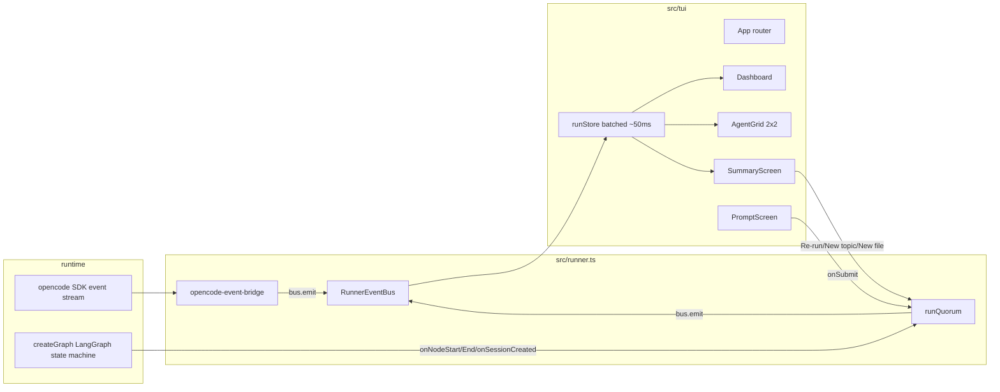
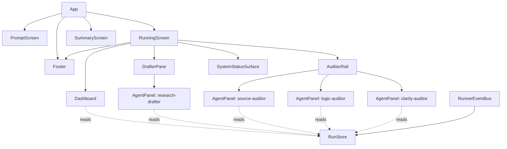

# TUI Implementation Plan: research-qurom

## 1. Goal

Replace the current line-printing CLI of `research-qurom` with a true terminal UI built on `@opentui/react`, so that a single screen shows:

- the overall run status (graph phase, round, outcome, telemetry)
- four live agent panels (one drafter + three auditors)
- a startup prompt for the input (topic or file)
- a post-run summary with re-run / new-input / quit actions

End state: `bun run dev` opens the TUI directly, the user picks an input mode (topic or compose-document), watches the run in a drafter-primary split view inspired by `reference/opencode` (main drafter pane + compact auditor rail + metadata/status surfaces), and on completion picks one of {Re-run same input, New topic, New document, Quit}. No CLI flags. No plain log fallback. Document input is composed in the user's `$EDITOR` (full markdown editing, not a file path picker).

## 2. Starting point, driving problem, and finish line

**Starting point.** `src/index.ts` (180 lines) parses `--topic`/`--file`, prints a JSON status block when no input is given, then calls `createGraph(...).invoke(...)` while `src/telemetry-enrichment.ts` subscribes to the opencode SDK's `client.event.subscribe()` stream and writes `[role] ...` lines to stdout (`src/telemetry-enrichment.ts:57-60`, gated by `process.stdout.isTTY` at `src/telemetry-enrichment.ts:36`). When the run finishes, `src/index.ts:160-176` prints another JSON blob and the process exits.

**Driving problem.** Four agents run in parallel (one drafter `research-drafter` plus three auditors `source-auditor`, `logic-auditor`, `clarity-auditor` per `quorum.config.json:1-7`) and each emits assistant text, reasoning, tool calls, permissions, and status events at the same time. They are interleaved into one stdout stream and prefixed only with a role tag, so the user has to scroll back through hundreds of lines to follow any one agent. There is also no live indication of which graph node is running, what round we are in, how many tool calls each agent has made, or whether the run has converged. After the run, the user has to re-launch the process to start over.

A second, smaller problem: the file `src/telemetry-enrichment.ts` is misnamed. It does not "enrich telemetry" — it subscribes to the opencode SDK event stream, decodes session/message/permission/tool events into per-role progress lines, and (as a side effect) opens Langfuse tool observations. Anyone reading the codebase has to open the file to learn what it does. The rewrite is the right time to rename it to something that matches its real responsibility.

**Finish line.** A single TUI process where:

- a thin status/header strip shows phase, round, run id, output dir, trace id, and compact live counters
- a running screen below uses a drafter-primary split layout: the drafter owns the main reading surface, auditors live in a compact rail that can still stream live reasoning/tool activity, and secondary metadata moves into lighter side/footer surfaces
- the user is prompted for input on startup (no flags); document input opens `$EDITOR` so the user composes the source markdown in their normal editor
- a post-run screen offers Re-run / New topic / New document / Quit and the same process keeps running across runs
- the TUI is the only UI; no plain mode
- the file that bridges opencode events into our event bus is named for what it does

The plan must connect the existing event sources (graph node observer, session events, opencode SDK event stream) to a typed event bus that drives a React component tree with no lost events and no duplicated events across re-runs.

## 3. Constraints and assumptions

**Hard constraints.**

- Default to Bun, but no Bun-only APIs (must work on Bun/Node/Deno) — `reference/opentui/AGENTS.md:14-16`.
- Bun loads `.env` automatically; do not depend on `dotenv` even though it is in `package.json:20` (it can stay; just no new uses).
- Style per opentui repo: oxfmt (no semicolons, printWidth 120), strict TS, explicit imports, minimal comments, no JSDoc — `reference/opentui/AGENTS.md:46-57`.
- `console.log` is **invisible** to the user while the alt-screen renderer is active; the renderer captures it. Anything that wants to surface to the user must go through the React tree or `renderer.console.show()` (`reference/opentui/packages/react/README.md:175-181`).
- The opencode SDK event subscription is one stream per call; calling `start()` twice without awaiting `stop()` will produce two parallel subscribers and double-fire every event. Existing `start/stop` lives at `src/telemetry-enrichment.ts:143-345`.
- Reasoning deltas arrive in tight bursts (`message.part.delta` is buffered and flushed only on punctuation/length at `src/telemetry-enrichment.ts:66-83`). React must batch these or the renderer will thrash.

**Assumptions (labelled).**

- *Confirmed*: the four roles in the UI come from `config.quorumConfig.designatedDrafter` + `config.quorumConfig.auditors` (`quorum.config.json:1-7`, surfaced by `src/index.ts:64-69`). The plan hard-wires "1 drafter + N auditors". The ambitious UI pass (new Phase 07.5) changes the presentation from an equal 2x2 grid to a drafter-primary split view while still keeping all four agents visible.
- *Confirmed*: every agent has exactly one opencode session, registered through `observer.onSessionCreated({ sessionID, role })` in `src/graph.ts:1244-1255`, and `role` is one of `"root" | "drafter" | "auditor:<name>"`.
- *Inferred*: the runner only ever runs one quorum at a time (graph state and checkpointer are per-thread keyed on `requestId` at `src/index.ts:124-128`). The TUI assumes serial runs.
- *Speculative*: the user's terminal is at least ~100 cols x 30 rows. Below that, a drafter-primary split view loses too much horizontal room, so we collapse to a vertical stack with the drafter first and auditors below; at very small sizes we still need a dedicated "Terminal too small" banner.
- *Confirmed*: opentui's `CliRenderer` exposes `suspend()` and `resume()` (`reference/opentui/packages/core/src/renderer.ts:2107-2165`). `suspend()` pauses the render loop, disables mouse + raw mode, releases the stdin listener, and calls the native `suspendRenderer`; `resume()` restores raw mode, drains buffered stdin, re-attaches the listener, and re-clears the back buffer. This is exactly the lifecycle needed to hand the terminal to `$EDITOR` and take it back. The TUI's `$EDITOR` integration (Step 5) calls these directly — no destroy/recreate.

**Why this changes the plan.** The "no double subscriber" and "console.log is invisible" constraints force two structural decisions: (a) the event subscriber must be owned by the runner and stopped/awaited between runs, and (b) we cannot leave any `logProgress` calls; every existing log site must become a typed event on a bus.

## 4. Current state

What runs today, in the order it runs:

1. `src/index.ts:52-57` loads config, ensures the artifact dir, validates opencode prerequisites.
2. `src/index.ts:84-93` constructs `createTelemetryEnrichment(config)` and starts its event subscriber. The subscriber lives in `src/telemetry-enrichment.ts:143-340` and:
   - listens via `client.event.subscribe({}, { signal })` (line 147)
   - turns `session.status`, `session.error`, `permission.asked`, `message.updated`, `message.part.delta`, `message.part.updated` (tool + reasoning) into `console.log` lines via `logProgress` (line 57-60)
   - tracks reasoning buffers and flushes on punctuation/length (`shouldFlushReasoning`, `flushReasoning`, lines 66-83)
   - opens Langfuse "tool" observations on tool start and ends them on tool complete/error (lines 281-330)
3. `src/index.ts:100-154` calls `createGraph(...).invoke(input, { configurable: { thread_id: requestId } })`. The graph (`src/graph.ts:1232-1311`) walks: `ingestRequest -> bootstrapRun -> draftInitial -> runParallelAudits -> reviewFindingsByDrafter -> {runTargetedRebuttals -> reviewRebuttalResponses}* -> aggregateConsensus -> {reviseDraft -> runParallelAudits | finalizeApprovedDraft | finalizeFailedRun}`. Each node calls `observer.onNodeStart/onNodeEnd` (lines 1175-1213).
4. On exit, `src/index.ts:160-179` prints a JSON summary, awaits `telemetry.shutdown()` and `progress.stop()`.

State machine values used as the dashboard's phase badge (from `src/graph.ts`):
`drafting -> auditing -> reviewing_findings -> awaiting_auditor_rebuttal -> reviewing_rebuttal_responses -> aggregating -> revising | approved | failed`.

`package.json:6-9` currently has `dev`/`start` both pointing at `src/index.ts`. `tsconfig.json` has no JSX config and `lib: ["ES2022"]`.

**Why this changes the plan.** Every event that the dashboard or panels need already exists in the system; nothing new has to be invented at the integration layer. The work is (a) re-routing those events from `console.log` to a typed bus, and (b) lifting the orchestration code out of `src/index.ts` so the TUI can call it on demand.

## 5. What is actually causing the problem

The problem is not "missing UI". It is that today's design glues four things together that should be separable:

1. **Argument parsing + process exit** are wired into the orchestration (`src/index.ts:9-50, 160-179`), so we cannot start a run from inside a long-lived TUI without forking a process.
2. **Live progress is printf, not data**. `logProgress` (`src/telemetry-enrichment.ts:57-60`) turns events into strings before any consumer sees them. A UI cannot recover the structured data (which agent, which tool, what status) from those strings.
3. **The event subscriber's lifetime is tied to the orchestration, not to the UI**. `start()`/`stop()` is owned by the index file; if the TUI wants to re-run, it has to be careful not to leak subscribers.
4. **The bridge file is misnamed**, which is small but real friction every time someone reads `src/index.ts` and sees `createTelemetryEnrichment` and has to open the file to find out it is actually the opencode event subscriber.

Solving (1) needs a `runQuorum()` function. Solving (2) needs the bridge code to emit typed events. Solving (3) needs `runQuorum()` to own the bus and tear it down on completion. Solving (4) is a rename, done as part of the rewrite.

**Why this changes the plan.** This is what justifies the "aggressive refactor" choice in section 7 instead of trying to scrape stdout into the TUI. There is no version of the TUI that works correctly while the events are still strings.

## 6. Intuition and mental model of the change

Imagine the run as a river of small typed events. Today the river goes through `console.log` and we let the user read the surface. The change moves the same river through a typed bus, and the React tree subscribes to it and decides what to show, where, and how.

End-to-end flow for one assistant reasoning chunk from `source-auditor`:

```
opencode SDK event ──▶ opencode-event-bridge ──▶ RunnerEventBus ──▶ runStore (batched ~50ms) ──▶ <AgentPanel role="source-auditor"/>
   message.part.delta     existing buffer logic    bus.emit({          dispatch reducer            scrollback append, tokens++
   field=text             (punctuation/length)      kind:"agent.reasoning",
                                                    role, text })
```

Two things make this easy to get wrong:

- **Double-subscribers across re-runs.** `client.event.subscribe()` opens one stream per call. If the TUI lets the user click "Re-run" before the previous subscriber has been awaited, the second run will receive every event twice and the dashboard counters will be inflated. The runner must not return until the subscriber has fully drained.
- **Render storms from delta bursts.** Reasoning text can arrive as 30+ deltas per second per agent. A naive `setState` on every event will repaint the terminal too often. The store batches dispatches inside a ~50ms tick and flushes once.

This intuition is the only reason the implementation steps below put `runQuorum()` and `RunnerEventBus` first and the React tree second.

## 7. Options considered

### Option A: Wrap stdout

Pipe `console.log` into the TUI, parse the existing `[role] ...` lines back into structured events.

- Pros: smallest diff to existing code.
- Cons: lossy (no structured tool call args, no token counts), brittle (string parsing of our own log format), and still doesn't solve the "console.log is invisible while the alt-screen is active" problem (`reference/opentui/packages/react/README.md:175-181`). Anything outside our parser pollutes the alt-screen.
- Verdict: rejected.

### Option B: Add a side-channel emitter alongside `logProgress`

Keep `console.log`, also emit events from inside `src/telemetry-enrichment.ts`.

- Pros: keeps current CLI working unchanged.
- Cons: two sources of truth, still need to silence `console.log` while the TUI runs (which means a flag), and the user explicitly asked to delete the plain mode.
- Verdict: rejected.

### Option C: Aggressive refactor — extract `runQuorum()` + typed event bus, rename and rewrite the bridge, replace `logProgress` with `bus.emit`, delete plain mode

- Pros: one source of truth for events, lifecycle is explicit, TUI can re-run cleanly. Matches the user's stated preference for an aggressive refactor.
- Cons: more code change up front; old `--topic`/`--file` flags go away.
- Verdict: **accepted**.

## 8. Recommended approach

Pick Option C. The work splits into three layers that can be built and verified in order:

1. **Runner layer** — `src/runner.ts` exposes `runQuorum({ config, prerequisites, request, bus, signal })` that wraps everything `src/index.ts:99-176` does today. It owns starting and stopping the opencode-event-bridge subscriber. It returns the same `runResult` shape that `createGraph().invoke()` already returns.
2. **Event layer** — rename `src/telemetry-enrichment.ts` to `src/opencode-event-bridge.ts` and rewrite it to take a `bus` and emit typed `RunnerEvent`s (`agent.reasoning`, `agent.tool`, `agent.message.start`, `session.status`, `session.error`, `agent.permission`, `agent.telemetry`). Keep the buffering logic from lines 66-83 unchanged. Drop the `liveConsole` gate at line 36 (no plain mode). Export `createOpencodeEventBridge`.
3. **TUI layer** — `src/tui/` with `index.tsx` (renderer + root), `App.tsx` (screen router), `state/runStore.ts` (reducer + batched dispatch), `components/{Dashboard,AgentGrid,AgentPanel,PromptScreen,SummaryScreen,Footer}.tsx`, and `theme.ts`.

The drafter gets a highlighted border (different `borderColor`) and the top-left grid slot. The keymap is **vim-style** (see Step 8): `h/j/k/l` for navigation, `j/k`/`Ctrl-d`/`Ctrl-u`/`gg`/`G` for scroll, `q` to quit, `r` to re-run.

**Why this is the best tradeoff.** The runner extraction is the smallest piece of code that lets the TUI re-run cleanly. The event bus is the smallest piece of data that lets four panels reconstruct their own state without parsing strings. Everything else (theme, dashboard density, summary card, vim keys, file rename) is presentation or hygiene on top.

## 9. Visual overview



The diagram matches the section names: `runQuorum`, `RunnerEventBus`, `opencode-event-bridge`, `runStore`, `Dashboard`, `AgentGrid`, `SummaryScreen`, `PromptScreen`. The arrows that matter most for correctness are the two going *into* `BUS`: those are the only event sources, and both are owned by `runQuorum`, which is what makes re-runs safe.

## 10. Step-by-step implementation plan

Order matters: the runner refactor has to land before the TUI can call it; the event types have to be defined before the bridge can emit them; only then can the React tree consume them.

### Step 1 — Dependencies and tsconfig

Files: `package.json`, `tsconfig.json`.

- Add deps: `@opentui/react`, `@opentui/core`, `react`, `@types/react`.
- Update `tsconfig.json` per `reference/opentui/packages/react/README.md:38-49`:
  - `"jsx": "react-jsx"`
  - `"jsxImportSource": "@opentui/react"`
  - `"lib": ["ESNext", "DOM"]`
  - keep `"strict": true`, `"skipLibCheck": true`, `"moduleResolution": "Bundler"`, `"allowImportingTsExtensions": true`.
- `include` should add `"src/**/*.tsx"`.
- Update `package.json` scripts: `"dev": "bun run src/tui/index.tsx"`, `"start": "bun run src/tui/index.tsx"`. Keep `typecheck`. Add `"test": "bun test"`.

### Step 2 — Define `RunnerEvent` and the bus

File: `src/runner.ts` (new).

- `type RunnerEvent` (discriminated union, `kind` field):
  - `lifecycle` — `phase: "starting" | "running" | "complete" | "error"`, `requestId`, `traceId?`, `outputDir?`
  - `graph.node` — `node`, `phase: "start" | "end"`
  - `session.created` — `sessionID`, `role` (raw role string from `src/graph.ts:1244-1255`)
  - `session.status` — `sessionID`, `role`, `status` (string, includes `retry N`)
  - `session.error` — `sessionID`, `role`, `name`, `message?`
  - `agent.message.start` — `role`, `messageID`
  - `agent.reasoning` — `role`, `text` (already buffered/flushed by the existing logic in `src/telemetry-enrichment.ts:66-83`)
  - `agent.tool` — `role`, `tool`, `status: "running" | "completed" | "error"`, `callID`, `error?`
  - `agent.permission` — `role`, `permission`
  - `agent.telemetry` — `role`, `tokensIn?`, `tokensOut?`, `toolCallsTotal?` (we can extend over time; emit what we have)
  - `result` — `runResult` shape returned by the graph (`src/index.ts:160-175` is the current shape)
- `createEventBus()` returns `{ emit, on, off }`. Internally a typed `EventTarget`-style or simple `Set<Listener>`. Synchronous emit is fine; the store batches.
- `runQuorum({ config, prerequisites, request, bus, signal? })`:
  - generates `requestId`, calls `createOpencodeEventBridge(config, { bus })`, awaits `bridge.start()`
  - constructs the `telemetry` from `createTelemetry(...)`
  - emits `lifecycle{phase:"starting", requestId, traceId, outputDir}`
  - calls `createGraph(...).invoke(...)` exactly as `src/index.ts:99-129` does, but routes `observer.onNodeStart/onNodeEnd/onSessionCreated` into `bus.emit(...)` instead of `progress.trackNodeStart/End/Session`
  - on success emits `result` then `lifecycle{phase:"complete"}`
  - on error emits `lifecycle{phase:"error", error}`
  - **always** awaits `telemetry.shutdown()` and `bridge.stop()` in a `finally` so the next run starts clean

### Step 3 — Rename and rewrite the opencode event bridge

Files: rename `src/telemetry-enrichment.ts` → `src/opencode-event-bridge.ts`. Update all importers (today only `src/index.ts:84` — that file is being deleted in Step 4, so this rename surfaces in `src/runner.ts` instead).

Rationale for the new name: the file's job is to subscribe to the opencode SDK event stream (`client.event.subscribe`, line 147) and convert SDK events into our internal events, plus open Langfuse tool observations on the way through. "Bridge" matches the pattern (one-way adapter from SDK events to our event bus); "opencode-event" pins the source. Reject `session-event-stream.ts` (too narrow — it also handles permissions/messages), `agent-events.ts` (ambiguous about who produces them), and keeping the old name (lies about purpose).

Rewrite changes inside the file:

- Exported function: `createOpencodeEventBridge(config, { bus })`. Drop the `liveConsole` branch (`lines 36, 85-100`); the TUI is always the consumer.
- Replace every `logProgress(role, text)` call site with the matching `bus.emit({ kind: ..., role, ... })`. The mapping is:
  - line 109 `session created` -> `session.created`
  - line 119/122 `node start/end` -> `graph.node`
  - line 179 `session ${nextStatus}` -> `session.status`
  - line 192 `session error` -> `session.error`
  - line 214 `permission asked` -> `agent.permission`
  - line 225 `assistant started` -> `agent.message.start`
  - line 237-242 reasoning buffer flush -> `agent.reasoning` (text is already trimmed/normalized by `flushReasoning`)
  - line 332-335 tool state -> `agent.tool`
- Per-role token/tool counters: keep a `Map<role, { tools: number, errors: number }>` updated on tool/error events and emit `agent.telemetry` after each change. Tokens can stay 0 until we wire model usage in.
- Add a guard so `start()` is a no-op when called twice without `stop()` in between (today's check at line 144 already handles this; preserve it).
- `persistArtifacts` keeps doing what it does; it just no longer logs anything.

### Step 4 — Delete the old entry point

Files: `src/index.ts`.

- Delete the file. `src/tui/index.tsx` is the new entry. The orchestration logic moves into `src/runner.ts`.

### Step 5 — Build the TUI shell

Files: `src/tui/index.tsx`, `src/tui/App.tsx`, `src/tui/theme.ts`, `src/tui/editor.ts`.

- `index.tsx`: `await loadRuntimeConfig()`, `await ensureArtifactDir(...)`, `await validateRuntimePrerequisites(...)`, `const renderer = await createCliRenderer({ exitOnCtrlC: false })`, `createRoot(renderer).render(<App config={...} prerequisites={...}/>)`.
- `App.tsx`: holds `screen: "prompt" | "running" | "summary"`, `currentRun: RunHandle | undefined`, and the last submitted `request` (so `r` can re-run). Tabs between screens based on lifecycle events.
- `theme.ts`: per-role accent colors (drafter: bright cyan border with `borderStyle: "double"` from `reference/opentui/packages/react/README.md:385`; auditors: muted single border in distinct hues), status colors (running/idle/error), background tokens.
- `editor.ts`: `openInEditor({ requestId, renderer })` returns `{ ok: true, content, path } | { ok: false, reason: "cancelled" | "empty" | "exit-code", code? }`. Steps inside:
  1. Resolve editor command: `process.env.VISUAL ?? process.env.EDITOR ?? "vi"`.
  2. Compute path: `runs/.drafts/<requestId>.md` under the configured artifact root. Create the dir lazily with `fs.mkdirSync(..., { recursive: true })`. If the file does not exist, write an empty file (so the editor opens cleanly and so re-runs reuse the same buffer).
  3. `renderer.suspend()` (releases the alt-screen, raw mode, and stdin listener — see `renderer.ts:2107-2132`).
  4. `spawnSync(cmd, [path], { stdio: "inherit", shell: false })` from `node:child_process`. `stdio: "inherit"` gives the child full control of the user's terminal.
  5. `renderer.resume()` in a `finally` so a crashing editor still restores the TUI.
  6. Read the file with `fs.readFileSync(path, "utf8")`. If `status !== 0` → `{ ok: false, reason: "exit-code", code: status }`. If trimmed content is empty → `{ ok: false, reason: "empty" }`. Otherwise return `{ ok: true, content, path }`.

The temp file persists across runs so "Re-run same input" can reuse `runs/.drafts/<requestId>.md` without re-opening the editor; "New document" generates a fresh `requestId` and therefore a fresh empty file.

### Step 6 — Run store with batched dispatch

Files: `src/tui/state/runStore.ts`, `src/tui/state/eventBindings.ts`.

- Store shape:
  ```
  {
    lifecycle: { phase, requestId?, traceId?, outputDir?, error? },
    graph: { node?, round, status },        // status mirrors ResearchState["status"]
    agents: Record<role, {
      sessionID?, status, lastEventAt,
      scrollback: Array<Entry>,             // {kind, text, ts}
      tokensIn, tokensOut, toolsTotal, toolsErrored,
      activeTool?: { tool, callID, startedAt },
      pendingPermission?: string,
    }>,
    result?: RunResult,
  }
  ```
- `eventBindings.ts`: `bindBusToStore(bus, store)` subscribes to all `RunnerEvent` kinds and queues reducer actions. A `setTimeout(flush, 50)` (or `queueMicrotask` if the queue stays small) coalesces bursts before a single `store.set(...)`.
- The reducer is a pure function `reduce(state, event) -> state`. This is what makes Step 11 testable.
- Roles map: incoming `role` is one of `"root" | "drafter" | "auditor:<name>"`; the store maps that to an internal role key matching `quorumConfig.designatedDrafter` and `quorumConfig.auditors[i]`. Root events go to the dashboard, not to a panel.

### Step 7 — Functional components

Files under `src/tui/components/`.

- `Dashboard.tsx` — the initial functional version can still be a simple two-row header, but treat it as temporary scaffolding: phase badge, round, request id, trace id, elapsed, compact per-agent stats, output dir. The ambitious layout pass moves the final hierarchy work to Step 7.5.
- `AgentGrid.tsx` — the initial functional version may still render all agents in a straightforward equal-weight layout so Phase 07 can prove the event/store plumbing. Do not over-invest in chrome here; the ambitious layout pass happens in Step 7.5.
- `AgentPanel.tsx` — functional bordered panel with a `<scrollbox focused={isFocused}>` of `Entry`s; header shows status dot, current tool name (if any), and a temporary "v new" indicator when the user has scrolled up and new content has arrived.
- `PromptScreen.tsx` — functional startup screen for "Topic" vs "Compose document". Topic mode shows a single-line `<input>`. Compose-document mode shows a one-line summary card (`runs/.drafts/<requestId>.md  ·  <N> chars  ·  press e to edit`) and three actions: `e` open `$EDITOR`, `Enter` submit (disabled while content is empty), `Esc` back to mode select. On submit, calls a passed `onSubmit({ inputMode: "topic" | "document", topic?, document? })` from `App` — `document` is the in-memory string returned from the editor, plus the path for display.
- `SummaryScreen.tsx` — functional summary card (outcome, round, approved agents, unresolved findings, output path, trace id) plus a `<select>` of `["Re-run same input", "New topic", "New document", "Quit"]`.
- `Footer.tsx` — temporary footer text. In the ambitious path, this should only show controls that are actually implemented at the current phase; do not treat the Phase 07 hint string as final UX.

### Step 7.5 — UI hierarchy and layout polish (ambitious)

Files under `src/tui/components/`, plus `src/tui/theme.ts` and possibly a small new layout helper under `src/tui/state/`.

- Replace the equal-weight running-screen layout with a drafter-primary split view inspired by `reference/opencode/packages/opencode/src/cli/cmd/tui/routes/session/index.tsx` and `sidebar.tsx`:
  - main column: thin status strip + large drafter surface + footer
  - secondary rail: one compact card per auditor, stacked vertically on wide terminals
  - optional metadata sidebar or compact inspector for output dir, trace id, system status, and future telemetry
- Redesign `PromptScreen.tsx` to be prompt-first instead of form-first, taking cues from `reference/opencode/packages/opencode/src/cli/cmd/tui/routes/home.tsx`: one dominant composer, compact mode switch, clearer document summary card.
- Redesign `SummaryScreen.tsx` to be outcome-first instead of a generic result box: prominent status/outcome, approved agents / unresolved findings, artifact location, and next actions with stronger hierarchy.
- Expand `theme.ts` from role/status accents into real surface tokens: `background`, `backgroundPanel`, `backgroundElement`, `borderSubtle`, `borderActive`, `text`, `textMuted`, `accent`, `success`, `warning`, `error`. The goal is to support lighter chrome and better contrast rather than more colors.
- Replace heavy full-box chrome where possible with lighter separators, split borders, section gutters, or shaded panels. Use `reference/opencode/packages/opencode/src/cli/cmd/tui/component/border.tsx` as a structural reference, not a copy target.
- Add a transient system-status surface for warnings and runner/bridge failures. This can be a toast/overlay or a reserved banner region; the goal is to stop burying operational status in the main content flow.
- Responsive behavior changes:
  - `width >= 120`: drafter-primary split view with stacked auditor rail
  - `100 <= width < 120`: compressed split view, reduced metadata, auditor cards remain visible
  - `width < 100`: vertical stack with drafter first, auditors below
  - `width < 60 || height < 20`: `TooSmallBanner`

This step is intentionally before keybindings. Once the layout hierarchy is stable, Phase 08 can wire focus order, scroll semantics, and footer hints against the final screen shape instead of a temporary 2x2 grid.

### Step 8 — Vim-style keyboard and focus

The keymap mirrors vim conventions so muscle memory transfers. Two layers: focus navigation across the final running-screen regions (always active), and scroll commands inside the focused pane.

**Focus navigation (always active when not in a text input):**

- `h` — move toward the primary pane or previous region in reading order
- `l` — move toward the secondary rail or next region in reading order
- `j` — move down through stacked regions (`dashboard -> drafter -> source -> logic -> clarity` on the wide split layout)
- `k` — move up through stacked regions
- `Tab` / `Shift+Tab` — fallback cycle (kept for non-vim users)

**Scroll commands (when an agent panel is focused):**

- `j` — scroll down one line (overrides focus-down while a pane is focused; focus-down requires `Esc` first to release the pane, then `j`)
- `k` — scroll up one line
- `Ctrl+d` — half page down
- `Ctrl+u` — half page up
- `Ctrl+f` — full page down
- `Ctrl+b` — full page up
- `g g` (two `g` within 500ms) — scroll to top
- `G` (shift+g) — scroll to bottom and re-enable auto-scroll
- `Esc` — release panel focus back to dashboard (so `h/j/k/l` resume focus-navigation semantics)

The intentional ambiguity on `j`/`k` (focus vs scroll) is resolved by which element holds focus: a focused pane "captures" `j/k` for scrolling; dashboard and other non-scrolling regions do not. `Esc` is the explicit "give focus back" gesture, matching vim's modal feel without a real mode line.

**Global commands (any screen):**

- `q` — quit (only on summary screen and prompt screen; ignored mid-run to prevent fat-fingering)
- `Q` (shift+q) — force quit on the running screen (asks for confirmation via a small modal `<box>`)
- `r` — on summary screen: re-run with same input (reuses the same `runs/.drafts/<requestId>.md` if document mode)
- `n` — on summary screen: new topic
- `f` — on summary screen: new document (opens `$EDITOR` immediately on a fresh empty file)
- `Ctrl+C` — always: cancel the in-flight run (via `AbortController`), then exit when the runner's `finally` resolves
- `?` — toggle a help overlay listing every binding (small `<box>` over the running screen)

**Prompt screen:**

- Mode select: `j/k` or arrows to move, `Enter` to confirm.
- Topic mode: `i` or `Enter` focuses the input (vim insert-mode entry); `Esc` leaves the input back to the mode select; `Enter` inside the input submits.
- Compose-document mode: `e` opens `$EDITOR` (suspends renderer; see Step 5); `Enter` submits if the file has non-empty trimmed content; `Esc` returns to mode select. While the editor is open, no opentui keybindings fire — the child process owns the terminal.

`useKeyboard` (`reference/opentui/packages/react/README.md:184-240`) is installed once at `App` for global commands and once per `AgentPanel` for scroll commands; the panel's hook only fires when its `focused` prop is true.

### Step 9 — Re-run flow

- `App.tsx` keeps the last `request` (including, in document mode, the path `runs/.drafts/<requestId>.md` and the content read at submit time) so `r` ("Re-run") can call `runQuorum` with the same input. For document mode, re-run does **not** re-open the editor — it re-reads the file from disk to pick up any out-of-band edits the user may have made, falling back to the cached content if the file is gone.
- `n` returns to `PromptScreen` in topic mode; `f` returns to `PromptScreen` in document mode and immediately invokes `openInEditor` with a fresh `requestId` (so a new empty file is created under `runs/.drafts/`).
- Between runs, `App` resets the store (clear scrollback, zero counters) before starting the next run. Because `runQuorum` already awaits its own subscriber teardown, no extra waiting is needed.

## 11. UI sketch and component map

ASCII mock at ~120 cols x 36 rows during a run (after Phase 07.5):

```
+--------------------------------------------------------------------------------------------------------------------+
| auditing  ·  round 2/4  ·  node runParallelAudits  ·  req 3f8e..  ·  trace 9b21..  ·  02:14  ·  out runs/3f8e.. |
+------------------------------------------------------------------------------------------------+-------------------+
| =[ research-drafter ]======================================================================= | source-auditor    |
| tool: webfetch · status: running · latest activity 00:01                                     | ● running         |
|                                                                                               | tool exa.search   |
| > thinking the draft needs a recent benchmark and cleaner structure...                        | > citation check  |
| > webfetch running                                                                            | > tool completed  |
| > webfetch completed                                                                          | > consistent      |
| > integrating source notes into the next revision...                                          +-------------------+
|                                                                                               | logic-auditor     |
|                                                                                               | ✗ error           |
|                                                                                               | tool grepapp      |
|                                                                                               | > rate limit      |
|                                                                                               | > retrying scope  |
|                                                                                               +-------------------+
|                                                                                               | clarity-auditor   |
|                                                                                               | ○ idle            |
|                                                                                               | > waiting turn    |
+------------------------------------------------------------------------------------------------+-------------------+
| Tab focus  ·  j/k scroll focused pane  ·  ? help  ·  C-c cancel  ·  / later: metadata, findings, system notices   |
+--------------------------------------------------------------------------------------------------------------------+
```

ASCII mock of the prompt screen (topic mode, after Phase 07.5):

```
+--------------------------------------------------------------+
|                           research-qurom                     |
|                                                              |
|  [ topic ]   compose document                                |
|                                                              |
|  Ask a research question or paste a topic:                   |
|  [________________________________________________________]  |
|                                                              |
|  Enter run   ·   e compose document   ·   q quit             |
+--------------------------------------------------------------+
```

ASCII mock of the prompt screen (compose-document mode, after editor returns):

```
+--------------------------------------------------------------+
|                           research-qurom                     |
|                                                              |
|  topic   [ compose document ]                                |
|                                                              |
|  runs/.drafts/3f8e..md   ·   1.4 KB                          |
|  # Notes on convex optimization                              |
|                                                              |
|  e edit   ·   Enter run   ·   Esc back                       |
+--------------------------------------------------------------+
```

ASCII mock of the summary screen (after Phase 07.5):

```
+--------------------------------------------------------------+
|  APPROVED                                                    |
|                                                              |
|  Round 2   ·   3 auditors approved   ·   0 unresolved        |
|  Artifact: runs/3f8e../draft.md                              |
|  Trace:    9b21..                                            |
|                                                              |
|  Re-run same input                                           |
|  New topic                                                   |
|  New document                                                |
|  Quit                                                        |
+--------------------------------------------------------------+
```

Component map:



State ownership:

- `App` owns `screen`, last `request`, and the `RunnerEventBus` for the current run.
- `RunStore` is the only owner of per-agent scrollback and counters. Components subscribe by selector to avoid re-rendering all four panels on each event.
- Each `AgentPanel` owns its own scroll position and its own `focused` flag (passed in from `App`).

Responsive behaviour:

- `width >= 120`: drafter-primary split view as drawn.
- `100 <= width < 120`: compressed split view, drafter still primary, metadata collapsed.
- `width < 100`: vertical stack, drafter first; auditors follow below; user scrolls the outer container with `Ctrl+d`/`Ctrl+u` while focused on the dashboard.
- `height < 30`: dashboard collapses to one row (phase + round + request id only); per-agent stats move to panel headers.

## 12. Risks and failure modes

- **Double-subscribe on re-run.** If `runQuorum` returns before `bridge.stop()` has been awaited, a second `Run` will open a second `client.event.subscribe` stream. The bus will then receive every event twice and counters will visibly double. Mitigation: `bridge.stop()` is awaited inside the `finally` of `runQuorum`; a unit-style smoke test (Section 13) runs two runs back-to-back and checks that `agent.tool` events for the second run are not duplicated.
- **Render storm from reasoning bursts.** `message.part.delta` arrives faster than the terminal can repaint. Without batching, the renderer thrashes and the UI feels frozen. Mitigation: 50ms tick coalescing in `runStore`. If still too jittery, drop to per-frame `requestAnimationFrame`-style throttling.
- **Stray `console.warn` from config/zod/telemetry corrupts the alt-screen.** The renderer captures stdout but unrelated libs may write to stderr or via process events. Mitigation: at TUI startup, install a temporary `console.warn`/`console.error` interceptor that buffers to a hidden "system" log surfaced only on `?` keypress (or a dedicated `D` key in debug builds), then restore on exit.
- **Tiny terminal.** Below ~100x30 the drafter-primary split view is unusable. Mitigation: `useTerminalDimensions()` (`reference/opentui/packages/react/README.md:265-285`) drives a vertical-stack fallback and a "Terminal too small" banner if `width < 60` or `height < 20`.
- **Ctrl+C while a run is in flight.** The opencode SDK call is mid-stream; if we just exit, the SDK process may be left running. Mitigation: `App` passes an `AbortController.signal` to `runQuorum`; on `Ctrl+C` we abort, await the run promise (which will short-circuit through the `finally` and stop the subscriber), then call `process.exit`.
- **Drafter highlighted slot wrong when auditor count != 3.** Today N=3, but `quorum.config.json` could change. Mitigation: `AgentGrid` lays out as `1 + N` cells, takes ceil sqrt, and always pins drafter to (0,0); below 4 cells it stays a single row.
- **Vim `j`/`k` ambiguity (focus vs scroll) confuses non-vim users.** Mitigation: footer always shows the current binding semantics; `Tab` keeps working as a non-vim fallback; `?` opens a help overlay listing every binding.
- **`$EDITOR` integration leaves the terminal in a bad state.** If the spawned editor crashes mid-edit or is killed by a signal, the TUI must still take the terminal back. Mitigation: `renderer.resume()` runs in the `finally` of `openInEditor` (Step 5); the renderer's own `resume()` re-enables raw mode, drains buffered stdin, and re-clears the back buffer (`renderer.ts:2134-2165`), so cursor/echo state is restored even on a crash. If `$EDITOR` is unset and `vi` is also absent (rare CI environments), `spawnSync` returns `error: ENOENT` — surface this as `{ ok: false, reason: "exit-code" }` with a footer hint to set `$EDITOR`.
- **`runs/.drafts/<requestId>.md` accumulates clutter.** Each new "Compose document" run creates a fresh empty file. Mitigation: keep the files (they are useful for re-running and for post-mortem); document that `runs/.drafts/` is safe to delete and add it to `.gitignore` alongside `runs/`.
- **Rename leaves dangling imports.** Mitigation: `bunx tsc --noEmit` in Step 1 of the verification plan catches any importer that still points at `telemetry-enrichment`.

## 13. Testing plan

The runner and reducer are pure-function shaped, so they are cheap to test without spinning up the real opencode SDK or the renderer. The TUI itself is verified manually because `@opentui/react` does not have a stable headless renderer for assertion. Run all automated tests with `bun test` (Bun's built-in test runner; no extra dependency).

**Unit tests (automated, fast):**

- `src/runner.test.ts`
  - `createEventBus()` delivers events to all listeners, supports `off`, swallows listener errors without breaking other listeners.
  - `RunnerEvent` type narrowing compiles (compile-time check via a small `assertNever` helper inside the test file).
- `src/opencode-event-bridge.test.ts`
  - Stub `client.event.subscribe` with an async iterator that yields a hand-written sequence of opencode events (one of each interesting type: `session.status`, `session.error`, `permission.asked`, `message.updated`, `message.part.delta` x10, `message.part.updated` for reasoning end and for a tool start+complete+error).
  - Assert the bridge emits the expected typed events on the bus in order, with the right `role` resolution.
  - Assert reasoning buffering: 10 small deltas without punctuation produce zero `agent.reasoning` events; one trailing `.` produces one.
  - Assert `start()` called twice without `stop()` does not open a second subscriber (existing guard at line 144).
  - Assert `stop()` aborts the iterator and resolves; a second `start()` after `stop()` opens a fresh subscriber.
- `src/tui/state/runStore.test.ts`
  - For each `RunnerEvent` kind, feed the reducer a known prior state and assert the next state matches the expected diff (status flips, scrollback append, counter increments, `lifecycle.phase` transitions).
  - Assert that an `agent.tool` event with `status:"error"` increments both `toolsTotal` and `toolsErrored`.
  - Assert role-key mapping: `"auditor:source"` resolves to the `source-auditor` agent slot when the test config matches `quorum.config.json`.
- `src/tui/state/eventBindings.test.ts`
  - Drive a fake bus with 100 `agent.reasoning` events inside one tick; assert `store.set` is called once (batched), and the resulting scrollback contains all 100 entries in order.
  - Assert that bindings can be torn down (`unbind()`) and a subsequent emit does not mutate the store.
- `src/tui/editor.test.ts`
  - Stub `node:child_process` `spawnSync` and `node:fs` to return scripted exit codes / file contents. Assert:
    - non-zero exit → `{ ok: false, reason: "exit-code", code }`.
    - exit 0, empty/whitespace-only file → `{ ok: false, reason: "empty" }`.
    - exit 0, non-empty file → `{ ok: true, content, path }`.
    - The chosen command honours `VISUAL` over `EDITOR` over `vi`.
    - The temp file path matches `runs/.drafts/<requestId>.md` and the parent dir is created if missing.
    - `renderer.suspend()` is called before spawn and `renderer.resume()` is called after, even when `spawnSync` throws.

**Integration test (automated, slower):**

- `src/runner.integration.test.ts` — gated behind `RUN_INTEGRATION=1`. Wires the real `runQuorum` with a stub `createGraph` that emits a scripted sequence of node start/end + session-created events, and a stub bridge that emits a small handful of agent events. Asserts the bus sees the full sequence end-to-end and that running it twice in a row produces exactly twice the events (no duplicates from a leaked subscriber).

**Manual verification (TUI):**

1. `bun install` then `bunx tsc --noEmit` (the existing `typecheck` script). Must pass with the new `tsx` files included and no references to `telemetry-enrichment`.
2. `bun test` — all unit + binding tests pass.
3. `bun run dev`. Expect the prompt screen. Type a short topic ("Capital of France") and hit Enter. Expect:
    - dashboard phase moves through `drafting -> auditing -> reviewing_findings -> aggregating -> approved`
    - the running screen shows a drafter-primary main pane plus a visible auditor rail, with all four agents still represented
    - tool events appear with `running` then `completed` per agent
4. Press `l` then `j` then `k` then `h`: focus border highlight moves drafter → source → clarity → logic → drafter (or equivalent depending on layout). `Tab` cycles in the same order as a fallback.
5. Focus a panel, press `j`/`k`: scroll one line at a time. `Ctrl+d`/`Ctrl+u`: half-page. `gg`: top. `G`: bottom and "v new" indicator clears. While scrolled up, fresh entries trigger the indicator. `Esc` releases panel focus.
6. After completion, summary screen shows `outcome`, output path, and trace id matching the JSON that the old `src/index.ts:160-175` would have printed (capture from a side log to compare).
7. Press `r` from the summary. Counters reset to zero before the second run starts. Watch for any duplicated `tool ... completed` lines in any panel during the second run; there must be none.
8. Press `f` from the summary. `$EDITOR` opens immediately on a fresh empty file under `runs/.drafts/`. Type a few paragraphs of markdown, save, exit. The TUI returns to the prompt screen with the document summary card showing the path and size. Press `Enter` to run.
9. Repeat step 8 but exit the editor with a non-zero status (`:cq` in vi) — the prompt screen stays in compose mode with no document loaded and shows a "cancelled" hint. Repeat with an empty save — same behaviour with an "empty" hint.
10. Press `?` mid-run: help overlay appears listing every binding. Press `?` again to dismiss.
11. Resize the terminal narrower than 100 cols mid-run. Layout switches to vertical stack without crashing.
12. `Ctrl+C` mid-run: process exits within 1-2s, no orphan opencode session warnings.

**Regression checks:**

- The artifact dir `runs/<requestId>/` still contains the same files it used to (draft, summary, optional `opencode-events.json`).
- Langfuse trace still appears (when env is configured) with the same observation tree; the runner refactor should not change anything about telemetry observation hierarchy.
- `grep -r telemetry-enrichment src/` returns no results after the rename.

**Success criteria:** all unit + binding tests pass; the manual run-through completes both an approved and a failed-quorum scenario without duplicated events, lost events, or alt-screen corruption.

## 14. Rollback or recovery plan

The change is large but localized: it adds `src/tui/`, adds `src/runner.ts`, renames+rewrites `src/telemetry-enrichment.ts` → `src/opencode-event-bridge.ts`, deletes `src/index.ts`, edits `package.json` and `tsconfig.json`.

If rollout breaks:

- `git revert` the merge commit. Nothing in `runs/`, `quorum.config.json`, or the opencode side is affected.
- If only the TUI is broken but the runner is good, a minimal recovery is `bun run src/runner.ts --topic "..."` after adding a 20-line CLI shim that calls `runQuorum` and pipes a default console-listener onto the bus. This shim is not part of the plan but is cheap to add as a safety hatch and worth keeping in the back pocket.

Blast radius is the developer's own machine; there is no deploy. The checkpoint sqlite at `config.env.QUORUM_CHECKPOINT_PATH` keeps working across both old and new code (`src/checkpointer.ts` is untouched).

## 15. Sources

Repo:

- `src/index.ts:9-179` — current arg parsing, JSON status, run invocation, JSON summary, shutdown.
- `src/telemetry-enrichment.ts:33-345` — opencode SDK subscription, reasoning buffering, tool observation lifecycle, `liveConsole` gating (file to be renamed to `src/opencode-event-bridge.ts`).
- `src/graph.ts:1175-1311` — node observer hooks, session creation events, full state machine and edge layout.
- `src/graph.ts:402-410, 470-478, 614-617, 690-699, 1001-1020` — status enum values that drive the dashboard phase badge.
- `quorum.config.json:1-15` — drafter and auditor names, max rounds, rebuttal cap, unanimous flag.
- `package.json:1-27` — current scripts and deps.
- `tsconfig.json:1-16` — current TS config.

opentui:

- `reference/opentui/packages/react/README.md:14-49` — install and tsconfig.
- `reference/opentui/packages/react/README.md:138-161` — `createCliRenderer` + `createRoot`.
- `reference/opentui/packages/react/README.md:165-181` — `useRenderer`, `renderer.console.show()`.
- `reference/opentui/packages/react/README.md:184-240` — `useKeyboard` shape (used for vim bindings).
- `reference/opentui/packages/react/README.md:243-285` — `useOnResize`, `useTerminalDimensions`.
- `reference/opentui/packages/react/README.md:407-449` — `<scrollbox>` component used for per-agent panels.
- `reference/opentui/packages/react/README.md:373-405` — `<box>` borders, `borderStyle: "double"` for drafter highlight.
- `reference/opentui/packages/react/README.md:451-505` — `<ascii-font>` for the dashboard wordmark.
- `reference/opentui/packages/core/src/renderer.ts:2107-2165` — `CliRenderer.suspend()` and `resume()`; the lifecycle the TUI uses to hand the terminal to `$EDITOR`.
- `reference/opentui/AGENTS.md:1-64` — Bun default, no Bun-only APIs, oxfmt style, "console.log invisible in TUI" debugging note.

Node:

- `node:child_process` `spawnSync` with `stdio: "inherit"` — the canonical pattern for handing the controlling terminal to a child editor process (used by `git commit`, `gh pr edit`, etc.).
- `process.env.VISUAL` / `process.env.EDITOR` — POSIX convention; `VISUAL` wins when both are set.

Vim conventions:

- `:help motion.txt` — `h/j/k/l` movement, `Ctrl-d`/`Ctrl-u` half-page, `Ctrl-f`/`Ctrl-b` full page, `gg`/`G` top/bottom (the keymap in Step 8 mirrors these directly inside agent panels).
