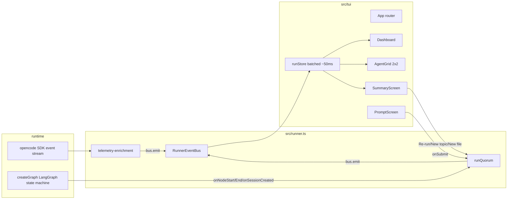
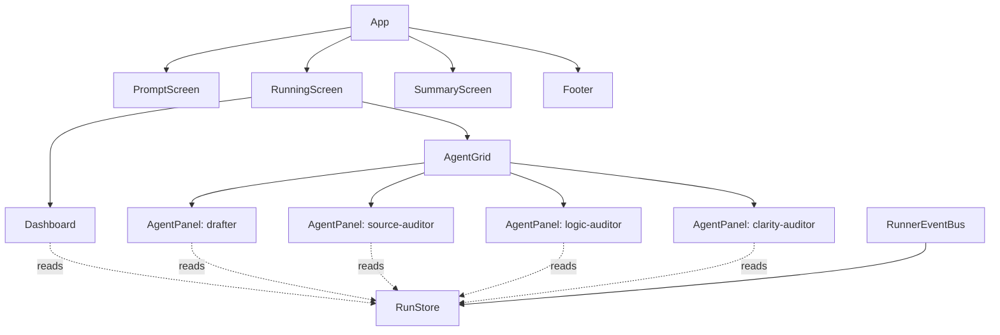

# TUI Implementation Plan: research-qurom

## 1. Goal

Replace the current line-printing CLI of `research-qurom` with a true terminal UI built on `@opentui/react`, so that a single screen shows:

- the overall run status (graph phase, round, outcome, telemetry)
- four live agent panels (one drafter + three auditors)
- a startup prompt for the input (topic or file)
- a post-run summary with re-run / new-input / quit actions

End state: `bun run dev` opens the TUI directly, the user types a topic (or selects a file), watches the four agents stream their reasoning and tool calls in a 2x2 grid with the drafter highlighted, and on completion picks one of {Re-run same input, New topic, New file, Quit}. No CLI flags. No plain log fallback.

## 2. Starting point, driving problem, and finish line

**Starting point.** `src/index.ts` (180 lines) parses `--topic`/`--file`, prints a JSON status block when no input is given, then calls `createGraph(...).invoke(...)` while `src/telemetry-enrichment.ts` subscribes to the opencode SDK's `client.event.subscribe()` stream and writes `[role] ...` lines to stdout (`src/telemetry-enrichment.ts:57-60`, gated by `process.stdout.isTTY` at `src/telemetry-enrichment.ts:36`). When the run finishes, `src/index.ts:160-176` prints another JSON blob and the process exits.

**Driving problem.** Four agents run in parallel (one drafter `research-drafter` plus three auditors `source-auditor`, `logic-auditor`, `clarity-auditor` per `quorum.config.json:1-7`) and each emits assistant text, reasoning, tool calls, permissions, and status events at the same time. They are interleaved into one stdout stream and prefixed only with a role tag, so the user has to scroll back through hundreds of lines to follow any one agent. There is also no live indication of which graph node is running, what round we are in, how many tool calls each agent has made, or whether the run has converged. After the run, the user has to re-launch the process to start over.

**Finish line.** A single TUI process where:

- a top dashboard shows phase, round, run id, output dir, trace id, and per-agent token/tool counters
- a 2x2 grid below shows one panel per agent with live streaming reasoning and tool activity, drafter visually highlighted top-left
- the user is prompted for input on startup (no flags)
- a post-run screen offers Re-run / New topic / New file / Quit and the same process keeps running across runs
- the TUI is the only UI; no plain mode

The plan must connect the existing event sources (graph node observer, session events, opencode SDK event stream) to a typed event bus that drives a React component tree with no lost events and no duplicated events across re-runs.

## 3. Constraints and assumptions

**Hard constraints.**

- Default to Bun, but no Bun-only APIs (must work on Bun/Node/Deno) — `reference/opentui/AGENTS.md:14-16`.
- Bun loads `.env` automatically; do not depend on `dotenv` even though it is in `package.json:20` (it can stay; just no new uses).
- Style per opentui repo: oxfmt (no semicolons, printWidth 120), strict TS, explicit imports, minimal comments, no JSDoc — `reference/opentui/AGENTS.md:46-57`.
- `console.log` is **invisible** to the user while the alt-screen renderer is active; the renderer captures it. Anything that wants to surface to the user must go through the React tree or `renderer.console.show()` (`reference/opentui/packages/react/README.md:175-181`).
- The opencode SDK event subscription is one stream per call; calling `start()` twice without awaiting `stop()` will produce two parallel subscribers and double-fire every event. Existing `start/stop` lives at `src/telemetry-enrichment.ts:143-345`.
- Reasoning deltas arrive in tight bursts (`message.part.delta` is buffered and flushed only on punctuation/length at `src/telemetry-enrichment.ts:66-83`). React must batch these or the renderer will thrash.

**Assumptions (labelled).**

- *Confirmed*: the four roles in the UI come from `config.quorumConfig.designatedDrafter` + `config.quorumConfig.auditors` (`quorum.config.json:1-7`, surfaced by `src/index.ts:64-69`). The plan hard-wires "1 drafter + N auditors" but renders the grid as 2x2 because today N=3.
- *Confirmed*: every agent has exactly one opencode session, registered through `observer.onSessionCreated({ sessionID, role })` in `src/graph.ts:1244-1255`, and `role` is one of `"root" | "drafter" | "auditor:<name>"`.
- *Inferred*: the runner only ever runs one quorum at a time (graph state and checkpointer are per-thread keyed on `requestId` at `src/index.ts:124-128`). The TUI assumes serial runs.
- *Speculative*: the user's terminal is at least ~100 cols x 30 rows. Below that, a 2x2 grid of useful panels does not fit; we add a single-stack fallback.

**Why this changes the plan.** The "no double subscriber" and "console.log is invisible" constraints force two structural decisions: (a) the event subscriber must be owned by the runner and stopped/awaited between runs, and (b) we cannot leave any `logProgress` calls; every existing log site must become a typed event on a bus.

## 4. Current state

What runs today, in the order it runs:

1. `src/index.ts:52-57` loads config, ensures the artifact dir, validates opencode prerequisites.
2. `src/index.ts:84-93` constructs `createTelemetryEnrichment(config)` and starts its event subscriber. The subscriber lives in `src/telemetry-enrichment.ts:143-340` and:
   - listens via `client.event.subscribe({}, { signal })` (line 147)
   - turns `session.status`, `session.error`, `permission.asked`, `message.updated`, `message.part.delta`, `message.part.updated` (tool + reasoning) into `console.log` lines via `logProgress` (line 57-60)
   - tracks reasoning buffers and flushes on punctuation/length (`shouldFlushReasoning`, `flushReasoning`, lines 66-83)
   - opens Langfuse "tool" observations on tool start and ends them on tool complete/error (lines 281-330)
3. `src/index.ts:100-154` calls `createGraph(...).invoke(input, { configurable: { thread_id: requestId } })`. The graph (`src/graph.ts:1232-1311`) walks: `ingestRequest -> bootstrapRun -> draftInitial -> runParallelAudits -> reviewFindingsByDrafter -> {runTargetedRebuttals -> reviewRebuttalResponses}* -> aggregateConsensus -> {reviseDraft -> runParallelAudits | finalizeApprovedDraft | finalizeFailedRun}`. Each node calls `observer.onNodeStart/onNodeEnd` (lines 1175-1213).
4. On exit, `src/index.ts:160-179` prints a JSON summary, awaits `telemetry.shutdown()` and `progress.stop()`.

State machine values used as the dashboard's phase badge (from `src/graph.ts`):
`drafting -> auditing -> reviewing_findings -> awaiting_auditor_rebuttal -> reviewing_rebuttal_responses -> aggregating -> revising | approved | failed`.

`package.json:6-9` currently has `dev`/`start` both pointing at `src/index.ts`. `tsconfig.json` has no JSX config and `lib: ["ES2022"]`.

**Why this changes the plan.** Every event that the dashboard or panels need already exists in the system; nothing new has to be invented at the integration layer. The work is (a) re-routing those events from `console.log` to a typed bus, and (b) lifting the orchestration code out of `src/index.ts` so the TUI can call it on demand.

## 5. What is actually causing the problem

The problem is not "missing UI". It is that today's design glues four things together that should be separable:

1. **Argument parsing + process exit** are wired into the orchestration (`src/index.ts:9-50, 160-179`), so we cannot start a run from inside a long-lived TUI without forking a process.
2. **Live progress is printf, not data**. `logProgress` (`src/telemetry-enrichment.ts:57-60`) turns events into strings before any consumer sees them. A UI cannot recover the structured data (which agent, which tool, what status) from those strings.
3. **The event subscriber's lifetime is tied to the orchestration, not to the UI**. `start()`/`stop()` is owned by the index file; if the TUI wants to re-run, it has to be careful not to leak subscribers.

Solving (1) needs a `runQuorum()` function. Solving (2) needs the telemetry-enrichment code to emit typed events. Solving (3) needs `runQuorum()` to own the bus and tear it down on completion.

**Why this changes the plan.** This is what justifies the "aggressive refactor" choice in section 7 instead of trying to scrape stdout into the TUI. There is no version of the TUI that works correctly while the events are still strings.

## 6. Intuition and mental model of the change

Imagine the run as a river of small typed events. Today the river goes through `console.log` and we let the user read the surface. The change moves the same river through a typed bus, and the React tree subscribes to it and decides what to show, where, and how.

End-to-end flow for one assistant reasoning chunk from `source-auditor`:

```
opencode SDK event ──▶ telemetry-enrichment ──▶ RunnerEventBus ──▶ runStore (batched ~50ms) ──▶ <AgentPanel role="source-auditor"/>
   message.part.delta     existing buffer logic    bus.emit({          dispatch reducer            scrollback append, tokens++
   field=text             (punctuation/length)      kind:"agent.reasoning",
                                                    role, text })
```

Two things make this easy to get wrong:

- **Double-subscribers across re-runs.** `client.event.subscribe()` opens one stream per call. If the TUI lets the user click "Re-run" before the previous subscriber has been awaited, the second run will receive every event twice and the dashboard counters will be inflated. The runner must not return until the subscriber has fully drained.
- **Render storms from delta bursts.** Reasoning text can arrive as 30+ deltas per second per agent. A naive `setState` on every event will repaint the terminal too often. The store batches dispatches inside a ~50ms tick and flushes once.

This intuition is the only reason the implementation steps below put `runQuorum()` and `RunnerEventBus` first and the React tree second.

## 7. Options considered

### Option A: Wrap stdout

Pipe `console.log` into the TUI, parse the existing `[role] ...` lines back into structured events.

- Pros: smallest diff to existing code.
- Cons: lossy (no structured tool call args, no token counts), brittle (string parsing of our own log format), and still doesn't solve the "console.log is invisible while the alt-screen is active" problem (`reference/opentui/packages/react/README.md:175-181`). Anything outside our parser pollutes the alt-screen.
- Verdict: rejected.

### Option B: Add a side-channel emitter alongside `logProgress`

Keep `console.log`, also emit events from inside `src/telemetry-enrichment.ts`.

- Pros: keeps current CLI working unchanged.
- Cons: two sources of truth, still need to silence `console.log` while the TUI runs (which means a flag), and the user explicitly asked to delete the plain mode.
- Verdict: rejected.

### Option C: Aggressive refactor — extract `runQuorum()` + typed event bus, replace `logProgress` with `bus.emit`, delete plain mode

- Pros: one source of truth for events, lifecycle is explicit, TUI can re-run cleanly. Matches the user's stated preference for an aggressive refactor.
- Cons: more code change up front; old `--topic`/`--file` flags go away.
- Verdict: **accepted**.

## 8. Recommended approach

Pick Option C. The work splits into three layers that can be built and verified in order:

1. **Runner layer** — `src/runner.ts` exposes `runQuorum({ config, prerequisites, request, bus, signal })` that wraps everything `src/index.ts:99-176` does today. It owns starting and stopping the telemetry-enrichment subscriber. It returns the same `runResult` shape that `createGraph().invoke()` already returns.
2. **Event layer** — rewrite `src/telemetry-enrichment.ts` to take a `bus` and emit typed `RunnerEvent`s (`agent.reasoning`, `agent.tool`, `agent.message.start`, `session.status`, `session.error`, `agent.permission`, `agent.telemetry`). Keep the buffering logic from lines 66-83 unchanged. Drop the `liveConsole` gate at line 36 (no plain mode).
3. **TUI layer** — `src/tui/` with `index.tsx` (renderer + root), `App.tsx` (screen router), `state/runStore.ts` (reducer + batched dispatch), `components/{Dashboard,AgentGrid,AgentPanel,PromptScreen,SummaryScreen,Footer}.tsx`, and `theme.ts`.

The drafter gets a highlighted border (different `borderColor`) and the top-left grid slot. Tab/Shift+Tab moves focus across {Dashboard, drafter, auditor1, auditor2, auditor3}. When a panel is focused, arrow keys / PgUp / PgDn / Home / End scroll its scrollback; End re-enables auto-scroll. When new content arrives while the user has scrolled up, a small "v new" hint appears in the panel header.

**Why this is the best tradeoff.** The runner extraction is the smallest piece of code that lets the TUI re-run cleanly. The event bus is the smallest piece of data that lets four panels reconstruct their own state without parsing strings. Everything else (theme, dashboard density, summary card) is presentation on top.

## 9. Visual overview



The diagram matches the section names: `runQuorum`, `RunnerEventBus`, `telemetry-enrichment`, `runStore`, `Dashboard`, `AgentGrid`, `SummaryScreen`, `PromptScreen`. The arrows that matter most for correctness are the two going *into* `BUS`: those are the only event sources, and both are owned by `runQuorum`, which is what makes re-runs safe.

## 10. Step-by-step implementation plan

Order matters: the runner refactor has to land before the TUI can call it; the event types have to be defined before telemetry-enrichment can emit them; only then can the React tree consume them.

### Step 1 — Dependencies and tsconfig

Files: `package.json`, `tsconfig.json`.

- Add deps: `@opentui/react`, `@opentui/core`, `react`, `@types/react`.
- Update `tsconfig.json` per `reference/opentui/packages/react/README.md:38-49`:
  - `"jsx": "react-jsx"`
  - `"jsxImportSource": "@opentui/react"`
  - `"lib": ["ESNext", "DOM"]`
  - keep `"strict": true`, `"skipLibCheck": true`, `"moduleResolution": "Bundler"`, `"allowImportingTsExtensions": true`.
- `include` should add `"src/**/*.tsx"`.
- Update `package.json` scripts: `"dev": "bun run src/tui/index.tsx"`, `"start": "bun run src/tui/index.tsx"`. Keep `typecheck`.

### Step 2 — Define `RunnerEvent` and the bus

File: `src/runner.ts` (new).

- `type RunnerEvent` (discriminated union, `kind` field):
  - `lifecycle` — `phase: "starting" | "running" | "complete" | "error"`, `requestId`, `traceId?`, `outputDir?`
  - `graph.node` — `node`, `phase: "start" | "end"`
  - `session.created` — `sessionID`, `role` (raw role string from `src/graph.ts:1244-1255`)
  - `session.status` — `sessionID`, `role`, `status` (string, includes `retry N`)
  - `session.error` — `sessionID`, `role`, `name`, `message?`
  - `agent.message.start` — `role`, `messageID`
  - `agent.reasoning` — `role`, `text` (already buffered/flushed by the existing logic in `src/telemetry-enrichment.ts:66-83`)
  - `agent.tool` — `role`, `tool`, `status: "running" | "completed" | "error"`, `callID`, `error?`
  - `agent.permission` — `role`, `permission`
  - `agent.telemetry` — `role`, `tokensIn?`, `tokensOut?`, `toolCallsTotal?` (we can extend over time; emit what we have)
  - `result` — `runResult` shape returned by the graph (`src/index.ts:160-175` is the current shape)
- `createEventBus()` returns `{ emit, on, off }`. Internally a typed `EventTarget`-style or simple `Set<Listener>`. Synchronous emit is fine; the store batches.
- `runQuorum({ config, prerequisites, request, bus, signal? })`:
  - generates `requestId`, calls `createTelemetryEnrichment(config, { bus })`, awaits `progress.start()`
  - constructs the `telemetry` from `createTelemetry(...)`
  - emits `lifecycle{phase:"starting", requestId, traceId, outputDir}`
  - calls `createGraph(...).invoke(...)` exactly as `src/index.ts:99-129` does, but routes `observer.onNodeStart/onNodeEnd/onSessionCreated` into `bus.emit(...)` instead of `progress.trackNodeStart/End/Session`
  - on success emits `result` then `lifecycle{phase:"complete"}`
  - on error emits `lifecycle{phase:"error", error}`
  - **always** awaits `telemetry.shutdown()` and `progress.stop()` in a `finally` so the next run starts clean

### Step 3 — Rewrite `src/telemetry-enrichment.ts`

Files: `src/telemetry-enrichment.ts`.

- Signature becomes `createTelemetryEnrichment(config, { bus })`. Drop the `liveConsole` branch (`lines 36, 85-100`); the TUI is always the consumer.
- Replace every `logProgress(role, text)` call site with the matching `bus.emit({ kind: ..., role, ... })`. The mapping is:
  - line 109 `session created` -> `session.created`
  - line 119/122 `node start/end` -> `graph.node`
  - line 179 `session ${nextStatus}` -> `session.status`
  - line 192 `session error` -> `session.error`
  - line 214 `permission asked` -> `agent.permission`
  - line 225 `assistant started` -> `agent.message.start`
  - line 237-242 reasoning buffer flush -> `agent.reasoning` (text is already trimmed/normalized by `flushReasoning`)
  - line 332-335 tool state -> `agent.tool`
- Per-role token/tool counters: keep a `Map<role, { tools: number, errors: number }>` updated on tool/error events and emit `agent.telemetry` after each change. Tokens can stay 0 until we wire model usage in.
- `persistArtifacts` keeps doing what it does; it just no longer logs anything.

### Step 4 — Delete the old entry point

Files: `src/index.ts`.

- Delete the file. `src/tui/index.tsx` is the new entry. The orchestration logic moves into `src/runner.ts`.

### Step 5 — Build the TUI shell

Files: `src/tui/index.tsx`, `src/tui/App.tsx`, `src/tui/theme.ts`.

- `index.tsx`: `await loadRuntimeConfig()`, `await ensureArtifactDir(...)`, `await validateRuntimePrerequisites(...)`, `const renderer = await createCliRenderer({ exitOnCtrlC: false })`, `createRoot(renderer).render(<App config={...} prerequisites={...}/>)`.
- `App.tsx`: holds `screen: "prompt" | "running" | "summary"`, `currentRun: RunHandle | undefined`. Tabs between screens based on lifecycle events.
- `theme.ts`: per-role accent colors (drafter: bright cyan border with `borderStyle: "double"` from `reference/opentui/packages/react/README.md:385`; auditors: muted single border in distinct hues), status colors (running/idle/error), background tokens.

### Step 6 — Run store with batched dispatch

Files: `src/tui/state/runStore.ts`, `src/tui/state/eventBindings.ts`.

- Store shape:
  ```
  {
    lifecycle: { phase, requestId?, traceId?, outputDir?, error? },
    graph: { node?, round, status },        // status mirrors ResearchState["status"]
    agents: Record<role, {
      sessionID?, status, lastEventAt,
      scrollback: Array<Entry>,             // {kind, text, ts}
      tokensIn, tokensOut, toolsTotal, toolsErrored,
      activeTool?: { tool, callID, startedAt },
      pendingPermission?: string,
    }>,
    result?: RunResult,
  }
  ```
- `eventBindings.ts`: `bindBusToStore(bus, store)` subscribes to all `RunnerEvent` kinds and queues reducer actions. A `setTimeout(flush, 50)` (or `queueMicrotask` if the queue stays small) coalesces bursts before a single `store.set(...)`.
- Roles map: incoming `role` is one of `"root" | "drafter" | "auditor:<name>"`; the store maps that to an internal role key matching `quorumConfig.designatedDrafter` and `quorumConfig.auditors[i]`. Root events go to the dashboard, not to a panel.

### Step 7 — Components

Files under `src/tui/components/`.

- `Dashboard.tsx` — two rows:
  - row 1: `<ascii-font font="tiny" text="QUORUM"/>`, phase badge, round, request id (short), trace id (short), elapsed
  - row 2: per-agent compact stats `[role | tools | errors | last event]`, output dir
- `AgentGrid.tsx` — `flexDirection: "column"`, two rows of two `AgentPanel`s. Drafter is row 0 col 0. Layout falls back to a single column when terminal width < 100.
- `AgentPanel.tsx` — `<box border title="...">` containing a `<scrollbox focused={isFocused}>` of `Entry`s; header shows status dot, current tool name (if any), and "v new" indicator when the user has scrolled up and new content has arrived. Drafter passes `borderStyle="double"` and a brighter `borderColor` from the theme.
- `PromptScreen.tsx` — `<select>` for "Topic" vs "File", then either an `<input>` (topic) or a file path `<input>` with on-blur existence check, then a "Run" hint. On submit, calls a passed `onSubmit({ inputMode, topic | documentPath })` from `App`.
- `SummaryScreen.tsx` — summary card (outcome, round, approved agents, unresolved findings, output path, trace id) plus a `<select>` of `["Re-run same input", "New topic", "New file", "Quit"]`.
- `Footer.tsx` — keybinding hints: `Tab focus  /  Arrows/PgUp/PgDn scroll  /  End auto  /  q quit  /  r re-run (after run)`.

### Step 8 — Keyboard and focus

- Global `useKeyboard` in `App` handles `q` (after run only), `Ctrl+C` (always: cancel signal then exit), `Tab`/`Shift+Tab` (cycle focus across panels and dashboard).
- Each `AgentPanel` reads its own `focused` prop and uses `useKeyboard` only when focused, mapping arrows/PgUp/PgDn/Home/End to scroll-related state.

### Step 9 — Re-run flow

- `App.tsx` keeps the last `request` so "Re-run" can call `runQuorum` with the same input. "New topic"/"New file" goes back to `PromptScreen`. Between runs, `App` resets the store (clear scrollback, zero counters) before starting the next run. Because `runQuorum` already awaits its own subscriber teardown, no extra waiting is needed.

## 11. UI sketch and component map

ASCII mock at ~120 cols x 36 rows during a run:

```
+--------------------------------------------------------------------------------------------------------------------+
|  QURM   phase: auditing   round: 2/4   req: 3f8e..   trace: 9b21..   elapsed: 02:14                                |
|  drafter   tools 7  err 0  last 00:01    src     tools 3  err 0  last 00:02    logic  tools 4  err 1  last 00:00   |
|  clarity  tools 2  err 0  last 00:03                                            out: runs/3f8e..                   |
+--------------------------------------------------------------------------------------------------------------------+
| =[ research-drafter ]=========================== | -[ source-auditor ]------------------------------               |
| status: running   tool: webfetch                  | status: running   tool: exa.search                             |
| > thinking the draft needs a recent benchmark...  | > thinking checking the cited paper for...                     |
| > tool webfetch running                           | > tool exa.search completed                                    |
| > tool webfetch completed                         | > thinking the citation is consistent with...                  |
|                                                   |                                                                |
| -[ logic-auditor ]------------------------------- | -[ clarity-auditor ]---------------------------                |
| status: error     tool: -                         | status: idle       tool: -                                     |
| > tool grepapp failed (rate limit)                | > assistant started                                            |
| > thinking retrying with smaller scope...         | > thinking the structure follows the rubric...                 |
+--------------------------------------------------------------------------------------------------------------------+
| Tab focus  Arrows/PgUp/PgDn scroll  End auto  Ctrl+C cancel                                                        |
+--------------------------------------------------------------------------------------------------------------------+
```

ASCII mock of the prompt screen:

```
+----------------------------------------------------+
|  QURM    new run                                   |
|                                                    |
|  Input mode:  ( ) Topic   ( ) File                 |
|                                                    |
|  Topic:       [_________________________________]  |
|                                                    |
|  Enter to run    Ctrl+C to quit                    |
+----------------------------------------------------+
```

ASCII mock of the summary screen:

```
+----------------------------------------------------+
|  QURM    run complete                              |
|                                                    |
|  outcome: approved      round: 2     unresolved: 0 |
|  approved: source, logic, clarity                  |
|  output:  runs/3f8e../draft.md                     |
|  trace:   9b21..                                   |
|                                                    |
|  > Re-run same input                               |
|    New topic                                       |
|    New file                                        |
|    Quit                                            |
+----------------------------------------------------+
```

Component map:



State ownership:

- `App` owns `screen`, last `request`, and the `RunnerEventBus` for the current run.
- `RunStore` is the only owner of per-agent scrollback and counters. Components subscribe by selector to avoid re-rendering all four panels on each event.
- Each `AgentPanel` owns its own scroll position and its own `focused` flag (passed in from `App`).

Responsive behaviour:

- `width >= 100`: 2x2 grid as drawn.
- `width < 100`: vertical stack, drafter first; user scrolls the outer container with PgUp/PgDn while focused on the dashboard.
- `height < 30`: dashboard collapses to one row (phase + round + request id only); per-agent stats move to panel headers.

## 12. Risks and failure modes

- **Double-subscribe on re-run.** If `runQuorum` returns before `progress.stop()` has been awaited, a second `Run` will open a second `client.event.subscribe` stream. The bus will then receive every event twice and counters will visibly double. Mitigation: `progress.stop()` is awaited inside the `finally` of `runQuorum`; a unit-style smoke test runs two runs back-to-back and checks that `agent.tool` events for the second run are not duplicated.
- **Render storm from reasoning bursts.** `message.part.delta` arrives faster than the terminal can repaint. Without batching, the renderer thrashes and the UI feels frozen. Mitigation: 50ms tick coalescing in `runStore`. If still too jittery, drop to per-frame `requestAnimationFrame`-style throttling.
- **Stray `console.warn` from config/zod/telemetry corrupts the alt-screen.** The renderer captures stdout but unrelated libs may write to stderr or via process events. Mitigation: at TUI startup, install a temporary `console.warn`/`console.error` interceptor that buffers to a hidden "system" log surfaced only on `D` keypress, then restore on exit.
- **Tiny terminal.** Below ~100x30 the 2x2 grid is unusable. Mitigation: `useTerminalDimensions()` (`reference/opentui/packages/react/README.md:265-285`) drives a single-column fallback and a "Terminal too small" banner if `width < 60` or `height < 20`.
- **Ctrl+C while a run is in flight.** The opencode SDK call is mid-stream; if we just exit, the SDK process may be left running. Mitigation: `App` passes an `AbortController.signal` to `runQuorum`; on `Ctrl+C` we abort, await the run promise (which will short-circuit through the `finally` and stop the subscriber), then call `process.exit`.
- **Drafter highlighted slot wrong when auditor count != 3.** Today N=3, but `quorum.config.json` could change. Mitigation: `AgentGrid` lays out as `1 + N` cells, takes ceil sqrt, and always pins drafter to (0,0); below 4 cells it stays a single row.

## 13. Verification plan

Run-time checks:

1. `bun install` then `bunx tsc --noEmit` (the existing `typecheck` script). Must pass with the new `tsx` files included.
2. `bun run dev`. Expect the prompt screen. Type a short topic ("Capital of France") and hit Enter. Expect:
   - dashboard phase moves through `drafting -> auditing -> reviewing_findings -> aggregating -> approved`
   - all four agent panels show activity, drafter top-left with double border
   - tool events appear with `running` then `completed` per agent
3. Press Tab a few times: focus border highlight cycles dashboard -> drafter -> source -> logic -> clarity -> dashboard. While focused on a panel, PgUp pauses auto-scroll and shows "v new" when fresh entries arrive; End re-enables auto-scroll.
4. After completion, summary screen shows `outcome`, output path, and trace id matching the JSON that the old `src/index.ts:160-175` would have printed (capture from a side log to compare).
5. Pick "Re-run same input" from the summary. Counters reset to zero before the second run starts. Watch for any duplicated `tool ... completed` lines in any panel during the second run; there must be none.
6. Pick "New file", point at a small markdown file in the repo, run again, verify document mode runs the same path.
7. Resize the terminal narrower than 100 cols mid-run. Layout should switch to single-column without crashing.
8. `Ctrl+C` mid-run: process exits within 1-2s, no orphan opencode session warnings.

Regression checks:

- The artifact dir `runs/<requestId>/` still contains the same files it used to (draft, summary, optional `opencode-events.json`).
- Langfuse trace still appears (when env is configured) with the same observation tree; the runner refactor should not change anything about telemetry observation hierarchy.

## 14. Rollback or recovery plan

The change is large but localized: it adds `src/tui/`, adds `src/runner.ts`, rewrites `src/telemetry-enrichment.ts`, deletes `src/index.ts`, edits `package.json` and `tsconfig.json`.

If rollout breaks:

- `git revert` the merge commit. Nothing in `runs/`, `quorum.config.json`, or the opencode side is affected.
- If only the TUI is broken but the runner is good, a minimal recovery is `bun run src/runner.ts --topic "..."` after adding a 20-line CLI shim that calls `runQuorum` and pipes a default console-listener onto the bus. This shim is not part of the plan but is cheap to add as a safety hatch and worth keeping in the back pocket.

Blast radius is the developer's own machine; there is no deploy. The checkpoint sqlite at `config.env.QUORUM_CHECKPOINT_PATH` keeps working across both old and new code (`src/checkpointer.ts` is untouched).

## 15. Sources

Repo:

- `src/index.ts:9-179` — current arg parsing, JSON status, run invocation, JSON summary, shutdown.
- `src/telemetry-enrichment.ts:33-345` — opencode SDK subscription, reasoning buffering, tool observation lifecycle, `liveConsole` gating.
- `src/graph.ts:1175-1311` — node observer hooks, session creation events, full state machine and edge layout.
- `src/graph.ts:402-410, 470-478, 614-617, 690-699, 1001-1020` — status enum values that drive the dashboard phase badge.
- `quorum.config.json:1-15` — drafter and auditor names, max rounds, rebuttal cap, unanimous flag.
- `package.json:1-27` — current scripts and deps.
- `tsconfig.json:1-16` — current TS config.

opentui:

- `reference/opentui/packages/react/README.md:14-49` — install and tsconfig.
- `reference/opentui/packages/react/README.md:138-161` — `createCliRenderer` + `createRoot`.
- `reference/opentui/packages/react/README.md:165-181` — `useRenderer`, `renderer.console.show()`.
- `reference/opentui/packages/react/README.md:184-240` — `useKeyboard` shape.
- `reference/opentui/packages/react/README.md:243-285` — `useOnResize`, `useTerminalDimensions`.
- `reference/opentui/packages/react/README.md:407-449` — `<scrollbox>` component used for per-agent panels.
- `reference/opentui/packages/react/README.md:373-405` — `<box>` borders, `borderStyle: "double"` for drafter highlight.
- `reference/opentui/packages/react/README.md:451-505` — `<ascii-font>` for the dashboard wordmark.
- `reference/opentui/AGENTS.md:1-64` — Bun default, no Bun-only APIs, oxfmt style, "console.log invisible in TUI" debugging note.
