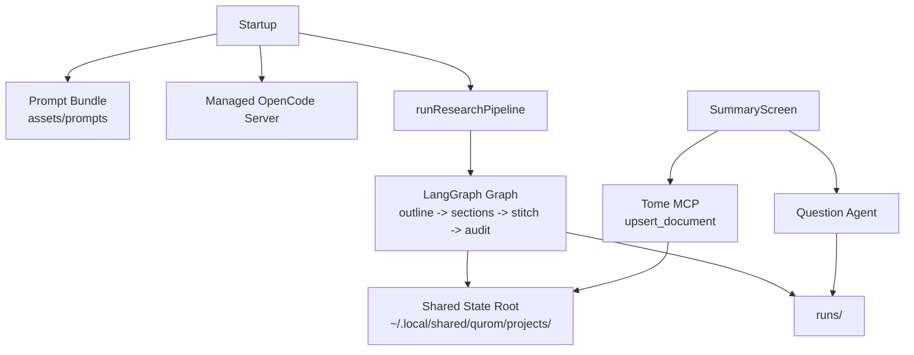

# Goal

Refresh the enhancement plan for `research-qurom` again so it starts from the codebase as it exists now, after the recent prompt-system and drafter-pipeline changes.

The remaining work should still finish the enhancement requests in `docs/ENHANCEMENT.md` and `docs/ENHANCEMENT2.md`, but the plan needs a different baseline now:

- keep the core quorum architecture fixed at `1 drafter + 3 auditors`
- keep visible artifacts in repo-local `runs/`
- move machine-owned state under `~/.local/shared/qurom`
- manage OpenCode startup from the app
- make runs resumable with LangGraph checkpoints, preserving OpenCode session continuity where possible
- add a post-approval follow-up and question flow
- add optional Tome publishing

Important current-state correction:

- the branch no longer uses a skill-wrapped single drafter prompt as its main draft path
- the app now loads repo-owned prompt assets from `assets/prompts/`
- the designated drafter now works through an outline -> section drafting -> stitch pipeline
- the runner now has checkpoint-based failure salvage for recursion, runtime, and stream failures

That means the old `drafterSkill` phase is no longer the right shape for the roadmap. The updated plan should treat repo-owned prompt assets and multi-stage drafting as completed foundation, then focus on the still-missing lifecycle and post-approval features.

Why this changes the plan:

The starting point has changed enough that the old roadmap would now spend time planning work that the branch has already replaced with a different design.

# Starting Point, Driving Problem, And Finish Line

Question: where is the codebase now, what is still wrong with it, and what does success look like from this new baseline?

Short answer:

- Starting point: the repo already has a fixed quorum loop, durable checkpoints, a summarizer subsystem, summary-driven output-path preparation, repo-owned prompt assets, a multi-stage drafter pipeline, and checkpoint-backed failure salvage.
- Driving problem: the remaining blockers are still lifecycle and state-placement problems, plus one new ownership problem. The app still assumes an already-running OpenCode server, still creates fresh runs only, still aborts OpenCode sessions on cancellation, still stores checkpoints and draft cache under repo-visible `runs/`, still has no resume UI, still has no post-approval follow-up or Tome publish path, and now splits draft-contract ownership between repo prompt assets and an agent-local skill instruction.
- Finish line: the app manages OpenCode startup, keeps machine-owned state under `~/.local/shared/qurom`, resumes the same run identity and sessions where possible, preserves visible artifacts under `runs/`, treats the prompt bundle as the clear source of truth for drafting behavior, and adds post-approval follow-up plus optional Tome publishing.

Concrete running example:

A document run for `# Hybrid reranking in Qdrant` now behaves very differently from the older plan’s assumptions:

- startup loads a prompt bundle from `assets/prompts/` in `src/tui/index.tsx:11-15` and `src/prompt-assets.ts:42-61`
- the graph summarizes the input document and derives a visible slugged run dir in `src/graph.ts:319-372`
- the designated drafter first produces a structured outline in `src/graph.ts:642-670`
- the graph drafts sections one at a time in `src/graph.ts:672-719`
- the drafter then stitches those section drafts into a full document in `src/graph.ts:721-749`
- if the run dies because of a recursion limit, runtime error, or stream error, the runner now tries to recover checkpointed state and write failure artifacts in `src/runner.ts:137-175` and `src/runner.ts:441-498`

But the same run still has the old lifecycle problems:

- startup still assumes OpenCode is already reachable in `src/tui/index.tsx:11-15`
- `runResearchPipeline()` still creates a fresh `requestId` every time in `src/runner.ts:309-390`
- cancellation still aborts created sessions in `src/runner.ts:508-512`
- checkpoints still default to `runs/checkpoints.sqlite` in `src/config.ts:6-15`
- document drafts are still repo-local according to `src/tui/editor.ts` and `README.md:128-130`
- there is still no resume mode in the prompt screen and no follow-up or publish action in the summary screen

Why this changes the plan:

The refreshed plan should begin after the prompt-bundle and structured-drafting work. The remaining roadmap is about state placement, run identity, session lifetime, and post-approval workflows.

# Constraints And Assumptions

Question: what is already fixed, what changed materially, and what assumptions does the remaining plan depend on?

Short answer:

The current branch narrows the remaining work in one way and complicates it in another: drafting behavior is now much more structured, but prompt ownership is less explicit than before.

Confirmed product decisions:

- Confirmed: keep the core quorum architecture fixed at `1 drafter + 3 auditors`.
- Confirmed: keep repo-local `runs/` as the visible artifact directory.
- Confirmed: move machine-owned state under `~/.local/shared/qurom`.
- Confirmed: managed OpenCode startup is still a desired end state.
- Confirmed: post-approval follow-up and optional Tome publish are still desired end states.

Confirmed technical constraints from the codebase:

- Confirmed: the shipped config still uses one drafter, three named auditors, and one summarizer in `quorum.config.json:1-23`.
- Confirmed: the config schema still exposes a partially generic auditor list with `.min(1)` in `src/config.ts:17-37`, even though the TUI layout is still hardcoded to `research-drafter`, `source-auditor`, `logic-auditor`, and `clarity-auditor` in `src/tui/App.tsx:74-80`.
- Confirmed: prompt contracts are now repo-owned and loaded from `assets/prompts/` through `src/prompt-assets.ts:5-61`.
- Confirmed: `promptManagement.source` exposes `local | langfuse` in config, but `loadPromptBundle()` only implements `local` and throws for anything else in `src/prompt-assets.ts:42-47`.
- Confirmed: the orchestrator no longer validates or injects `deep-dive-research` at runtime, because `validateRuntimePrerequisites()` now checks agents only in `src/opencode.ts:394-410`, while the agent definition still tells the drafter to load that skill in `.opencode/agents/research-drafter.md:22-25`.
- Confirmed: the runner now supports checkpoint-backed failure salvage with new failure reasons `recursion_limit_exhausted`, `runtime_error`, and `stream_error` in `src/schema.ts:11-18` and `src/runner.ts:137-175`.

Inferred assumptions:

- Inferred: the `opencode` CLI binary is available on the machine, because managed startup still depends on spawning `opencode serve`.
- Inferred: the target Tome docs workspace root will be configured separately from this repo.
- Inferred: the recent prompt-bundle work is the preferred long-term drafting direction, because it is wired into startup, config, README, tests, and the graph itself.
- Inferred: if the repo keeps the `deep-dive-research` skill dependency in the agent file, startup should validate it explicitly again instead of leaving it as a hidden runtime dependency.

Why this changes the plan:

These constraints mean the updated roadmap should not plan a broad runtime `drafterSkill` feature as if the branch were still skill-centric. It should first settle prompt ownership and fixed-quorum ownership, then finish the remaining lifecycle work.

# Current State

Question: what is already implemented today, and what is still missing from the enhancement requests?

Short answer:

The repo is farther ahead than the previous enhancement plan captured. The main missing work is still around startup, resume, internal state placement, and post-approval actions. The major new baseline is repo-owned prompt assets plus structured multi-stage drafting.

## Already Landed Foundation

The following work is already present and should be treated as completed baseline:

- A dedicated summarizer service exists in `src/summarizer.ts:27-66` and prompts `config.quorumConfig.summarizerAgent` for structured markdown summaries.
- Graph state includes `inputSummary` and `artifactSummary` in `src/schema.ts:52-60` and `src/schema.ts:262-289`.
- The graph still has `summarizeInputDocument`, `prepareOutputPath`, and `summarizeOutputArtifact` in `src/graph.ts:319-372` and `src/graph.ts:1384-1426`.
- Visible run directories still use `slugHint` through `src/output.ts:99-117`.
- The app now loads repo-owned prompt assets at startup through `src/tui/index.tsx:11-15` and `src/prompt-assets.ts:42-61`.
- The config now includes `promptAssetsDir`, `promptManagement`, and `recursionLimit` in `src/config.ts:17-37` and `quorum.config.json:1-23`.
- The designated drafter no longer jumps straight to a single full-draft prompt. The graph now uses:
  - `draftOutline()` in `src/graph.ts:642-670`
  - repeated `draftNextSection()` in `src/graph.ts:672-719`
  - `stitchDraft()` in `src/graph.ts:721-749`
- The graph wiring already runs `bootstrapRun -> draftOutline -> draftNextSection -> stitchDraft -> runParallelAudits` in `src/graph.ts:1569-1623`.
- `ResearchState` now persists `outline` and `sectionDrafts` in `src/schema.ts:271-289`, which means the graph can checkpoint structured partial drafting progress, not just a single `draft` string.
- The runner now normalizes recursion-limit, runtime, and stream failures, then attempts to recover checkpointed graph state and write failure artifacts when possible in `src/runner.ts:137-175` and `src/runner.ts:441-498`.
- The running TUI still supports read-only artifact viewing through `e`, and the summary screen now includes additional distribution data beyond the earlier summary cards.

## Remaining Gaps

The following enhancement items are still missing:

- no managed OpenCode server startup from the app
- no shared state root under `~/.local/shared/qurom`
- no run-record layer for recent-run discovery
- no resume path that reuses an existing `requestId` and `thread_id`
- no non-destructive detach semantics
- no resume UI or recent-run selection
- no post-approval follow-up and question flow
- no Tome publish integration

The following new inconsistency also needs cleanup because it changes how the remaining roadmap should be implemented:

- prompt ownership is split between repo-owned prompt assets and an agent-local skill instruction
- fixed quorum is split between a partially generic config schema and a hardcoded TUI layout

Concrete examples of what is still wrong today:

- `src/tui/index.tsx:11-15` still validates prerequisites and loads prompt assets before any server-lifecycle management exists.
- `src/config.ts:6-15` still defaults `QUORUM_CHECKPOINT_PATH` to `runs/checkpoints.sqlite`.
- `src/runner.ts:317-390` still creates a fresh `requestId` for every run.
- `src/runner.ts:508-512` still aborts all created sessions when the run signal is aborted.
- `src/tui/App.tsx:129-140` and `src/tui/components/HelpOverlay.tsx:23-26` still treat `Ctrl-C` as cancel-and-exit rather than detach.
- `src/tui/components/SummaryScreen.tsx:7-19` still only offers rerun, new topic, new document, and quit.
- `.opencode/agents/research-drafter.md:22-25` still hides a `deep-dive-research` dependency that the app no longer validates.

Why this changes the plan:

The old missing-work list is no longer accurate. The refreshed roadmap should remove the obsolete `drafterSkill` phase, add prompt/quorum ownership cleanup, and keep the remaining focus on startup, state location, resume, and post-approval actions.

# What Is Actually Causing The Remaining Problem

Question: why can’t the missing work be solved by adding a couple of buttons or a small config tweak?

Short answer:

Because the blockers are still about run identity, session lifetime, and state ownership. The current branch added much richer drafting behavior, but it did not solve the lifecycle model around that behavior.

Concrete causes:

1. Fresh-run-only identity

`runResearchPipeline()` still generates a fresh `requestId` and invokes the graph with `thread_id = requestId` in `src/runner.ts:317-390`. There is still no code path that reuses an existing run identity.

2. Destructive abort semantics

The runner still aborts every created OpenCode session when the run signal is aborted in `src/runner.ts:508-512`. That directly conflicts with resume and session continuity.

3. Machine-owned state still lives in user-visible `runs/`

- checkpoints default to `runs/checkpoints.sqlite` in `src/config.ts:6-15`
- document drafts are still documented as repo-local in `README.md:128-130`
- visible artifacts still share the same root as internal checkpoint storage

4. No recent-run discovery surface

The prompt screen still offers only topic or document modes in `src/tui/components/PromptScreen.tsx:14-255`, and there is no run-record index for the app to query.

5. No post-approval actions

The summary screen still has no action path for follow-up or publish in `src/tui/components/SummaryScreen.tsx:7-239`.

6. Split prompt-contract ownership

The app now owns a drafting contract in `assets/prompts/` and `src/prompt-assets.ts`, but the `research-drafter` agent still independently says “Load the `deep-dive-research` skill” in `.opencode/agents/research-drafter.md:22-25`. That means part of the drafting behavior is explicit in repo-owned prompts and part is implicit in an agent file.

7. Split quorum ownership

The config schema still allows arbitrary auditor counts with `.min(1)` in `src/config.ts:19`, but the TUI layout is still hardcoded to the three named auditors in `src/tui/App.tsx:74-80`. That is a half-generic, half-fixed design.

Why this changes the plan:

The updated roadmap should first settle ownership boundaries, then finish the lifecycle work. Otherwise new resume and follow-up features will inherit configuration and prompt ambiguity.

# Intuition And Mental Model Of The Change

Question: what is the simplest mental model for the remaining architecture work from this new baseline?

Short answer:

Treat the run as six things that must stay aligned:

- `requestId`: the durable run identity
- LangGraph `thread_id`: the durable bookmark for execution state
- OpenCode session ids: the live agent conversations attached to that run
- prompt bundle: the app-owned drafting contract loaded at startup
- checkpointed partial drafting state: outline, section drafts, draft, audits, rebuttals
- `runs/<slug-requestId>`: the visible artifact folder for humans

A plain-English example:

For the `Hybrid reranking in Qdrant` run:

- the prompt bundle defines how the drafter should plan, draft sections, stitch, revise, and respond to audits
- the checkpointed graph state may already contain an outline and three completed section drafts
- the drafter and auditors each have OpenCode session ids stored in graph state
- the visible artifact directory is something like `runs/hybrid-reranking-in-qdrant-<requestId>`

A correct resume keeps all of those aligned. A broken resume might keep the checkpoint but destroy the sessions, or keep the sessions but silently change the prompt contract, or keep both while still storing machine-owned files under `runs/`.

The new prompt-ownership issue has a similar mental model:

- repo-owned prompt assets are the app’s script
- the agent-local skill instruction is a second hidden script

If both scripts matter, they should be coordinated explicitly. If only one really matters, the other should stop being a hidden dependency.

Why this changes the plan:

The remaining design should preserve the richer structured drafting path, but it needs one source of truth for prompts and one clear owner for run state before resume and post-approval features are trustworthy.

# Options Considered

Question: what realistic implementation paths fit the current codebase now, and which one is best?

Short answer:

There are four realistic paths from this new baseline.

## Option 1: Keep the current prompt-asset and multi-stage drafting baseline, clean up ownership, then finish lifecycle and post-approval work

What it is:

- treat prompt assets and outline/section/stitch drafting as the new normal
- keep prompt management local-only for this roadmap
- clean up the hidden skill dependency and fixed-quorum mismatch
- then finish shared state, managed startup, resume, follow-up, and Tome publish

Pros:

- matches the current codebase shape
- preserves the richer drafting pipeline that is already wired through the graph and tests
- avoids redoing recently landed work
- keeps the remaining roadmap focused on the original enhancement requests

Cons:

- requires one cleanup step around prompt ownership before the lifecycle work is fully coherent
- still requires a medium refactor across startup, runner, TUI, and storage helpers

Why it is accepted:

It solves the actual remaining problem without reopening the current branch’s new drafting model.

Why this changes the plan:

This becomes the updated recommendation.

## Option 2: Reintroduce runtime-configurable `drafterSkill` as the main draft-contract surface

What it is:

- treat the earlier `drafterSkill` idea as the main abstraction again
- reintroduce explicit runtime skill validation and prompt composition around that skill
- keep or weaken the new prompt-asset system

Pros:

- aligns more directly with the older plan language
- gives one obvious app-level extension point

Cons:

- conflicts with the newly landed prompt-asset system
- duplicates contract ownership across prompt assets, agent instructions, and runtime config
- enlarges scope beyond the original enhancement docs
- would require reworking startup, README, tests, and graph prompt assembly again

Why it is rejected:

The branch has already moved to repo-owned prompts and structured drafting. Re-centering the roadmap on runtime skill composition would spend effort undoing that direction instead of finishing the requested lifecycle work.

Why this changes the plan:

The old `drafterSkill` phase should be removed or heavily re-scoped.

## Option 3: Add resume, follow-up, and publish UI only, but keep the current lifecycle and state placement

What it is:

- add a resume list UI
- add follow-up and publish actions to the summary screen
- leave startup external
- leave checkpoints and draft cache under `runs/`
- keep abort semantics destructive

Pros:

- smallest UI-only change set
- minimal graph changes

Cons:

- resume would still be incomplete or misleading
- cancellation would still destroy the sessions needed for continuity
- visible artifact directories would still be mixed with machine-owned files

Why it is rejected:

The remaining blocker is still not missing buttons. It is lifecycle and storage-model mismatch.

Why this changes the plan:

It rules out the tempting but incorrect UI-only path.

## Option 4: Expand prompt management now to support remote or Langfuse-backed prompts as part of the enhancement roadmap

What it is:

- implement non-local prompt sources because `promptManagement.source` already exposes `langfuse`

Pros:

- would complete the new prompt-management abstraction
- could centralize prompt edits later

Cons:

- not required by `docs/ENHANCEMENT.md` or `docs/ENHANCEMENT2.md`
- `src/prompt-assets.ts` currently supports `local` only
- would add external prompt-management work to a roadmap that is supposed to finish lifecycle and post-approval features

Why it is rejected for this roadmap:

It is an unrelated prompt-management track. The enhancement plan should stay focused on startup, state, resume, and post-approval work.

Why this changes the plan:

The updated roadmap should explicitly keep prompt management local-only for now.

# Recommended Approach

Question: what should the refreshed roadmap be now?

Short answer:

Treat the prompt-bundle and structured-drafting work as completed foundation, clean up prompt and quorum ownership, then implement six remaining feature phases in order:

1. codify fixed quorum and prompt ownership
2. move machine-owned state under a shared state root and add run records
3. add managed OpenCode startup and consolidated prerequisites
4. make the runner resume-aware and detach-friendly
5. add resume discovery and selection in the TUI
6. add post-approval follow-up and optional Tome publishing

Key recommendation details:

- Keep `runs/` as the visible artifact root.
- Keep prompt management local-only for this roadmap.
- Treat repo-owned prompt assets as the drafting contract the app owns.
- If `deep-dive-research` remains a real requirement, either validate it explicitly at startup or remove the hidden dependency from the agent file. Do not leave it implicit.
- Preserve `requestId` as the run identity and use it as the resume key.
- Distinguish `detach` from `terminate`.
- Keep follow-up and publish as post-approval flows outside the core quorum loop.

Why this changes the plan:

It removes the stale `drafterSkill` phase, preserves the richer current draft pipeline, and focuses the remaining roadmap on the actual missing capabilities.

# Visual Overview

Question: what does the target system shape look like after the remaining work lands?

Short answer:

The app becomes an orchestrator over five persistent surfaces: prompt bundle, managed OpenCode, LangGraph run identity, shared internal state, and visible artifacts. Follow-up and Tome publish happen after approval, outside the core quorum loop.



What the diagram is showing:

- startup now has to own both prompt-bundle loading and OpenCode lifecycle
- the graph keeps its structured drafting pipeline
- machine-owned state moves into the shared state root
- visible artifacts stay under repo-local `runs/`
- follow-up and publishing remain additive post-approval flows

Why this changes the plan:

It makes the ownership boundaries explicit. Prompt contracts are app-owned. Shared state is app-owned. `runs/` is user-facing. Follow-up and publish are post-approval actions.

# Step-By-Step Implementation Plan

Question: what exact work remains, and in what order should it land from this new baseline?

Short answer:

Treat prompt assets, structured drafting, summary-driven output paths, and failure salvage as completed baseline, then land the remaining work in six phases.

## Completed Baseline: Do Not Re-Plan This Work

Already implemented:

- summarizer agent support
- `inputSummary` and `artifactSummary` state
- `summarizeInputDocument`
- `prepareOutputPath`
- `summarizeOutputArtifact`
- `slugHint`-based run-dir naming
- prompt-bundle loading from `assets/prompts/`
- local prompt-management config surface
- drafter outline -> section drafting -> stitch pipeline
- recursion-limit config
- checkpoint-backed failure salvage for recursion, runtime, and stream failures
- read-only artifact viewing from the running TUI
- summary cards and distribution info in the summary UI

This refreshed plan starts after that baseline.

## Phase 1: Codify Fixed Quorum And Prompt Ownership

Files to change:

- `src/config.ts`
- `quorum.config.json`
- `src/opencode.ts`
- `.opencode/agents/research-drafter.md`
- `src/tui/App.tsx`
- `README.md`
- tests that assert config assumptions

Implementation:

- Make the fixed `1 drafter + 3 auditors` decision explicit in the config/schema layer instead of leaving a `.min(1)` generic auditor schema beside a hardcoded three-auditor layout.
- Recommended shape: keep config-derived agent names, but require exactly three auditors in the schema so the TUI and runtime share one source of truth.
- Treat repo-owned prompt assets as the main drafting contract.
- Decide the fate of the `deep-dive-research` skill dependency in `.opencode/agents/research-drafter.md`:
  - preferred: remove the mandatory skill-load line so the repo prompt bundle is the only contract owner
  - fallback: if the skill is still required, restore explicit startup validation so it is no longer a hidden dependency
- Keep `promptManagement.source` effectively local-only for this roadmap. Do not broaden scope into remote prompt management now.

Why this phase comes first:

The previous plan’s `drafterSkill` phase is no longer correct, but the branch now has a smaller ownership cleanup problem. Solving that first keeps the rest of the roadmap from targeting the wrong abstraction.

Why this changes the plan:

It replaces the stale `drafterSkill` phase with a smaller, codebase-matching prompt-ownership and fixed-quorum cleanup.

## Phase 2: Move Machine-Owned State Under A Shared State Root

Files to change:

- `src/config.ts`
- `src/output.ts`
- `src/opencode-event-bridge.ts`
- `src/tui/editor.ts`
- `README.md`
- new `src/state-paths.ts`
- new `src/run-record.ts`
- tests for state-path and run-record helpers

Implementation:

- Add `QUORUM_STATE_ROOT` with default `~/.local/shared/qurom`.
- Derive a workspace-scoped directory such as `~/.local/shared/qurom/projects/<workspace-key>/...`.
- Keep `quorumConfig.artifactDir` as the visible artifact root.
- Move draft-cache paths out of the visible artifact tree.
- Move event-capture outputs out of the visible run dir and into shared state.
- Add a small run-record layer, for example `run-records/<requestId>.json`, containing:
  - `requestId`
  - input mode and human-friendly summary data
  - current lifecycle status
  - session ids
  - `outputPath`
  - timestamps
  - optional follow-up and publish metadata
- Preserve explicit `QUORUM_CHECKPOINT_PATH` overrides. If unset, derive the checkpoint path from shared state.

Why this phase is still the storage foundation:

The branch already supports late-bound visible output paths and checkpoint salvage. That makes it easier to move machine-owned files without disturbing user-facing artifacts.

Why this changes the plan:

Every later feature still depends on a clean split between internal state and visible outputs.

## Phase 3: Add Managed OpenCode Startup And Consolidated Prerequisites

Files to change:

- `src/tui/index.tsx`
- `src/opencode.ts`
- `src/prompt-assets.ts`
- new `src/opencode-server.ts`
- `README.md`

Implementation:

- Probe `config.env.OPENCODE_BASE_URL` before runtime prerequisite validation.
- If the server is already reachable, attach to it.
- If it is not reachable, start `opencode serve` and wait until the listening line appears.
- Only stop the server on app exit if this app instance started it.
- Keep prompt-bundle loading as part of startup.
- If phase 1 keeps a real skill dependency, validate it here as part of consolidated prerequisites.
- Surface startup failures through the existing system-status path.

Source-backed behavior to mirror:

- the OpenCode CLI server command is `opencode serve` in `reference/opencode/packages/opencode/src/cli/cmd/serve.ts:6-20`
- the reference SDK helper waits for `opencode server listening ...` in `reference/opencode/packages/sdk/js/src/v2/server.ts:22-99`

Why this changes the plan:

Startup is now responsible for more than agent validation. It owns server lifecycle, prompt-bundle loading, and any retained prompt/skill prerequisites.

## Phase 4: Make The Runner Resume-Aware And Detach-Friendly

Files to change:

- `src/runner.ts`
- `src/graph.ts`
- `src/schema.ts`
- `src/run-record.ts`
- `src/tui/App.tsx`
- `src/tui/components/HelpOverlay.tsx`
- `tests/runner.test.ts`
- `tests/runner.integration.test.ts`

Implementation:

- Extend the runner with `fresh` and `resume` modes.
- In `fresh` mode, keep current behavior and create a new `requestId`.
- In `resume` mode, reuse the stored `requestId` and pass the same `thread_id`.
- Load the latest graph state before reattaching the UI.
- Resume execution against the same run identity. LangGraph documents `graph.getState(config)` for reading persisted state and `invoke(null, config)` with the same `thread_id` for resume-style continuation in the JavaScript docs.
- Preserve the newly landed checkpoint salvage path for failure cases.
- Change ordinary `Ctrl-C` behavior from destructive abort to detach.
- Add a separate explicit terminate path that aborts tracked sessions and marks the run record accordingly.

Important behavior change:

- `Ctrl-C` should become `detach and preserve run`
- a separate terminate action should perform the destructive cleanup that the current code does automatically

Why this changes the plan:

Resume still depends on changing the runner’s lifecycle contract. The new structured drafting pipeline makes this even more valuable, because a resumed run may already have outline and section progress worth preserving.

## Phase 5: Add Resume Discovery And Selection In The TUI

Files to change:

- `src/tui/App.tsx`
- `src/tui/components/PromptScreen.tsx`
- `src/tui/components/SummaryScreen.tsx`
- `src/tui/state/runStore.ts`
- new `src/tui/components/ResumeList.tsx`
- tests for prompt and summary actions

Implementation:

- Add a `resume run` mode to the prompt screen.
- Read recent runs from the run-record directory for the current workspace.
- Show request id, input summary title, status, and last update time.
- Seed the in-memory store from persisted graph state and run record before live bridge events arrive.
- Update help text so the UI distinguishes `detach` from `terminate`.
- Keep the running layout structurally similar, but let the dashboard reflect resumed partial drafting progress when present.

Why this changes the plan:

The storage and runner changes only become useful once the TUI can discover and reopen existing runs.

## Phase 6: Add Post-Approval Follow-Up And Optional Tome Publishing

Files to change:

- `.opencode/agents/question-asker.md`
- `src/tui/App.tsx`
- `src/tui/components/SummaryScreen.tsx`
- new `src/followup.ts`
- new `src/tome.ts`
- new `src/publish-metadata.ts`
- `src/run-record.ts`
- tests for follow-up and publish flow
- `README.md`

Implementation:

- Add a fixed `question-asker` supporting agent.
- Add `Ask follow-up` and `Publish to Tome` actions to the summary screen.
- Prompt the question agent with the final artifact, input summary, and user question.
- Write follow-up output into the visible run dir as `followup-<timestamp>.md`.
- Record follow-up metadata in the shared run record.
- Add config for the target Tome docs workspace root.
- Spawn `tome mcp` in that docs workspace and call `upsert_document` over stdio.
- Ask the designated drafter for structured publish metadata:
  - `documentId`
  - `title`
  - optional `description`
  - optional `tags`
- Validate `documentId` in app code.
- If invalid, re-prompt once with validation errors.
- Record publish results in the run record and surface them in the TUI.

Document-id rules to enforce in app code:

- lower-case path segments
- kebab-case per segment
- no leading slash
- no `.md` suffix
- no `..` traversal

Why this changes the plan:

The core lifecycle work stays separate from post-approval actions, but both still belong in the final roadmap because the enhancement docs explicitly ask for follow-up questioning and optional Tome write-out.

# UI Sketch And Component Map

Question: what does the user actually see after the remaining work lands from this new baseline?

Short answer:

Most of the visible changes still happen in the prompt and summary screens. The running screen keeps its current panel structure, but its exit semantics and resume affordances change.

## ASCII Sketch

Prompt screen:

```text
research-qurom

[ topic ] [ compose document ] [ resume run ]

Recent runs

hybrid-reranking-in-qdrant  drafting: 3/6 sections  8m ago
raft-leader-election        approved                1h ago

Enter: run or resume
Tab: switch modes
```

Running screen footer or help text:

```text
Ctrl-C: detach and preserve run
Shift+Q: terminate run
e: view current markdown
?: help
```

Summary screen:

```text
APPROVED
artifact: runs/hybrid-reranking-in-qdrant-req-1
trace: abcd1234..

what next
- Re-run same input
- New topic
- New document
- Ask follow-up
- Publish to Tome
- Quit
```

## Component Map

State owners:

- `App` keeps screen transitions and high-level actions.
- `prompt-assets` owns app-loaded prompt contracts.
- `run-record` owns recent-run discovery and lifecycle snapshots.
- `runStore` keeps the live running view.
- `followup` owns post-approval question-agent invocation and follow-up artifact writes.
- `tome` owns MCP process lifecycle and publish calls.

UI components:

- `PromptScreen`
- new `ResumeList`
- `RunningScreen`
- `SummaryScreen`
- new follow-up prompt surface

Responsive notes:

- the running quorum grid can stay structurally the same because the core quorum does not change
- the resume list should collapse to a single-column list on narrow terminals and a denser table-like view on wider terminals

Why this changes the plan:

It keeps the new UI work concentrated in lifecycle edges rather than disturbing the existing running quorum layout or the new drafter pipeline.

# Risks And Failure Modes

Question: what can still go wrong after the roadmap is refreshed for the new baseline?

Short answer:

The main risks are still stale preserved sessions and state drift, but the branch now adds prompt-ownership drift and fixed-quorum drift as real risks too.

Concrete risks:

- Session continuity risk: a checkpoint may exist while the OpenCode server has been restarted and the preserved session ids are no longer valid.
- Run-record drift: the run-record index may say a run is resumable while the checkpoint file is missing or corrupt.
- Shared-state permissions: `~/.local/shared/qurom` may be unwritable or unavailable.
- Behavior-change risk: changing `Ctrl-C` from destructive abort to detach is user-visible and needs clear help text.
- Workspace-key collision risk: an inconsistent workspace-key strategy could hide valid runs or cross-wire repos.
- Prompt-contract drift: repo-owned prompt assets and agent-local skill instructions can silently diverge if both remain active.
- Prompt-source drift: `promptManagement.source` already advertises `langfuse`, so leaving it exposed without implementation can create misleading configuration.
- Quorum-shape drift: leaving the config schema generic while the TUI stays fixed at three named auditors can create confusing partial flexibility.
- Publish-metadata risk: the drafter may derive an invalid or conflicting `documentId`.
- Tome target risk: publish may fail against remote-backed or MDX pages, which Tome intentionally rejects in `reference/tome/packages/core/src/mcp-server.test.ts:546-614`.

Why this changes the plan:

These risks justify an early ownership-cleanup phase, a phased rollout, and explicit validation rather than silent fallback behavior.

# Verification Plan

Question: how do we know the refreshed roadmap is actually complete when implemented from this new baseline?

Short answer:

Keep the already-landed prompt-bundle, structured-drafting, summary, and failure-salvage behavior working, then verify the new work around state placement, startup, resume, and post-approval actions.

Automated commands from this repo:

```bash
bun run typecheck
bun run test
```

Automated coverage to add or extend:

- prompt ownership and fixed-quorum config assertions
- state-path and run-record helpers
- managed OpenCode startup helper
- runner fresh vs resume semantics
- detach vs terminate semantics
- PromptScreen resume mode
- SummaryScreen follow-up and publish actions
- follow-up artifact writing
- Tome publish and error handling

Manual verification checklist:

1. Existing completed baseline still works
- start a document run
- confirm startup loads prompt assets from `assets/prompts/`
- confirm the graph still runs `draftOutline -> draftNextSection -> stitchDraft`
- confirm `summarizeInputDocument()` and `prepareOutputPath()` still drive a slugged visible output path
- confirm Dashboard and Summary screen still show input and artifact summaries
- confirm `e` still opens the current artifact in read-only mode

2. Prompt and quorum ownership are explicit
- confirm the runtime no longer has a hidden skill dependency, or confirm startup validates that dependency clearly if retained
- confirm the config/TUI/runtime agree on exactly three auditors

3. Machine-owned state moves out of `runs/`
- confirm checkpoints, drafts, run records, and event captures live under `~/.local/shared/qurom/projects/<workspace-key>/...`
- confirm visible artifacts still live under `runs/<slug-requestId>/...`

4. Managed startup works
- stop any running OpenCode server
- start the app
- confirm the app starts or attaches to the server before validating agents and loading prompts

5. Detach and resume work
- start a run and detach mid-flight while the graph has partial section drafts
- relaunch the app
- confirm the run appears in the resume list
- confirm resume uses the same `requestId` and visible output path
- confirm section progress, draft state, and session continuity are preserved when the original server is still alive

6. Terminate is explicit and destructive
- start a second run
- terminate it explicitly
- confirm the run record is marked terminated and the tracked sessions are aborted

7. Failure salvage still works
- force a recursion-limit or runtime failure
- confirm the runner recovers checkpointed state when available and writes failure artifacts with the expected failure reason

8. Follow-up works
- complete a run to approval
- ask a follow-up question
- confirm a `followup-*.md` artifact appears in the visible run dir and metadata is recorded in the shared run record

9. Tome publish works
- configure a valid Tome docs workspace root
- publish an approved run
- confirm Tome returns `id`, `url`, `filePath`, and `action`
- confirm the page appears in the target docs workspace

Success criteria:

- the already-landed prompt-bundle, structured-drafting, summary, and failure-salvage behavior remains intact
- visible `runs/` stays human-facing
- internal state no longer leaks into the visible artifact tree
- resume works without starting over
- session continuity is preserved when available and handled explicitly when unavailable
- prompt ownership and quorum ownership are no longer split implicitly
- approved runs support both follow-up and optional Tome publish

Why this changes the plan:

It keeps verification aligned with the actual current baseline instead of retesting an older one-prompt drafter design that no longer exists.

# Rollback Or Recovery Plan

Question: how do we reduce blast radius if the remaining rollout goes wrong from this new baseline?

Short answer:

Keep the new lifecycle and storage behavior additive where possible, preserve prompt management as local-only, and avoid broad prompt-system changes while shipping the enhancement work.

Rollback strategy:

- Keep `QUORUM_CHECKPOINT_PATH` as an override so operators can temporarily force the old checkpoint location if needed.
- Make managed startup disableable so the app can still attach to a manually managed server.
- Keep prompt management local-only during this roadmap. Do not tie enhancement delivery to a remote prompt-source rollout.
- If prompt-ownership cleanup regresses drafting quality, keep the current agent instruction temporarily but document and validate the dependency explicitly rather than leaving it hidden.
- Keep follow-up and Tome publish as manual summary-screen actions, not automatic side effects of approval.
- If preserved sessions are unavailable during resume, fail clearly or use a documented fallback instead of silently mutating the run into a fresh session tree.
- If the resume list proves unstable, keep the run-record service internal until storage behavior is solid.

Recovery path for a bad partial rollout:

- disable managed startup and point the app at an already-running OpenCode server
- temporarily set `QUORUM_CHECKPOINT_PATH` back to a known-good location
- keep prompt assets local and static while lifecycle work is stabilized
- keep using visible `runs/` output while shared-state migration is stabilized
- disable follow-up and Tome publish until resume and state placement are trustworthy

Why this changes the plan:

Rollback should preserve the already-working fixed quorum, prompt-bundle drafting, summary system, and visible artifact path behavior while allowing the new lifecycle features to be turned down independently.

# Sources

Enhancement requests and latest product scope:

- `docs/ENHANCEMENT.md`
- `docs/ENHANCEMENT2.md`
- latest discussion decisions in this planning thread

Current repo sources:

- `quorum.config.json:1-23`
- `src/config.ts:6-49`
- `src/schema.ts:11-18`
- `src/schema.ts:52-80`
- `src/schema.ts:262-289`
- `src/summarizer.ts:27-66`
- `src/prompt-assets.ts:5-61`
- `assets/prompts/deep-dive-contract.md`
- `assets/prompts/draft-outline.md`
- `assets/prompts/draft-section.md`
- `assets/prompts/stitch-draft.md`
- `assets/prompts/revise-draft.md`
- `assets/prompts/audit.md`
- `assets/prompts/review-findings.md`
- `assets/prompts/rebuttal.md`
- `assets/prompts/review-rebuttal-responses.md`
- `src/output.ts:99-169`
- `src/graph.ts:104-187`
- `src/graph.ts:319-372`
- `src/graph.ts:642-749`
- `src/graph.ts:786-1218`
- `src/graph.ts:1319-1646`
- `src/opencode.ts:377-410`
- `src/opencode-event-bridge.ts:9-18`
- `src/opencode-event-bridge.ts:94-117`
- `src/runner.ts:137-175`
- `src/runner.ts:309-533`
- `src/tui/index.tsx:11-15`
- `src/tui/App.tsx:74-80`
- `src/tui/App.tsx:129-140`
- `src/tui/components/PromptScreen.tsx:14-255`
- `src/tui/components/HelpOverlay.tsx:17-27`
- `src/tui/components/SummaryScreen.tsx:7-239`
- `.opencode/agents/research-drafter.md:22-25`
- `README.md:21-25`
- `README.md:35-46`
- `README.md:81-131`
- `tests/graph.test.ts:20-376`
- `tests/runner.test.ts:21-378`
- `tests/runner.integration.test.ts:15-162`
- `tests/output.test.ts:8-83`
- `tests/schema.test.ts:10-106`

Reference sources for OpenCode and Tome:

- `reference/opencode/packages/opencode/src/cli/cmd/serve.ts:6-20`
- `reference/opencode/packages/sdk/js/src/v2/server.ts:22-99`
- `reference/tome/packages/cli/src/cli.ts:1155-1166`
- `reference/tome/packages/core/src/mcp-server.ts:239-247`
- `reference/tome/packages/core/src/mcp-server.test.ts:461-614`

External library behavior:

- LangGraph JavaScript docs via Context7:
  - `graph.getState(config)` to inspect persisted state
  - `invoke(null, config)` with the same `thread_id` to resume-style continue execution
  - `checkpoint_id` support for replaying from a specific checkpoint
